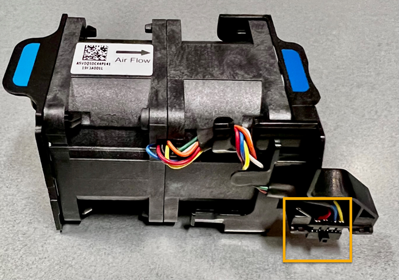
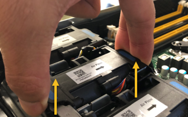

= 
:allow-uri-read: 

.Sobre esta tarefa
Para evitar interrupções de serviço, confirme se todos os outros nós de armazenamento estão conetados à grade antes de iniciar a substituição do ventilador ou substitua o ventilador durante uma janela de manutenção programada quando os períodos de interrupção de serviço são aceitáveis. Consulte as informações sobre https://docs.netapp.com/us-en/storagegrid-118/monitor/monitoring-system-health.html#monitor-node-connection-states["monitorização dos estados de ligação do nó"^]o .

CAUTION: Se você já usou uma regra ILM que cria apenas uma cópia de um objeto, você deve substituir o ventilador durante uma janela de manutenção programada, porque você pode perder temporariamente o acesso a esses objetos durante este procedimento. Consulte informações sobre https://docs.netapp.com/us-en/storagegrid-118/ilm/why-you-should-not-use-single-copy-replication.html["por que você não deve usar replicação de cópia única"^]o .

O nó do aparelho não estará acessível enquanto substituir a ventoinha.

A fotografia mostra um ventilador para o aparelho. O conetor elétrico é realçado. As ventoinhas de arrefecimento estão acessíveis depois de retirar a tampa superior do aparelho.

NOTE: Cada uma das duas unidades de fonte de alimentação também contém um ventilador. As ventoinhas da fonte de alimentação não estão incluídas neste procedimento.

.Passos
. Enrole a extremidade da correia da pulseira ESD à volta do pulso e fixe a extremidade do clipe a um solo metálico para evitar descargas estáticas.
. Localize o ventilador que você precisa substituir.
+
As oito ventoinhas estão nas seguintes posições no chassis (metade dianteira do aparelho StorageGRID com a tampa superior removida apresentada):

+
image::../media/SGF6112-fan-locations.png[Localizações das ventoinhas]

|===

|  | Grupo motoventilador 

 a| 
1
 a| 
Fan_SYS0

 a| 
2
 a| 
Fan_SYS1

 a| 
3
 a| 
Fan_SYS2

 a| 
4
 a| 
Fan_SYS3

 a| 
5
 a| 
Fan_SYS4

 a| 
6
 a| 
Fan_SYS5

 a| 
7
 a| 
Fan_SYS6

 a| 
8
 a| 
Fan_SYS7

|===
. Usando as abas azuis na ventoinha, levante a ventoinha com falha para fora do chassis.
+

. Faça deslizar a ventoinha de substituição para a ranhura aberta no chassis.
+
Certifique-se de que alinha o conetor da ventoinha com a tomada na placa de circuito impresso.

. Pressione firmemente o conetor da ventoinha na placa de circuito (tomada destacada).
+
image::../media/sgf6112_fan_socket_check.png[Verificação do conetor do ventilador]

