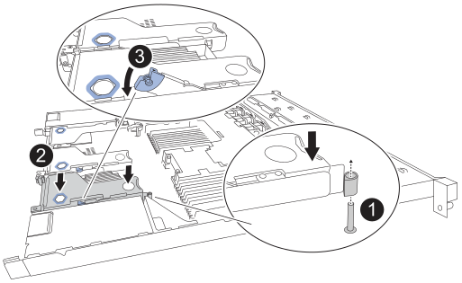
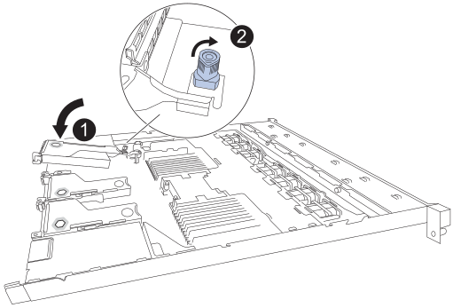

= Passo 1: Remova a NIC
:allow-uri-read: 

== Passo 1: Remova a NIC

[role="tabbed-block"]
====
.NIC 1/NIC 2
--
.Passos
. Enrole a extremidade da correia da pulseira ESD à volta do pulso e fixe a extremidade do clipe a um solo metálico para evitar descargas estáticas.
. Localize o conjunto riser que contém a NIC na parte de trás do aparelho.
. Gire a trava de bloqueio azul na placa riser com a NIC com defeito para cima e abra.
+
image:../media/drw_s2025_io_1_2_replace_ieops-2555.svg["Removendo a NIC 1 ou NIC 2 do conjunto riser"]

. Com cuidado, levante o conjunto do riser com a placa de rede defeituosa usando os orifícios marcados em azul. Mova o conjunto do riser em direção à frente do chassi enquanto o levanta para permitir que os conectores externos da placa de rede instalada fiquem livres do chassi.
. Coloque o riser em uma superfície plana antiestática com a estrutura metálica voltada para baixo para acessar a NIC.
. Abra a trava azul da placa de rede com defeito e remova-a cuidadosamente do conjunto riser. Balance a placa de rede levemente para facilitar a remoção do conector. Não use força excessiva.
+
image:../media/drw_s2025_IO_card_replace_ieops-2557.svg["Removendo uma placa de E/S do conjunto riser"]

. Coloque o riser e a placa de rede em uma superfície plana antiestática.

--
.NIC 3
--
.Passos
. Enrole a extremidade da correia da pulseira ESD à volta do pulso e fixe a extremidade do clipe a um solo metálico para evitar descargas estáticas.
. Gire a trava azul no riser com a placa de rede com defeito para a posição aberta.
+
image:../media/drw_s2025_io_3_replace_ieops-2556.svg["Removendo a NIC 3 do conjunto riser"]

. Com cuidado, levante o conjunto do riser usando o orifício marcado em azul e a borda do riser. Mova o conjunto do riser em direção à frente do chassi enquanto o levanta para permitir que os conectores externos do NIC instalado fiquem livres do chassi.
. Coloque o riser em uma superfície plana antiestática com a estrutura metálica voltada para baixo para acessar a NIC.
. Abra a trava azul da placa de rede com defeito e remova-a cuidadosamente do conjunto riser. Balance a placa de rede levemente para facilitar a remoção do conector. Não use força excessiva.
+
image:../media/drw_s2025_IO_card_replace_ieops-2557.svg["Removendo uma placa de E/S do conjunto riser"]

. Coloque o riser e a placa de rede em uma superfície plana antiestática.

--
====

== Etapa 2: reinstale a placa de rede interna

Instale a NIC de substituição no mesmo local que a que foi removida.

[role="tabbed-block"]
====
.NIC 1/NIC 2
--
.Passos
. Enrole a extremidade da correia da pulseira ESD à volta do pulso e fixe a extremidade do clipe a um solo metálico para evitar descargas estáticas.
. Remova a placa de rede de substituição da respetiva embalagem.
. Instale a placa de rede de substituição no conjunto riser.
+
.. Certifique-se de que o trinco azul está na posição aberta.
+
image:../media/drw_s2025_IO_card_replace_ieops-2557.svg["Instalando uma placa de E/S no conjunto riser"]

.. Alinhe a placa de rede com o conector correspondente no conjunto riser. Pressione cuidadosamente a placa de rede no conector até que esteja totalmente encaixada e, em seguida, feche a trava azul.

. Reinstale o conjunto do riser no chassi.
+
.. Localize o orifício de alinhamento no conjunto do riser que se alinha com um pino guia na placa do sistema para garantir o posicionamento correto do conjunto do riser.
+

.. Posicione o conjunto da riser no chassi, certificando-se de que ele se alinha com o conetor na placa de sistema e o pino guia.
.. Pressione cuidadosamente o conjunto da riser no lugar ao longo de sua linha central, ao lado dos orifícios marcados com azul, até que esteja totalmente assentado.

. Se não tiver outros procedimentos de manutenção a executar no aparelho, volte a instalar a tampa do aparelho, volte a colocar o aparelho no rack, ligue os cabos e ligue a alimentação.

Após substituir a peça, devolva a peça defeituosa à NetApp, conforme descrito nas instruções de RMA que acompanham o kit. Consulte a  https://mysupport.netapp.com/site/info/rma["Devolução e substituição de peças"^] página para obter mais informações.

--
.NIC 3
--
.Passos
. Enrole a extremidade da correia da pulseira ESD à volta do pulso e fixe a extremidade do clipe a um solo metálico para evitar descargas estáticas.
. Remova a placa de rede de substituição da respetiva embalagem.
. Instale a placa de rede de substituição no conjunto riser.
+
.. Certifique-se de que o trinco azul está na posição aberta.
+
image:../media/drw_s2025_IO_card_replace_ieops-2557.svg["Instalando uma placa de E/S no conjunto riser"]

.. Alinhe a placa de rede com o conector correspondente no conjunto riser. Pressione cuidadosamente a placa de rede no conector até que esteja totalmente encaixada e, em seguida, feche a trava azul.

. Reinstale o conjunto do riser no chassi.
+
.. Posicione o conjunto do riser no chassi, certificando-se de que as bordas do conjunto do riser estejam corretamente alinhadas com as bordas do chassi.
+

.. Pressione cuidadosamente o conjunto do riser no lugar ao longo de sua linha central, próximo ao orifício marcado em azul, até que esteja totalmente encaixado.
.. Gire a trava azul no suporte para a posição fechada.

. Remova as tampas de proteção das portas NIC onde você estará reinstalando os cabos.
. Se não tiver outros procedimentos de manutenção a executar no aparelho, volte a instalar a tampa do aparelho, volte a colocar o aparelho no rack, ligue os cabos e ligue a alimentação.

Após substituir a peça, devolva a peça defeituosa à NetApp, conforme descrito nas instruções de RMA que acompanham o kit. Consulte a  https://mysupport.netapp.com/site/info/rma["Devolução e substituição de peças"^] página para obter mais informações.

--
====