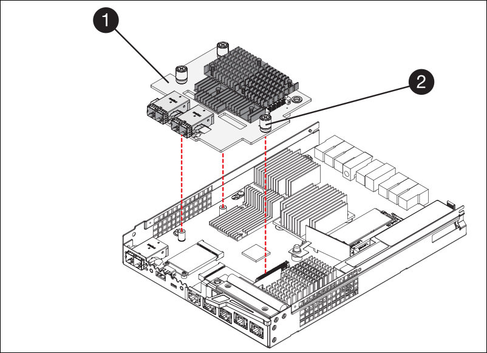

= Passo 5: Mova o HIC para o novo controlador, se necessário
:allow-uri-read: 

== Passo 5: Mova o HIC para o novo controlador, se necessário

Se o controlador com falha incluir uma placa de interface do host (HIC), mova o HIC do controlador com falha para o controlador de substituição.

Um HIC separado é usado apenas para o controlador E2800B. O HIC é montado na placa do controlador principal e inclui dois conetores SPF.

NOTE: As ilustrações neste procedimento mostram um HIC de 2 portas. O HIC no controlador pode ter um número diferente de portas.

[role="tabbed-block"]
====
.E2800A
--
Um controlador E2800A não tem um HIC.

Volte a colocar a tampa do controlador E2800A e avance para <<step6_replace_controller,Passo 6: Substitua o controlador>>

--
.E2800B
--
Mova o HIC do controlador E2800B com falha para o controlador de substituição.

.Passos
. Remova quaisquer SFPs do HIC.
. Usando uma chave de fenda Phillips nº 1, remova os parafusos que prendem a placa frontal HIC ao controlador.
+
Há quatro parafusos: Um na parte superior, um na parte lateral e dois na parte frontal.

+
image::../media/28_dwg_e2800_hic_faceplace_screws_maint-e2800.png[E2800 parafusos da placa frontal]

. Retire a placa frontal do HIC.
. Utilizando os dedos ou uma chave de fendas Phillips, desaperte os três parafusos de aperto manual que fixam o HIC à placa do controlador.
. Retire cuidadosamente o HIC da placa controladora levantando a placa para cima e deslizando-a para trás.
+

CAUTION: Tenha cuidado para não arranhar ou bater os componentes na parte inferior do HIC ou na parte superior da placa controladora.

+
image::../media/28_dwg_e2800_hic_thumbscrews_maint-e2800.png[Parafusos de aperto manual HIC E2800A]

+
[cols="1a,2a"]
|===
| Etiqueta | Descrição 

 a| 
1
 a| 
Placas de interface do host

 a| 
2
 a| 
Parafusos de aperto manual

|===
. Coloque o HIC sobre uma superfície livre de estática.
. Usando uma chave de fenda Phillips nº 1, remova os quatro parafusos que prendem a placa frontal vazia ao controlador de substituição e remova a placa frontal.
. Alinhe os três parafusos de aperto manual no HIC com os orifícios correspondentes no controlador de substituição e alinhe o conetor na parte inferior do HIC com o conetor de interface HIC na placa do controlador.
+
Tenha cuidado para não arranhar ou bater os componentes na parte inferior do HIC ou na parte superior da placa controladora.

. Baixe cuidadosamente o HIC para o devido lugar e assente o conetor HIC pressionando suavemente o HIC.
+

CAUTION: *Possíveis danos ao equipamento* - tenha cuidado para não apertar o conetor de fita dourada para os LEDs do controlador entre o HIC e os parafusos de aperto manual.

+

+
[cols="1a,2a"]
|===
| Etiqueta | Descrição 

 a| 
1
 a| 
Placas de interface do host

 a| 
2
 a| 
Parafusos de aperto manual

|===
. Aperte manualmente os parafusos de aperto manual do HIC.
+
Não use uma chave de fenda, ou você pode apertar demais os parafusos.

. Usando uma chave de fenda Phillips nº 1, prenda a placa frontal HIC removida do controlador original ao novo controlador com quatro parafusos.
+
image::../media/28_dwg_e2800_hic_faceplace_screws_maint-e2800.png[E2800A parafusos da placa frontal]

. Volte a instalar quaisquer SFPs removidos no HIC.

--
====