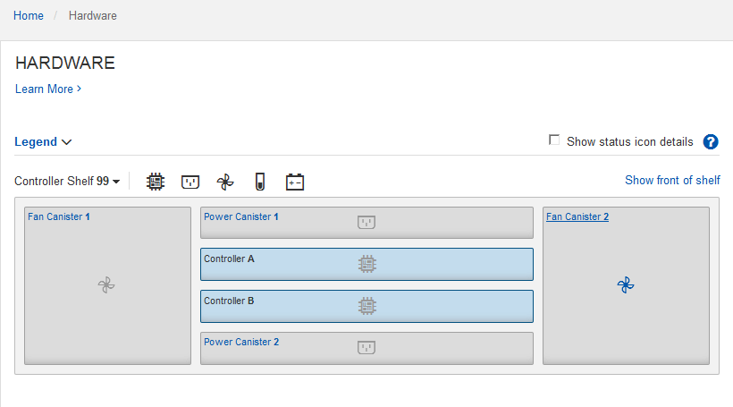

= Configurar o Gerenciador de sistemas SANtricity (SG6160, SG6000, SG5700 e SG5800)
:allow-uri-read: 
:icons: font
:imagesdir: ../media/

[role="lead"]
Você pode usar o Gerenciador de sistemas do SANtricity para monitorar o status das controladoras de storage, discos de storage e outros componentes de hardware no compartimento de controladora de storage. Você também pode configurar um proxy para o e-Series AutoSupport que permite enviar mensagens AutoSupport do dispositivo sem o uso da porta de gerenciamento.

== Configure e acesse o Gerenciador de sistema do SANtricity

Talvez seja necessário acessar o Gerenciador de sistema do SANtricity no controlador de storage para monitorar o hardware no compartimento de controladora de storage ou para configurar o e-Series AutoSupport.

.Antes de começar
* Você está usando um https://docs.netapp.com/us-en/storagegrid-118/admin/web-browser-requirements.html["navegador da web suportado"^].
* Para acessar o Gerenciador de sistema do SANtricity por meio do Gerenciador de Grade, você instalou o StorageGRID e tem a permissão de administrador do dispositivo de armazenamento ou a permissão de acesso à raiz.
* Para acessar o Gerenciador de sistema do SANtricity usando o Instalador de dispositivos do StorageGRID, você tem o nome de usuário e a senha do administrador do Gerenciador de sistema do SANtricity.
* Para acessar diretamente o Gerenciador de sistema do SANtricity usando um navegador da Web, você tem o nome de usuário e a senha do administrador do Gerenciador de sistema do SANtricity.

NOTE: Você deve ter o firmware 8,70 ou superior do SANtricity para acessar o Gerenciador de sistema do SANtricity usando o Gerenciador de Grade ou o Instalador de dispositivos StorageGRID. Pode verificar a versão do firmware utilizando o Instalador de aplicações StorageGRID e selecionando *Ajuda* > *acerca*.

NOTE: O acesso ao Gerenciador de sistema do SANtricity a partir do Gerenciador de Grade ou do Instalador de dispositivos é geralmente destinado apenas para monitorar seu hardware e configurar o e-Series AutoSupport. Muitos recursos e operações dentro do Gerenciador de sistema do SANtricity, como atualização de firmware, não se aplicam ao monitoramento do dispositivo StorageGRID. Para evitar problemas, siga sempre as instruções de instalação e manutenção do hardware do seu aparelho.

.Sobre esta tarefa
Há três maneiras de acessar o Gerenciador de sistema do SANtricity, dependendo de qual estágio do processo de instalação e configuração você está:

* Se o dispositivo ainda não tiver sido implantado como um nó no sistema StorageGRID, você deve usar a guia Avançado no Instalador de dispositivos StorageGRID.
+

NOTE: Depois que o nó for implantado, você não poderá mais usar o Instalador de dispositivos StorageGRID para acessar o Gerenciador de sistemas do SANtricity.

* Se o dispositivo tiver sido implantado como um nó em seu sistema StorageGRID, use a guia Gerenciador de sistema do SANtricity na página nós no Gerenciador de Grade.
* Se você não puder usar o Instalador de dispositivos StorageGRID ou o Gerenciador de Grade, poderá acessar o Gerenciador de sistema do SANtricity diretamente usando um navegador da Web conetado à porta de gerenciamento.

Este procedimento inclui etapas para o seu acesso inicial ao Gerenciador de sistema do SANtricity. Se você já tiver configurado o Gerenciador de sistema do SANtricity, vá para o <<config_hardware_alerts_sg6000,etapa de configurar alertas de hardware>>.

NOTE: O uso do Gerenciador de Grade ou do Instalador de dispositivos StorageGRID permite que você acesse o Gerenciador de sistema do SANtricity sem ter que configurar ou conetar a porta de gerenciamento do dispositivo.

Você usa o Gerenciador de sistema do SANtricity para monitorar o seguinte:

* Dados de performance, como performance em nível de storage array, latência de e/S, utilização de CPU e taxa de transferência
* Status do componente de hardware
* Funções de suporte, incluindo visualização de dados de diagnóstico

Você pode usar o Gerenciador de sistema do SANtricity para configurar as seguintes configurações:

* Alertas de e-mail, alertas SNMP ou alertas syslog para os componentes no compartimento do controlador de armazenamento
* Configurações do e-Series AutoSupport para os componentes no compartimento do controlador de storage.
+
Para obter detalhes adicionais sobre o e-Series AutoSupport, consulte http://mysupport.netapp.com/info/web/ECMP1658252.html["Site de Documentação de sistemas NetApp e-Series"^].

* Chaves de segurança da unidade, que são necessárias para desbloquear unidades seguras (esta etapa é necessária se o recurso Segurança da unidade estiver ativado)
* Senha de administrador para acessar o Gerenciador de sistema do SANtricity

.Passos
. Execute um dos seguintes procedimentos:
+
** Use o Instalador de dispositivos StorageGRID e selecione *Avançado* > *Gerenciador de sistemas SANtricity*
** Use o Gerenciador de Grade e selecione *NÓS* > * `*_appliance Storage Node_*`Gerenciador do sistema SANtricity*

+

NOTE: Se essas opções não estiverem disponíveis ou a página de login não for exibida, use o <<Defina endereços IP para controladores de armazenamento usando o Instalador de dispositivos StorageGRID,Endereços IP para os controladores de armazenamento>>. Acesse o Gerenciador de sistema do SANtricity navegando até o IP do controlador de armazenamento.

. Defina ou introduza a palavra-passe do administrador.
+
O Gerenciador de sistema do SANtricity usa uma única senha de administrador que é compartilhada entre todos os usuários.

+
image::../media/san_setup_wizard.gif[Captura de tela mostrando o botão Cancelar para o assistente de configuração]

. Selecione *Cancelar* para fechar o assistente.
+

NOTE: Não conclua o assistente de configuração de um dispositivo StorageGRID.

+
image::../media/sam_home_page.gif[Captura de tela da página inicial do Gerenciador de sistema do SANtricity]

. [[Config_hardware_alerts_sg6000 4]]Configurar alertas de hardware.
+
.. Selecione *Ajuda* para acessar a ajuda on-line do Gerenciador de sistemas do SANtricity.
.. Use a seção *Configurações* > *Alertas* da ajuda online para saber mais sobre alertas.
.. Siga as instruções ""como fazer"" para configurar alertas de e-mail, alertas SNMP ou alertas syslog.

. Gerenciar o AutoSupport para os componentes no compartimento do controlador de storage.
+
.. Selecione *Ajuda* para acessar a ajuda on-line do Gerenciador de sistemas do SANtricity.
.. Use a seção *SUPORTE* > *Centro de suporte* da ajuda on-line para saber mais sobre o recurso AutoSupport.
.. Siga as instruções ""como fazer"" para gerenciar o AutoSupport.
+
Para obter instruções específicas sobre como configurar um proxy StorageGRID para enviar mensagens AutoSupport da série e sem usar a porta de gerenciamento, vá para o https://docs.netapp.com/us-en/storagegrid-118/admin/configuring-storage-proxy-settings.html["instruções para configurar as configurações de proxy de armazenamento"^].

. Se o recurso Segurança da unidade estiver ativado para o dispositivo, crie e gerencie a chave de segurança.
+
.. Selecione *Ajuda* para acessar a ajuda on-line do Gerenciador de sistemas do SANtricity.
.. Utilize a secção *Definições* > *sistema* > *Gestão de chaves de segurança* da ajuda online para saber mais sobre a segurança da unidade.
.. Siga as instruções de "como fazer" para criar e gerenciar a chave de segurança.

. Opcionalmente, altere a senha do administrador.
+
.. Selecione *Ajuda* para acessar a ajuda on-line do Gerenciador de sistemas do SANtricity.
.. Use a seção *Home* > *Storage array Administration* da ajuda on-line para saber mais sobre a senha do administrador.
.. Siga as instruções "'como fazer'" para alterar a senha.

== Revise o status do hardware no Gerenciador do sistema do SANtricity

Você pode usar o Gerenciador de sistema do SANtricity para monitorar e gerenciar componentes de hardware individuais no compartimento de controladora de storage e analisar informações ambientais e de diagnóstico de hardware, como temperaturas dos componentes, bem como problemas relacionados às unidades.

.Antes de começar
* Você está usando um https://docs.netapp.com/us-en/storagegrid-118/admin/web-browser-requirements.html["navegador da web suportado"^].
* Para acessar o Gerenciador de sistema do SANtricity por meio do Gerenciador de Grade, você tem a permissão de administrador do dispositivo de armazenamento ou a permissão de acesso à raiz.
* Para acessar o Gerenciador de sistema do SANtricity usando o Instalador de dispositivos do StorageGRID, você tem o nome de usuário e a senha do administrador do Gerenciador de sistema do SANtricity.
* Para acessar diretamente o Gerenciador de sistema do SANtricity usando um navegador da Web, você tem o nome de usuário e a senha do administrador do Gerenciador de sistema do SANtricity.

NOTE: Você deve ter o firmware 8,70 ou superior do SANtricity para acessar o Gerenciador de sistema do SANtricity usando o Gerenciador de Grade ou o Instalador de dispositivos StorageGRID.

NOTE: O acesso ao Gerenciador de sistema do SANtricity a partir do Gerenciador de Grade ou do Instalador de dispositivos é geralmente destinado apenas para monitorar seu hardware e configurar o e-Series AutoSupport. Muitos recursos e operações dentro do Gerenciador de sistema do SANtricity, como atualização de firmware, não se aplicam ao monitoramento do dispositivo StorageGRID. Para evitar problemas, siga sempre as instruções de instalação e manutenção do hardware do seu aparelho.

.Passos
. <<Configure e acesse o Gerenciador de sistema do SANtricity,Acesse o Gerenciador do sistema do SANtricity>>.
. Introduza o nome de utilizador e a palavra-passe do administrador, se necessário.
. Clique em *Cancelar* para fechar o assistente de configuração e exibir a página inicial do Gerenciador do sistema SANtricity.
+
É apresentada a página inicial do Gestor do sistema SANtricity. No Gerenciador de sistemas do SANtricity, o compartimento de controladora é chamado de storage array.

+
image::../media/sam_home_page.gif[Captura de tela da página inicial do Gerenciador de sistema do SANtricity]

. Revise as informações exibidas para o hardware do dispositivo e confirme se todos os componentes de hardware têm o status ideal.
+
.. Clique na guia *hardware*.
.. Clique em *Mostrar parte posterior da prateleira*.
+

+
Na parte de trás da gaveta, você pode visualizar os dois controladores de armazenamento, a bateria em cada controlador de armazenamento, os dois coletores de energia, os dois coletores de ventilador e os compartimentos de expansão (se houver). Também pode visualizar as temperaturas dos componentes.

.. Para ver as configurações de cada controlador de armazenamento, selecione o controlador e selecione *View settings* no menu de contexto.
.. Para ver as configurações de outros componentes na parte de trás da prateleira, selecione o componente que deseja exibir.
.. Clique em *Mostrar frente da prateleira* e selecione o componente que deseja exibir.
+
Na parte da frente da gaveta, é possível visualizar as unidades e as gavetas de unidades da gaveta de controladora de armazenamento ou das gavetas de expansão (se houver).

Se o status de qualquer componente for necessário atenção, siga as etapas no Recovery Guru para resolver o problema ou entre em Contato com o suporte técnico.

== Defina endereços IP para controladores de armazenamento usando o Instalador de dispositivos StorageGRID

A porta de gerenciamento 1 em cada controlador de storage coneta o dispositivo à rede de gerenciamento do Gerenciador de sistema do SANtricity. Se você não conseguir acessar o Gerenciador de sistema do SANtricity a partir do Instalador de dispositivos StorageGRID, defina um endereço IP estático para cada controlador de armazenamento para garantir que você não perca sua conexão de gerenciamento com o hardware e o firmware do controlador no compartimento de controladora.

.Antes de começar
* Você está usando qualquer cliente de gerenciamento que possa se conetar à rede de administração do StorageGRID ou tem um laptop de serviço.
* O cliente ou laptop de serviço tem um navegador da Web suportado.

.Sobre esta tarefa
Os endereços atribuídos pelo DHCP podem ser alterados a qualquer momento. Atribua endereços IP estáticos aos controladores para garantir uma acessibilidade consistente.

NOTE: Siga este procedimento somente se você não tiver acesso ao Gerenciador de sistemas SANtricity a partir do Instalador de dispositivos StorageGRID (*Avançado* > *Gerenciador de sistemas SANtricity*) ou Gerenciador de Grade (*NÓS* > *Gerenciador de sistemas SANtricity*).

.Passos
. No cliente, insira o URL para o instalador do StorageGRID Appliance
`*https://_Appliance_Controller_IP_:8443*`
+
Para `_Appliance_Controller_IP_`, use o endereço IP do dispositivo em qualquer rede StorageGRID.

+
A página inicial do instalador do dispositivo StorageGRID é exibida.

. Selecione *Configure hardware* > *Storage Controller Network Configuration*.
+
A página Configuração da rede do controlador de armazenamento é exibida.

. Dependendo da configuração da rede, selecione *Enabled* para IPv4, IPv6 ou ambos.
. Anote o endereço IPv4 que é exibido automaticamente.
+
DHCP é o método padrão para atribuir um endereço IP à porta de gerenciamento do controlador de armazenamento.

+

NOTE: Pode demorar alguns minutos para que os valores DHCP apareçam.

+
image::../media/storage_controller_network_config_ipv4.gif[Configuração de rede do controlador de armazenamento IPv4]

. Opcionalmente, defina um endereço IP estático para a porta de gerenciamento do controlador de armazenamento.
+

NOTE: Você deve atribuir um IP estático para a porta de gerenciamento ou atribuir uma concessão permanente para o endereço no servidor DHCP.

+
.. Selecione *estático*.
.. Introduza o endereço IPv4, utilizando a notação CIDR.
.. Introduza o gateway predefinido.
+
image::../media/storage_controller_ipv4_and_def_gateway.gif[Configuração de rede do controlador de armazenamento IPv4 e Gateway predefinido]

.. Clique em *Salvar*.
+
Pode levar alguns minutos para que suas alterações sejam aplicadas.

+
Quando você se conetar ao Gerenciador de sistema do SANtricity, você usará o novo endereço IP estático como URL
`*https://_Storage_Controller_IP_*`

