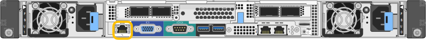

= Acesse a interface BMC
:allow-uri-read: 
:icons: font
:imagesdir: ../media/

[role="lead"]
Você pode acessar a interface BMC usando o DHCP ou o endereço IP estático para a porta de gerenciamento BMC nos seguintes modelos de appliance:

* SG100
* SG110
* SG1000
* SG1100
* SG6000
* SG6100

.Antes de começar
* O cliente de gerenciamento está usando um https://docs.netapp.com/us-en/storagegrid-118/admin/web-browser-requirements.html["navegador da web suportado"^].
* A porta de gerenciamento do BMC no dispositivo está conetada à rede de gerenciamento que você planeja usar.
+
[role="tabbed-block"]
====
.SG100
--
image::../media/sg100_bmc_management_port.png[SG100 porta de gerenciamento BMC]

--
.SG110
--
image::../media/sgf6112_cn_bmc_management_port.png[Porta de gerenciamento BMC SG110]

--
.SG1000
--

--
.SG1100
--
image::../media/sg1100_bmc_management_port.png[Porta de gerenciamento BMC SG1100]

--
.SG6000
--
image::../media/sg6000_cn_bmc_management_port.gif[SG6000-CN controlador BMC porta de gerenciamento]

--
.SG6100
--
_SGF6112_:

image::../media/sgf6112_cn_bmc_management_port.png[Porta de gerenciamento BMC SGF6112]

_SG6100-CN_:

image::../media/sg6100_cn_bmc_management_port.png[Porta de gestão BMC SG610-CN]

--
====

.Passos
. Digite o URL para a interface do BMC
`*https://_BMC_Port_IP_*`
+
Para `_BMC_Port_IP_`, utilize o DHCP ou o endereço IP estático para a porta de gestão BMC.

+
É apresentada a página de início de sessão do BMC.

+

NOTE: Se ainda não tiver configurado `BMC_Port_IP`, siga as instruções em link:configuring-bmc-interface.html["Configurar a interface BMC"]. Se você não conseguir seguir esse procedimento devido a um problema de hardware e ainda não tiver configurado um endereço IP BMC, talvez você ainda consiga acessar o BMC. Por padrão, o BMC obtém um endereço IP usando DHCP. Se o DHCP estiver ativado na rede BMC, o administrador da rede pode fornecer o endereço IP atribuído ao MAC BMC, que é impresso na etiqueta na parte frontal do dispositivo. Se o DHCP não estiver ativado na rede BMC, o BMC não responderá após alguns minutos e atribuirá a si próprio o IP estático padrão `192.168.0.120` . Talvez seja necessário conetar o laptop diretamente à porta BMC e alterar a configuração de rede para atribuir um IP ao laptop, como `192.168.0.200/24`, para navegar até `192.168.0.120`.

. Introduza o nome de utilizador e a palavra-passe admin ou root, utilizando a palavra-passe definida quando link:changing-root-password-for-bmc-interface.html["alterou a palavra-passe predefinida"]:
+

NOTE: O usuário padrão depende de quando você instalou o dispositivo StorageGRID. O usuário padrão é *admin* para novas instalações e *root* para instalações mais antigas.

. Selecione *entrar*.
+
image::../media/bmc_dashboard.gif[Painel do BMC]

. Opcionalmente, crie usuários adicionais selecionando *Configurações* > *Gerenciamento de usuários* e clicando em qualquer usuário "habilitado".
+

NOTE: Quando os usuários entram pela primeira vez, eles podem ser solicitados a alterar sua senha para aumentar a segurança.

