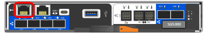
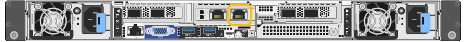
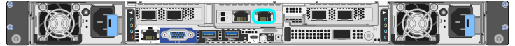

= Acesse o Instalador de dispositivos StorageGRID
:allow-uri-read: 
:icons: font
:imagesdir: ../media/

[role="lead"]
Você deve acessar o Instalador do StorageGRID Appliance para verificar a versão do instalador e configurar as conexões entre o appliance e as três redes StorageGRID: A rede de grade, a rede de administração (opcional) e a rede de cliente (opcional).

.Antes de começar
* Você está usando qualquer cliente de gerenciamento que possa se conetar à rede de administração do StorageGRID ou tem um laptop de serviço.
* O cliente ou laptop de serviço tem um https://docs.netapp.com/us-en/storagegrid/admin/web-browser-requirements.html["navegador da web suportado"^].
* O dispositivo de serviços ou o controlador do dispositivo de armazenamento está ligado a todas as redes StorageGRID que pretende utilizar.
* Você conhece o endereço IP, o gateway e a sub-rede do dispositivo de serviços ou do controlador do dispositivo de armazenamento nessas redes.
* Configurou os comutadores de rede que pretende utilizar.

.Sobre esta tarefa
Para acessar inicialmente o Instalador de dispositivos StorageGRID, você pode usar o endereço IP atribuído por DHCP para a porta de rede Admin no utilitário de serviços ou no controlador de dispositivo de armazenamento (supondo que ele esteja conetado à rede Admin) ou conetar um laptop de serviço diretamente ao controlador de dispositivo de serviços ou dispositivo de armazenamento.

.Passos
. Se possível, use o endereço DHCP para a porta Admin Network no utilitário de serviços ou no controlador do dispositivo de armazenamento. A porta Admin Network (rede de administração) é realçada na figura a seguir. (Use o endereço IP na rede de grade se a rede de administração não estiver conetada.)
+
[role="tabbed-block"]
====
.SG100
--
image::../media/sg100_admin_network_port.png[Porta de rede Admin no SG100]

--
.SG110
--
image::../media/sg6100_admin_network_port.png[Porta de rede Admin no SG110]

--
.SG1000
--
image::../media/sg1000_admin_network_port.png[Porta de rede Admin no SG1000]

--
.SG1100
--
image::../media/sg1100_admin_network_port.png[Porta de rede Admin no SG1100]

--
.E5700SG
--
Para o E5700SG, você pode fazer um dos seguintes procedimentos:

** Observe o visor de sete segmentos no controlador E5700SG. Se as portas de gerenciamento 1 e 10/25-GbE 2 e 4 no controlador E5700SG estiverem conetadas a redes com servidores DHCP, o controlador tentará obter endereços IP atribuídos dinamicamente ao ligar o gabinete. Depois que o controlador tiver concluído o processo de ativação, o visor de sete segmentos mostra *HO*, seguido de uma sequência repetida de dois números.
+
[listing]
----
HO -- IP address for Admin Network -- IP address for Grid Network HO
----
+
Na sequência:

+
*** O primeiro conjunto de números é o endereço DHCP para o nó de armazenamento do dispositivo na rede Admin, se estiver conetado. Este endereço IP é atribuído à porta de gerenciamento 1 no controlador E5700SG.
*** O segundo conjunto de números é o endereço DHCP para o nó de armazenamento do dispositivo na rede de Grade. Esse endereço IP é atribuído às portas 2 e 4 de 10/25 GbE quando você primeiro aplica energia ao dispositivo.
+

NOTE: Se um endereço IP não puder ser atribuído usando DHCP, 0.0.0.0 será exibido.

--
.SG5800
--

--
.SG6000-CN
--
image::../media/sg6000_cn_admin_network_port.png[Porta de rede Admin no controlador SG6000-CN]

--
.SG6100-CN
--
image::../media/sg6100_cn_admin_network_port.png[Porta de rede Admin no controlador SG6000-CN]

--
.SGF6112
--
image::../media/sg6100_admin_network_port.png[Porta de rede Admin no SGF6112]

--
====
+
.. Obtenha o endereço DHCP para o dispositivo na rede de administração do administrador da rede.
.. No cliente, insira esta URL para o instalador do StorageGRID Appliance
`*https://_Appliance_IP_:8443*`
+
Para `_Appliance_IP_`, utilize o endereço DHCP (utilize o endereço IP da rede de administração, se o tiver).

.. Se for solicitado um alerta de segurança, exiba e instale o certificado usando o assistente de instalação do navegador.
+
O alerta não aparecerá na próxima vez que você acessar este URL.

+
A página inicial do instalador do dispositivo StorageGRID é exibida. As informações e as mensagens mostradas quando você acessa esta página pela primeira vez dependem de como o dispositivo está conetado atualmente às redes StorageGRID. Podem aparecer mensagens de erro que serão resolvidas em etapas posteriores.

. Se não conseguir obter um endereço IP utilizando DHCP, pode utilizar uma ligação local.
+
[role="tabbed-block"]
====
.SG100
--
Conete um laptop de serviço diretamente à porta RJ-45 mais à direita do dispositivo de serviços, usando um cabo Ethernet.

image::../media/sg100_link_local_port.png[SG100 ligação local]

--
.SG110
--
Conete um laptop de serviço diretamente à porta RJ-45 mais à direita do aparelho, usando um cabo Ethernet.

--
.SG1000
--
Conete um laptop de serviço diretamente à porta RJ-45 mais à direita do dispositivo de serviços, usando um cabo Ethernet.

image::../media/sg1000_link_local_port.png[SG1000 ligação local]

--
.SG1100
--
Conete um laptop de serviço diretamente à porta RJ-45 mais à direita do aparelho, usando um cabo Ethernet.

image::../media/sg1100_link_local_port.png[SG1100 ligação local]

--
.E5700SG
--
Conete o notebook de serviço à porta de gerenciamento 2 no controlador E5700SG, usando um cabo Ethernet.

image::../media/e5700sg_mgmt_port_2.gif[Localização da porta de gestão 2 no controlador E5700SG]

--
.SG5800
--
Conete o notebook de serviço à porta de gerenciamento 1 no controlador SG5800, usando um cabo Ethernet.

image::../media/sg5800_mgmt_port.png[Localização da porta de gestão 1 no controlador SG5800]

--
.SG6000-CN
--
Conete um laptop de serviço diretamente à porta RJ-45 mais à direita do controlador SG6000-CN, usando um cabo Ethernet.

image::../media/sg6000_cn_link_local_port.png[Localização do porto de gestão para SG6000-CN]

--
.SG6100-CN
--
Conete um laptop de serviço diretamente à porta RJ-45 mais à direita do controlador SG6100-CN, usando um cabo Ethernet.

--
.SGF6112
--
Conete um laptop de serviço diretamente à porta RJ-45 mais à direita do aparelho, usando um cabo Ethernet.

--
====
+
.. Abra um navegador da Web no laptop de serviço.
.. Digite este URL para o instalador do StorageGRID Appliance
`*\https://169.254.0.1:8443*`
+
A página inicial do instalador do dispositivo StorageGRID é exibida. As informações e as mensagens mostradas quando você acessa esta página pela primeira vez dependem de como o dispositivo está conetado atualmente às redes StorageGRID. Podem aparecer mensagens de erro que serão resolvidas em etapas posteriores.

+

NOTE: Se não conseguir aceder à página inicial através de uma ligação local, configure o endereço IP do computador portátil de serviço como `169.254.0.2`, e tente novamente.

.Depois de terminar
Depois de acessar o Instalador de dispositivos StorageGRID:

* Verifique se a versão do Instalador de dispositivos StorageGRID no dispositivo corresponde à versão de software instalada no sistema StorageGRID. Atualize o Instalador de dispositivos StorageGRID, se necessário.
+
link:verifying-and-upgrading-storagegrid-appliance-installer-version.html["Verifique e atualize a versão do instalador do StorageGRID Appliance"]

* Revise todas as mensagens exibidas na página inicial do Instalador do StorageGRID Appliance e configure a configuração do link e a configuração do IP, conforme necessário.

