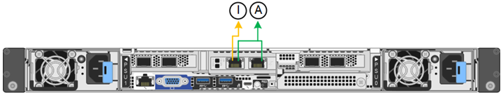

= Configurar ligações de rede
:allow-uri-read: 
:icons: font
:imagesdir: ../media/

[role="lead"]
Você pode configurar links de rede para as portas usadas para conetar o dispositivo à rede de Grade, à rede de cliente e à rede de administração. Você pode definir a velocidade do link, bem como os modos de ligação de porta e rede.

TIP: Se estiver usando o ConfigBuilder para gerar um arquivo JSON, você poderá configurar os links de rede automaticamente. link:automating-appliance-installation-and-configuration.html["Automatize a instalação e a configuração do dispositivo"]Consulte .

.Antes de começar
* Você link:obtaining-additional-equipment-and-tools.html["obteve o equipamento adicional"] exigiu para o seu tipo de cabo e velocidade de ligação.
* Você instalou os transcetores corretos nas portas, com base na velocidade de link que você planeja usar.
* Você conetou as portas de rede a switches que suportam a velocidade escolhida.

Se você planeja usar o modo de ligação de porta agregada, o modo de ligação de rede LACP ou a marcação de VLAN:

* Você conetou as portas de rede do dispositivo a switches que podem suportar VLAN e LACP.
* Se vários switches estiverem participando da ligação LACP, os switches suportam grupos de agregação de links de vários gabinetes (MLAG) ou equivalente.
* Você entende como configurar os switches para usar VLAN, LACP e MLAG ou equivalente.
* Você conhece a tag VLAN exclusiva a ser usada para cada rede. Essa tag VLAN será adicionada a cada pacote de rede para garantir que o tráfego de rede seja roteado para a rede correta.

.Sobre esta tarefa
Só é necessário configurar as definições na página Configuração de ligação se pretender utilizar uma definição não predefinida.

NOTE: A política de hash de transmissão LACP é layer2-3.

As figuras e tabelas resumem as opções para o modo de ligação de porta e modo de ligação de rede para cada dispositivo. Consulte o seguinte para obter mais informações:

* link:gathering-installation-information-sg100-and-sg1000.html#port-bond-modes["Modos de ligação de porta (SG1000 e SG100)"]
* link:gathering-installation-information-sg110-and-sg1100.html#port-bond-modes["Modos de ligação de porta (SG1100 e SG110)"]
* link:gathering-installation-information-sg5700.html#port-bond-modes["Modos de ligação de porta (E5700SG)"]
* link:gathering-installation-information-sg5800.html#port-bond-modes["Modos de ligação de porta (SG5800)"]
* link:gathering-installation-information-sg6000.html#port-bond-modes["Modos de ligação de porta (SG6000-CN)"]
* link:gathering-installation-information-sg6100.html#port-bond-modes["Modos de ligação portuária (SGF6112 e SG6100-CN)"]

[role="tabbed-block"]
====
.SG100 e SG1000
--
Modo de ligação de porta fixa (predefinição)::
+
--
As figuras mostram como as quatro portas de rede no SG1000 ou SG100 são ligadas no modo de ligação de porta fixa (configuração padrão).

SG1000:

image::../media/sg1000_fixed_port.png[SG1000 modo de ligação de porta fixa]

SG100:

image::../media/sg100_fixed_port_draft.png[SG100 modo de ligação de porta fixa]

[cols="1a,3a"]
|===
| Legenda | Quais portas estão coladas 

 a| 
C
 a| 
As portas 1 e 3 são Unidas para a rede do cliente, se esta rede for utilizada.

 a| 
G
 a| 
As portas 2 e 4 são Unidas para a rede de Grade.

|===
A tabela resume as opções de configuração das quatro portas de rede. Só é necessário configurar as definições na página Configuração de ligação se pretender utilizar uma definição não predefinida.

[cols="1a,2a,2a"]
|===
| Modo de ligação de rede | Rede cliente desativada (predefinição) | Rede cliente ativada 

 a| 
Ative-Backup (padrão)
 a| 
* As portas 2 e 4 usam uma ligação de backup ativo para a rede de Grade.
* As portas 1 e 3 não são usadas.
* Uma etiqueta VLAN é opcional.

 a| 
* As portas 2 e 4 usam uma ligação de backup ativo para a rede de Grade.
* As portas 1 e 3 usam uma ligação de backup ativo para a rede do cliente.
* Tags VLAN podem ser especificadas para ambas as redes para a conveniência do administrador de rede.

 a| 
Bola de Futsal (802,3ad)
 a| 
* As portas 2 e 4 usam uma ligação LACP para a rede de Grade.
* As portas 1 e 3 não são usadas.
* Uma etiqueta VLAN é opcional.

 a| 
* As portas 2 e 4 usam uma ligação LACP para a rede de Grade.
* As portas 1 e 3 usam uma ligação LACP para a rede de clientes.
* Tags VLAN podem ser especificadas para ambas as redes para a conveniência do administrador de rede.

|===
--
Modo de ligação de porta agregada::
+
--
Estas figuras mostram como as quatro portas de rede são ligadas no modo de ligação de porta agregada.

SG1000:

image::../media/sg1000_aggregate_ports.png[Modo de ligação de porta agregada SG1000]

SG100:

image::../media/sg100_aggregate_ports.png[Modo de ligação de porta agregada SG100]

[cols="1a,3a"]
|===
| Legenda | Quais portas estão coladas 

 a| 
1
 a| 
Todas as quatro portas são agrupadas em uma única ligação LACP, permitindo que todas as portas sejam usadas para o tráfego de rede de Grade e rede de Cliente.

|===
A tabela resume as opções de configuração das quatro portas de rede. Só é necessário configurar as definições na página Configuração de ligação se pretender utilizar uma definição não predefinida.

[cols="1a,2a,2a"]
|===
| Modo de ligação de rede | Rede cliente desativada (predefinição) | Rede cliente ativada 

 a| 
Apenas LACP (802,3ad)
 a| 
* As portas 1-4 usam uma única ligação LACP para a rede de Grade.
* Uma única etiqueta VLAN identifica pacotes de rede de Grade.

 a| 
* As portas 1-4 usam uma única ligação LACP para a rede de Grade e a rede do Cliente.
* Duas etiquetas VLAN permitem que os pacotes de rede de Grade sejam segregados dos pacotes de rede de Cliente.

|===
--
Modo de ligação de rede ative-Backup para portas de gestão::
+
--
Essas figuras mostram como as duas portas de gerenciamento de 1 GbE nos dispositivos são ligadas no modo de ligação de rede do ative-Backup para a rede de administração.

SG1000:

image::../media/sg1000_bonded_management_ports.png[Portas de rede Admin ligadas SG1000]

SG100:

image::../media/sg100_bonded_management_ports.png[Portas de rede Admin ligadas SG100]

--

--
.SG110 e SG1100
--
Modo de ligação de porta fixa (predefinição)::
+
--
As figuras mostram como as quatro portas de rede no SG1100 ou SG110 são ligadas no modo de ligação de porta fixa (configuração padrão).

SG1100:

image::../media/sg1100_fixed_port.png[SG1100 modo de ligação de porta fixa]

SG110:

image::../media/sgf6112_fixed_port.png[SG110 modo de ligação de porta fixa]

[cols="1a,3a"]
|===
| Legenda | Quais portas estão coladas 

 a| 
C
 a| 
As portas 1 e 3 são Unidas para a rede do cliente, se esta rede for utilizada.

 a| 
G
 a| 
As portas 2 e 4 são Unidas para a rede de Grade.

|===
A tabela resume as opções de configuração das quatro portas de rede. Só é necessário configurar as definições na página Configuração de ligação se pretender utilizar uma definição não predefinida.

[cols="1a,2a,2a"]
|===
| Modo de ligação de rede | Rede cliente desativada (predefinição) | Rede cliente ativada 

 a| 
Ative-Backup (padrão)
 a| 
* As portas 2 e 4 usam uma ligação de backup ativo para a rede de Grade.
* As portas 1 e 3 não são usadas.
* Uma etiqueta VLAN é opcional.

 a| 
* As portas 2 e 4 usam uma ligação de backup ativo para a rede de Grade.
* As portas 1 e 3 usam uma ligação de backup ativo para a rede do cliente.
* Tags VLAN podem ser especificadas para ambas as redes para a conveniência do administrador de rede.

 a| 
Bola de Futsal (802,3ad)
 a| 
* As portas 2 e 4 usam uma ligação LACP para a rede de Grade.
* As portas 1 e 3 não são usadas.
* Uma etiqueta VLAN é opcional.

 a| 
* As portas 2 e 4 usam uma ligação LACP para a rede de Grade.
* As portas 1 e 3 usam uma ligação LACP para a rede de clientes.
* Tags VLAN podem ser especificadas para ambas as redes para a conveniência do administrador de rede.

|===
--
Modo de ligação de porta agregada::
+
--
Estas figuras mostram como as quatro portas de rede são ligadas no modo de ligação de porta agregada.

SG1100:

image::../media/sg1100_aggregate_ports.png[Modo de ligação de porta agregada SG1100]

SG110:

image::../media/sgf6112_aggregate_ports.png[SG110 modo de ligação de porta agregada]

[cols="1a,3a"]
|===
| Legenda | Quais portas estão coladas 

 a| 
1
 a| 
Todas as quatro portas são agrupadas em uma única ligação LACP, permitindo que todas as portas sejam usadas para o tráfego de rede de Grade e rede de Cliente.

|===
A tabela resume as opções de configuração das portas de rede. Só é necessário configurar as definições na página Configuração de ligação se pretender utilizar uma definição não predefinida.

[cols="1a,2a,2a"]
|===
| Modo de ligação de rede | Rede cliente desativada (predefinição) | Rede cliente ativada 

 a| 
Apenas LACP (802,3ad)
 a| 
* As portas 1-4 usam uma única ligação LACP para a rede de Grade.
* Uma única etiqueta VLAN identifica pacotes de rede de Grade.

 a| 
* As portas 1-4 usam uma única ligação LACP para a rede de Grade e a rede do Cliente.
* Duas etiquetas VLAN permitem que os pacotes de rede de Grade sejam segregados dos pacotes de rede de Cliente.

|===
--
Modo de ligação de rede ative-Backup para portas de gestão::
+
--
Essas figuras mostram como as duas portas de gerenciamento de 1 GbE nos dispositivos são ligadas no modo de ligação de rede do ative-Backup para a rede de administração.

SG1100:

image::../media/sg1100_bonded_management_ports.png[Portas de rede Admin ligadas SG1100]

SG110:

--

--
.SG5700
--
Modo de ligação de porta fixa (predefinição)::
+
--
Esta figura mostra como as quatro portas 10/25-GbE são ligadas no modo de ligação de porta fixa (configuração padrão).

image::../media/e5700sg_fixed_port.gif[Imagem que mostra como as portas 10/25-GbE no controlador E5700SG estão ligadas no modo fixo]

[cols="1a,3a"]
|===
| Legenda | Quais portas estão coladas 

 a| 
C
 a| 
As portas 1 e 3 são Unidas para a rede do cliente, se esta rede for utilizada.

 a| 
G
 a| 
As portas 2 e 4 são Unidas para a rede de Grade.

|===
A tabela resume as opções de configuração das quatro portas 10/25 GbE. Só é necessário configurar as definições na página Configuração de ligação se pretender utilizar uma definição não predefinida.

[cols="1a,2a,2a"]
|===
| Modo de ligação de rede | Rede cliente desativada (predefinição) | Rede cliente ativada 

 a| 
Ative-Backup (padrão)
 a| 
* As portas 2 e 4 usam uma ligação de backup ativo para a rede de Grade.
* As portas 1 e 3 não são usadas.
* Uma etiqueta VLAN é opcional.

 a| 
* As portas 2 e 4 usam uma ligação de backup ativo para a rede de Grade.
* As portas 1 e 3 usam uma ligação de backup ativo para a rede do cliente.
* Tags VLAN podem ser especificadas para ambas as redes para a conveniência do administrador de rede.

 a| 
Bola de Futsal (802,3ad)
 a| 
* As portas 2 e 4 usam uma ligação LACP para a rede de Grade.
* As portas 1 e 3 não são usadas.
* Uma etiqueta VLAN é opcional.

 a| 
* As portas 2 e 4 usam uma ligação LACP para a rede de Grade.
* As portas 1 e 3 usam uma ligação LACP para a rede de clientes.
* Tags VLAN podem ser especificadas para ambas as redes para a conveniência do administrador de rede.

|===
--
Modo de ligação de porta agregada::
+
--
Esta figura mostra como as quatro portas 10/25-GbE são ligadas no modo de ligação de porta agregada.

image::../media/e5700sg_aggregate_port.gif[Imagem mostrando como as portas 10/25-GbE no controlador E5700SG são ligadas no modo agregado]

[cols="1a,3a"]
|===
| Legenda | Quais portas estão coladas 

 a| 
1
 a| 
Todas as quatro portas são agrupadas em uma única ligação LACP, permitindo que todas as portas sejam usadas para o tráfego de rede de Grade e rede de Cliente.

|===
A tabela resume as opções de configuração das quatro portas 10/25 GbE. Só é necessário configurar as definições na página Configuração de ligação se pretender utilizar uma definição não predefinida.

[cols="1a,2a,2a"]
|===
| Modo de ligação de rede | Rede cliente desativada (predefinição) | Rede cliente ativada 

 a| 
Apenas LACP (802,3ad)
 a| 
* As portas 1-4 usam uma única ligação LACP para a rede de Grade.
* Uma única etiqueta VLAN identifica pacotes de rede de Grade.

 a| 
* As portas 1-4 usam uma única ligação LACP para a rede de Grade e a rede do Cliente.
* Duas etiquetas VLAN permitem que os pacotes de rede de Grade sejam segregados dos pacotes de rede de Cliente.

|===
--
Modo de ligação de rede ative-Backup para portas de gestão::
+
--
Esta figura mostra como as duas portas de gerenciamento de 1 GbE na controladora E5700SG são ligadas no modo de ligação de rede ative-Backup para a rede Admin.

image::../media/e5700sg_bonded_management_ports.gif[E5700SG portas de gerenciamento conetadas]

--

--
.SG5800
--
Modo de ligação de porta fixa (predefinição)::
+
--
Esta figura mostra como as quatro portas 10/25-GbE são ligadas no modo de ligação de porta fixa (configuração padrão).

image::../media/sg5800_fixed_port.png[Imagem que mostra como as portas 10/25-GbE no controlador SG5800 estão ligadas no modo fixo]

[cols="1a,3a"]
|===
| Legenda | Quais portas estão coladas 

 a| 
C
 a| 
As portas 1 e 3 são Unidas para a rede do cliente, se esta rede for utilizada.

 a| 
G
 a| 
As portas 2 e 4 são Unidas para a rede de Grade.

|===
A tabela resume as opções de configuração das quatro portas 10/25 GbE. Só é necessário configurar as definições na página Configuração de ligação se pretender utilizar uma definição não predefinida.

[cols="1a,2a,2a"]
|===
| Modo de ligação de rede | Rede cliente desativada (predefinição) | Rede cliente ativada 

 a| 
Ative-Backup (padrão)
 a| 
* As portas 2 e 4 usam uma ligação de backup ativo para a rede de Grade.
* As portas 1 e 3 não são usadas.
* Uma etiqueta VLAN é opcional.

 a| 
* As portas 2 e 4 usam uma ligação de backup ativo para a rede de Grade.
* As portas 1 e 3 usam uma ligação de backup ativo para a rede do cliente.
* Tags VLAN podem ser especificadas para ambas as redes para a conveniência do administrador de rede.

 a| 
Bola de Futsal (802,3ad)
 a| 
* As portas 2 e 4 usam uma ligação LACP para a rede de Grade.
* As portas 1 e 3 não são usadas.
* Uma etiqueta VLAN é opcional.

 a| 
* As portas 2 e 4 usam uma ligação LACP para a rede de Grade.
* As portas 1 e 3 usam uma ligação LACP para a rede de clientes.
* Tags VLAN podem ser especificadas para ambas as redes para a conveniência do administrador de rede.

|===
--
Modo de ligação de porta agregada::
+
--
Esta figura mostra como as quatro portas 10/25-GbE são ligadas no modo de ligação de porta agregada.

image::../media/sg5800_aggregate_port.png[Imagem mostrando como as portas 10/25-GbE no controlador SG5800 são ligadas no modo agregado]

[cols="1a,3a"]
|===
| Legenda | Quais portas estão coladas 

 a| 
1
 a| 
Todas as quatro portas são agrupadas em uma única ligação LACP, permitindo que todas as portas sejam usadas para o tráfego de rede de Grade e rede de Cliente.

|===
A tabela resume as opções de configuração das quatro portas 10/25 GbE. Só é necessário configurar as definições na página Configuração de ligação se pretender utilizar uma definição não predefinida.

[cols="1a,2a,2a"]
|===
| Modo de ligação de rede | Rede cliente desativada (predefinição) | Rede cliente ativada 

 a| 
Apenas LACP (802,3ad)
 a| 
* As portas 1-4 usam uma única ligação LACP para a rede de Grade.
* Uma única etiqueta VLAN identifica pacotes de rede de Grade.

 a| 
* As portas 1-4 usam uma única ligação LACP para a rede de Grade e a rede do Cliente.
* Duas etiquetas VLAN permitem que os pacotes de rede de Grade sejam segregados dos pacotes de rede de Cliente.

|===
--

--
.SG6000
--
Modo de ligação de porta fixa (predefinição)::
+
--
Esta figura mostra como as quatro portas de rede são ligadas no modo de ligação de porta fixa (configuração padrão)

image::../media/sg6000_cn_fixed_port.gif[Imagem que mostra como as portas de rede no controlador SG6000-CN são coladas no modo fixo]

[cols="1a,3a"]
|===
| Legenda | Quais portas estão coladas 

 a| 
C
 a| 
As portas 1 e 3 são Unidas para a rede do cliente, se esta rede for utilizada.

 a| 
G
 a| 
As portas 2 e 4 são Unidas para a rede de Grade.

|===
A tabela resume as opções de configuração das portas de rede. Só é necessário configurar as definições na página Configuração de ligação se pretender utilizar uma definição não predefinida.

[cols="1a,3a,3a"]
|===
| Modo de ligação de rede | Rede cliente desativada (predefinição) | Rede cliente ativada 

 a| 
Ative-Backup (padrão)
 a| 
* As portas 2 e 4 usam uma ligação de backup ativo para a rede de Grade.
* As portas 1 e 3 não são usadas.
* Uma etiqueta VLAN é opcional.

 a| 
* As portas 2 e 4 usam uma ligação de backup ativo para a rede de Grade.
* As portas 1 e 3 usam uma ligação de backup ativo para a rede do cliente.
* Tags VLAN podem ser especificadas para ambas as redes para a conveniência do administrador de rede.

 a| 
Bola de Futsal (802,3ad)
 a| 
* As portas 2 e 4 usam uma ligação LACP para a rede de Grade.
* As portas 1 e 3 não são usadas.
* Uma etiqueta VLAN é opcional.

 a| 
* As portas 2 e 4 usam uma ligação LACP para a rede de Grade.
* As portas 1 e 3 usam uma ligação LACP para a rede de clientes.
* Tags VLAN podem ser especificadas para ambas as redes para a conveniência do administrador de rede.

|===
--
Modo de ligação de porta agregada::
+
--
Esta figura mostra como as quatro portas de rede são ligadas no modo de ligação de porta agregada.

image::../media/sg6000_cn_aggregate_port.gif[Imagem que mostra como as portas de rede no controlador SG6000-CN são coladas no modo agregado]

[cols="1a,3a"]
|===
| Legenda | Quais portas estão coladas 

 a| 
1
 a| 
Todas as quatro portas são agrupadas em uma única ligação LACP, permitindo que todas as portas sejam usadas para o tráfego de rede de Grade e rede de Cliente.

|===
A tabela resume as opções de configuração das portas de rede. Só é necessário configurar as definições na página Configuração de ligação se pretender utilizar uma definição não predefinida.

[cols="1a,3a,3a"]
|===
| Modo de ligação de rede | Rede cliente desativada (predefinição) | Rede cliente ativada 

 a| 
Apenas LACP (802,3ad)
 a| 
* As portas 1-4 usam uma única ligação LACP para a rede de Grade.
* Uma única etiqueta VLAN identifica pacotes de rede de Grade.

 a| 
* As portas 1-4 usam uma única ligação LACP para a rede de Grade e a rede do Cliente.
* Duas etiquetas VLAN permitem que os pacotes de rede de Grade sejam segregados dos pacotes de rede de Cliente.

|===
--
Modo de ligação de rede ative-Backup para portas de gestão::
+
--
Esta figura mostra como as duas portas de gerenciamento de 1 GbE no controlador SG6000-CN são ligadas no modo de ligação de rede ative-Backup para a rede Admin.

image::../media/sg6000_cn_bonded_managemente_ports.png[Portas de rede Admin ligadas]

--

--
.SG6100
--
Modo de ligação de porta fixa (predefinição)::
+
--
A figura mostra como as quatro portas de rede são ligadas no modo de ligação de porta fixa (configuração padrão).

*SGF6112*:

image::../media/sgf6112_fixed_port.png[SGF6112 modo de ligação de porta fixa]

*SG6100*:

image::../media/sg6100_cn_fixed_port.png[SG6100-CN modo de ligação de porta fixa]

[cols="1a,3a"]
|===
| Legenda | Quais portas estão coladas 

 a| 
C
 a| 
As portas 1 e 3 são Unidas para a rede do cliente, se esta rede for utilizada.

 a| 
G
 a| 
As portas 2 e 4 são Unidas para a rede de Grade.

|===
A tabela resume as opções de configuração das portas de rede. Só é necessário configurar as definições na página Configuração de ligação se pretender utilizar uma definição não predefinida.

[cols="1a,2a,2a"]
|===
| Modo de ligação de rede | Rede cliente desativada (predefinição) | Rede cliente ativada 

 a| 
Ative-Backup (padrão)
 a| 
* As portas 2 e 4 usam uma ligação de backup ativo para a rede de Grade.
* As portas 1 e 3 não são usadas.
* Uma etiqueta VLAN é opcional.

 a| 
* As portas 2 e 4 usam uma ligação de backup ativo para a rede de Grade.
* As portas 1 e 3 usam uma ligação de backup ativo para a rede do cliente.
* Tags VLAN podem ser especificadas para ambas as redes para a conveniência do administrador de rede.

 a| 
Bola de Futsal (802,3ad)
 a| 
* As portas 2 e 4 usam uma ligação LACP para a rede de Grade.
* As portas 1 e 3 não são usadas.
* Uma etiqueta VLAN é opcional.

 a| 
* As portas 2 e 4 usam uma ligação LACP para a rede de Grade.
* As portas 1 e 3 usam uma ligação LACP para a rede de clientes.
* Tags VLAN podem ser especificadas para ambas as redes para a conveniência do administrador de rede.

|===
--
Modo de ligação de porta agregada::
+
--
A figura mostra como as quatro portas de rede são ligadas no modo de ligação de porta agregada.

*SGF6112*:

image::../media/sgf6112_aggregate_ports.png[SGF6112 modo de ligação de porta agregada]

*SG6100*:

image::../media/sg6100_cn_aggregate_ports.png[Modo de ligação de porta agregada SG6100-CN]

[cols="1a,3a"]
|===
| Legenda | Quais portas estão coladas 

 a| 
1
 a| 
Todas as quatro portas são agrupadas em uma única ligação LACP, permitindo que todas as portas sejam usadas para o tráfego de rede de Grade e rede de Cliente.

|===
A tabela resume as opções de configuração das portas de rede. Só é necessário configurar as definições na página Configuração de ligação se pretender utilizar uma definição não predefinida.

[cols="1a,2a,2a"]
|===
| Modo de ligação de rede | Rede cliente desativada (predefinição) | Rede cliente ativada 

 a| 
Apenas LACP (802,3ad)
 a| 
* As portas 1-4 usam uma única ligação LACP para a rede de Grade.
* Uma única etiqueta VLAN identifica pacotes de rede de Grade.

 a| 
* As portas 1-4 usam uma única ligação LACP para a rede de Grade e a rede do Cliente.
* Duas etiquetas VLAN permitem que os pacotes de rede de Grade sejam segregados dos pacotes de rede de Cliente.

|===
--
Modo de ligação de rede ative-Backup para portas de gestão::
+
--
Esta figura mostra como as duas portas de gerenciamento de 1 GbE são ligadas no modo de ligação de rede do ative-Backup para a rede Admin.

*SGF6112*:

*SG6100*:

image::../media/sg6100_cn_bonded_management_ports.png[Portas de rede Admin ligadas SG6100-CN]

--

--
====
.Passos
. Na barra de menus do Instalador de dispositivos StorageGRID, clique em *Configurar rede* > *Configuração de ligação*.
+
A página Network Link Configuration (Configuração da ligação de rede) apresenta um diagrama do seu dispositivo com as portas de rede e de gestão numeradas.

+
A tabela Status do link lista o estado do link, a velocidade do link e outras estatísticas das portas numeradas.

+
A primeira vez que aceder a esta página:

+
** *Link Speed* está definido para *Auto*.
** *Port bond mode* está definido como *Fixed*.
** *O modo de ligação de rede* está definido como *ative-Backup* para a rede de Grade.
** A *Admin Network* está ativada e o modo de ligação de rede está definido como *Independent*.
** A *rede do cliente* está desativada.

. Selecione a velocidade da ligação para as portas de rede na lista pendente *Link speed* (velocidade da ligação).
+
Os switches de rede que você está usando para a rede de Grade e a rede do cliente também devem suportar e ser configurados para essa velocidade. Você deve usar os adaptadores ou transcetores apropriados para a velocidade de link configurada. Utilize a velocidade de ligação automática quando possível, porque esta opção negocia tanto a velocidade de ligação como o modo de correção de erro de avanço (FEC) com o parceiro de ligação.

+
Se você planeja usar a velocidade de link de 25 GbE para as portas de rede SG6100, SG6000, SG5800 ou SG5700:

+
** Use transcetores SFP28 e cabos Twinax SFP28 ou cabos óticos.
** Para o SG5700, selecione *25GbE* na lista suspensa *Link Speed*.
** Para o SG5800, SG6000 ou SG6100, selecione *Auto* na lista suspensa *Link Speed*.

. Ative ou desative as redes StorageGRID que pretende utilizar.
+
A rede de Grade é necessária. Não é possível desativar esta rede.

+
.. Se o dispositivo não estiver conetado à rede Admin, desmarque a caixa de seleção *Ativar rede* para a rede Admin.
.. Se o dispositivo estiver conetado à rede do cliente, marque a caixa de seleção *Ativar rede* para a rede do cliente.
+
As configurações de rede do cliente para as portas NIC de dados são agora mostradas.

. Consulte a tabela e configure o modo de ligação de porta e o modo de ligação de rede.
+
Este exemplo mostra:

+
** *Agregar* e *LACP* selecionados para a rede e as redes de clientes. Você deve especificar uma tag VLAN exclusiva para cada rede. Pode selecionar valores entre 0 e 4095.
** *Ative-Backup* selecionado para a rede Admin.
+
image::../media/sg1000_network_link_configuration_aggregate.png[Agregação de configuração de ligação de rede]

. Quando estiver satisfeito com suas seleções, clique em *Salvar*.
+

NOTE: Poderá perder a ligação se tiver efetuado alterações à rede ou à ligação através da qual está ligado. Se você não estiver conetado novamente dentro de 1 minuto, insira novamente o URL do Instalador de appliance StorageGRID usando um dos outros endereços IP atribuídos ao appliance
`*https://_appliance_IP_:8443*`

