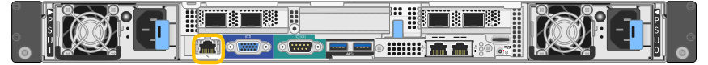

= Reunir informações de rede (SG100 e SG1000)
:allow-uri-read: 
:icons: font
:imagesdir: ../media/

[role="lead"]
Utilizando as tabelas, registe as informações necessárias para cada rede que ligar ao aparelho. Esses valores são necessários para instalar e configurar o hardware.

TIP: Em vez de usar as tabelas, use a pasta de trabalho fornecida com o ConfigBuilder. O uso da pasta de trabalho do ConfigBuilder permite que você carregue as informações do sistema e gere um arquivo JSON para concluir automaticamente algumas etapas de configuração no Instalador do StorageGRID Appliance. link:automating-appliance-installation-and-configuration.html["Automatize a instalação e a configuração do dispositivo"]Consulte .

== Verifique a versão do StorageGRID

Antes de instalar um dispositivo de serviços SG100 ou SG1000, confirme se o sistema StorageGRID está usando uma versão necessária do software StorageGRID.

[cols="1a,2a"]
|===
| Aparelho | Versão StorageGRID necessária 

 a| 
SG1000
 a| 
11,3 ou posterior (correção mais recente recomendada)

 a| 
SG100
 a| 
11,4 ou posterior (correção mais recente recomendada)

|===

== Portas de administração e manutenção

A rede de administração para StorageGRID é uma rede opcional, usada para administração e manutenção do sistema. O dispositivo se coneta à rede Admin usando as seguintes portas de gerenciamento de 1 GbE no dispositivo.

SG100 portas RJ-45:

image::../media/sg100_rj_45_ports_circled.png[SG100 portas RJ-45]

SG1000 portas RJ-45:

image::../media/sg1000_rj_45_ports_circled.png[SG1000 portas RJ-45]

[cols="2a,1a"]
|===
| Informações necessárias | O seu valor 

 a| 
Rede de administração ativada
 a| 
Escolha uma:

* Não
* Sim (predefinição)

 a| 
Modo de ligação de rede
 a| 
Escolha uma:

* Independente (predefinição)
* Ative-Backup

 a| 
Porta do switch para a porta esquerda circulada no diagrama (porta ativa padrão para o modo de ligação de rede independente)
 a| 

 a| 
Porta do switch para a porta direita circulada no diagrama (apenas modo de ligação de rede ative-Backup)
 a| 

 a| 
Endereço MAC para a porta Admin Network

*Nota:* a etiqueta de endereço MAC na parte frontal do dispositivo lista o endereço MAC da porta de gerenciamento BMC. Para determinar o endereço MAC da porta Admin Network, adicione *2* ao número hexadecimal na etiqueta. Por exemplo, se o endereço MAC na etiqueta terminar em *09*, o endereço MAC da porta Admin terminaria em *0B*. Se o endereço MAC na etiqueta terminar em *(_y_)FF*, o endereço MAC da porta Admin terminaria em *(_y_(1)01*. Você pode facilmente fazer esse cálculo abrindo o Calculator no Windows, definindo-o para o modo Programador, selecionando Hex, digitando o endereço MAC e, em seguida, digitando * 2 *.
 a| 

 a| 
Endereço IP atribuído pelo DHCP para a porta Admin Network, se disponível após a ativação

*Observação:* você pode determinar o endereço IP atribuído pelo DHCP usando o endereço MAC para procurar o IP atribuído.
 a| 
* Endereço IPv4 (CIDR):
* Gateway:

 a| 
Endereço IP estático que pretende utilizar para o nó de dispositivo na rede Admin

*Nota:* se a rede não tiver um gateway, especifique o mesmo endereço IPv4 estático para o gateway.
 a| 
* Endereço IPv4 (CIDR):
* Gateway:

 a| 
Sub-redes de rede Admin (CIDR)
 a| 

|===

== Portas de rede

As quatro portas de rede no dispositivo se conetam à rede de grade StorageGRID e à rede de cliente opcional.

[cols="2a,1a"]
|===
| Informações necessárias | O seu valor 

 a| 
Velocidade da ligação
 a| 
Para o SG100, escolha uma das seguintes opções:

* Auto (predefinição)
* 10 GbE
* 25 GbE

Para o SG1000, escolha uma das seguintes opções:

* Auto (predefinição)
* 10 GbE
* 25 GbE
* 40 GbE
* 100 GbE

*Nota:* para as velocidades de SG1000, 10 e 25 GbE requerem o uso de adaptadores QSA.

 a| 
Modo de ligação da porta
 a| 
Escolha uma:

* Fixo (padrão)
* Agregado

 a| 
Porta do switch para a porta 1 (rede do cliente para o modo fixo)
 a| 

 a| 
Porta do switch para a porta 2 (rede de grade para modo fixo)
 a| 

 a| 
Porta do switch para a porta 3 (rede do cliente para o modo fixo)
 a| 

 a| 
Porta do switch para a porta 4 (rede de grade para modo fixo)
 a| 

|===

== Portas de rede de grade

A rede de Grade para StorageGRID é uma rede necessária, usada para todo o tráfego interno de StorageGRID. O dispositivo se coneta à rede de grade usando as quatro portas de rede.

[cols="2a,1a"]
|===
| Informações necessárias | O seu valor 

 a| 
Modo de ligação de rede
 a| 
Escolha uma:

* Ative-Backup (padrão)
* Bola de Futsal (802,3ad)

 a| 
Marcação de VLAN ativada
 a| 
Escolha uma:

* Não (predefinição)
* Sim

 a| 
Etiqueta VLAN (se a marcação VLAN estiver ativada)
 a| 
Introduza um valor entre 0 e 4095:

 a| 
Endereço IP atribuído pelo DHCP para a rede de Grade, se disponível após a ativação
 a| 
* Endereço IPv4 (CIDR):
* Gateway:

 a| 
Endereço IP estático que pretende utilizar para o nó de dispositivo na rede de grelha

*Nota:* se a rede não tiver um gateway, especifique o mesmo endereço IPv4 estático para o gateway.
 a| 
* Endereço IPv4 (CIDR):
* Gateway:

 a| 
Sub-redes de rede de rede (CIDR)
 a| 

 a| 
Configuração da unidade de transmissão máxima (MTU) (opcional) você pode usar o valor padrão de 1500, ou definir a MTU para um valor adequado para quadros jumbo, como 9000.
 a| 

|===

== Portas de rede do cliente

A rede de cliente para StorageGRID é uma rede opcional, normalmente usada para fornecer acesso de protocolo de cliente à grade. O dispositivo se coneta à rede do cliente usando as quatro portas de rede.

[cols="2a,1a"]
|===
| Informações necessárias | O seu valor 

 a| 
Rede cliente ativada
 a| 
Escolha uma:

* Não (predefinição)
* Sim

 a| 
Modo de ligação de rede
 a| 
Escolha uma:

* Ative-Backup (padrão)
* Bola de Futsal (802,3ad)

 a| 
Marcação de VLAN ativada
 a| 
Escolha uma:

* Não (predefinição)
* Sim

 a| 
Etiqueta VLAN (se a marcação VLAN estiver ativada)
 a| 
Introduza um valor entre 0 e 4095:

 a| 
Endereço IP atribuído pelo DHCP para a rede do cliente, se disponível após a ligação
 a| 
* Endereço IPv4 (CIDR):
* Gateway:

 a| 
Endereço IP estático que pretende utilizar para o nó de dispositivo na rede Cliente

*Nota:* se a rede do cliente estiver ativada, a rota padrão no dispositivo usará o gateway especificado aqui.
 a| 
* Endereço IPv4 (CIDR):
* Gateway:

|===

== Portas de rede de gerenciamento BMC

Você pode acessar a interface BMC no utilitário de serviços usando a porta de gerenciamento de 1 GbE circulada no diagrama. Esta porta suporta a gestão remota do hardware do controlador através de Ethernet, utilizando a norma IPMI (Intelligent Platform Management Interface).

NOTE: Você pode ativar ou desativar o acesso remoto IPMI para todos os dispositivos que contêm um BMC. A interface IPMI remota permite o acesso de hardware de baixo nível aos seus dispositivos StorageGRID por qualquer pessoa com uma conta e senha do BMC. Se você não precisar de acesso remoto IPMI ao BMC, desative esta opção usando um dos seguintes métodos: No Gerenciador de Grade, vá para *CONFIGURATION* > *Security* > *Security* > *Security settings* > *Appliances* e desmarque a caixa de seleção *Enable Remote IPMI Access*. Na API de gerenciamento de grade, use o endpoint privado: `PUT /private/bmc`.

SG100 porta de gerenciamento BMC:

SG1000 porta de gerenciamento BMC:

image::../media/sg1000_bmc_management_port.png[SG1000 porta de gerenciamento BMC]

[cols="2a,1a"]
|===
| Informações necessárias | O seu valor 

 a| 
Porta do switch Ethernet, você se conetará à porta de gerenciamento BMC (circulada no diagrama)
 a| 

 a| 
Endereço IP atribuído por DHCP para a rede de gerenciamento BMC, se disponível após a inicialização
 a| 
* Endereço IPv4 (CIDR):
* Gateway:

 a| 
Endereço IP estático que pretende utilizar para a porta de gestão BMC
 a| 
* Endereço IPv4 (CIDR):
* Gateway:

|===

== Modos de ligação de porta

Ao configurar links de rede para os dispositivos SG100 e SG1000, você pode usar a ligação de portas para as portas que se conetam à rede de Grade e à rede cliente opcional e as portas de gerenciamento de 1 GbE que se conetam à rede de administração opcional. A ligação de portas ajuda a proteger os seus dados fornecendo caminhos redundantes entre as redes StorageGRID e o dispositivo.

=== Modos de ligação de rede

As portas de rede no dispositivo de serviços suportam o modo de ligação de porta fixa ou o modo de ligação de porta agregada para as conexões de rede de Grade e rede de cliente.

==== Modo de ligação de porta fixa

O modo de ligação de porta fixa é a configuração padrão para as portas de rede. As figuras mostram como as portas de rede no SG1000 ou SG100 são coladas no modo de ligação de porta fixa.

SG100:

image::../media/sg100_fixed_port.png[SG100 modo de ligação de porta fixa]

SG1000:

image::../media/sg1000_fixed_port.png[SG1000 modo de ligação de porta fixa]

[cols="1a,3a"]
|===
| Legenda | Quais portas estão coladas 

 a| 
C
 a| 
As portas 1 e 3 são Unidas para a rede do cliente, se esta rede for utilizada.

 a| 
G
 a| 
As portas 2 e 4 são Unidas para a rede de Grade.

|===
Ao usar o modo de ligação de porta fixa, as portas podem ser coladas usando o modo de backup ativo ou o modo de protocolo de controle de agregação de link (LACP 802,3ad).

* No modo de backup ativo (padrão), apenas uma porta está ativa por vez. Se a porta ativa falhar, sua porta de backup fornecerá automaticamente uma conexão de failover. A porta 4 fornece um caminho de backup para a porta 2 (rede de Grade) e a porta 3 fornece um caminho de backup para a porta 1 (rede de cliente).
* No modo LACP, cada par de portas forma um canal lógico entre o dispositivo de serviços e a rede, permitindo uma maior taxa de transferência. Se uma porta falhar, a outra continua a fornecer o canal. A taxa de transferência é reduzida, mas a conetividade não é afetada.

NOTE: Se você não precisar de conexões redundantes, você pode usar apenas uma porta para cada rede. No entanto, esteja ciente de que o alerta *Assistente de Serviços para baixo* pode ser acionado no Gerenciador de Grade após a instalação do StorageGRID, indicando que um cabo está desconetado. Você pode desativar esta regra de alerta com segurança.

==== Modo de ligação de porta agregada

O modo de ligação de porta agregada aumenta significativamente a taxa de transferência para cada rede StorageGRID e fornece caminhos de failover adicionais. Estas figuras mostram como as portas de rede são ligadas no modo de ligação de porta agregada.

SG100:

image::../media/sg100_aggregate_ports.png[SG100 modo de ligação de porta agregada]

SG1000:

image::../media/sg1000_aggregate_ports.png[SG1000 modo de ligação de porta agregada]

[cols="1a,3a"]
|===
| Legenda | Quais portas estão coladas 

 a| 
1
 a| 
Todas as portas conetadas são agrupadas em uma única ligação LACP, permitindo que todas as portas sejam usadas para o tráfego de rede de Grade e rede de Cliente.

|===
Se você planeja usar o modo de ligação de porta agregada:

* Você deve usar o modo de ligação de rede LACP.
* Você deve especificar uma tag VLAN exclusiva para cada rede. Essa tag VLAN será adicionada a cada pacote de rede para garantir que o tráfego de rede seja roteado para a rede correta.
* As portas devem ser conetadas a switches que possam suportar VLAN e LACP. Se vários switches estiverem participando da ligação LACP, os switches devem suportar grupos de agregação de links de vários gabinetes (MLAG) ou equivalente.
* Você entende como configurar os switches para usar VLAN, LACP e MLAG, ou equivalente.

Se você não quiser usar todas as quatro portas, você pode usar uma, duas ou três portas. O uso de mais de uma porta maximiza a chance de que alguma conetividade de rede permaneça disponível se uma das portas falhar.

NOTE: Se você optar por usar menos de quatro portas de rede, esteja ciente de que um alerta de link do dispositivo de serviços desativado* pode ser acionado no Gerenciador de Grade depois que o nó do dispositivo for instalado, indicando que um cabo está desconetado. Pode desativar esta regra de alerta com segurança para o alerta acionado.

=== Modos de ligação de rede para portas de gestão

Para as duas portas de gerenciamento de 1 GbE no dispositivo de serviços, você pode escolher o modo de ligação de rede independente ou o modo de ligação de rede ative-Backup para se conetar à rede Admin opcional. Estas figuras mostram como as portas de gerenciamento nos dispositivos são coladas no modo de ligação de rede para a rede Admin.

SG100:

image::../media/sg100_bonded_management_ports.png[SG100 portas de gerenciamento de rede conetadas]

SG1000:

image::../media/sg1000_bonded_management_ports.png[SG1000 portas de gerenciamento de rede conetadas]

[cols="1a,3a"]
|===
| Legenda | Modo de ligação de rede 

 a| 
A
 a| 
Modo ative-Backup (cópia de segurança ativa). Ambas as portas de gerenciamento são ligadas a uma porta de gerenciamento lógico conetada à rede de administração.

 a| 
I
 a| 
Modo independente. A porta à esquerda está ligada à rede de administração. A porta à direita está disponível para conexões locais temporárias (endereço IP 169.254.0.1).

|===
No modo independente, apenas a porta de gerenciamento à esquerda está conetada à rede de administração. Este modo não fornece um caminho redundante. A porta de gerenciamento à direita está desconetada e disponível para conexões locais temporárias (usa o endereço IP 169.254.0.1)

No modo ative-Backup, ambas as portas de gerenciamento estão conetadas à rede Admin. Apenas uma porta está ativa de cada vez. Se a porta ativa falhar, sua porta de backup fornecerá automaticamente uma conexão de failover. A ligação dessas duas portas físicas em uma porta de gerenciamento lógico fornece um caminho redundante para a rede de administração.

NOTE: Se você precisar fazer uma conexão local temporária com o dispositivo de serviços quando as portas de gerenciamento de 1 GbE estiverem configuradas para o modo ative-Backup, remova os cabos de ambas as portas de gerenciamento, conete o cabo temporário à porta de gerenciamento à direita e acesse o dispositivo usando o endereço IP 169.254.0.1.

.Informações relacionadas
* link:cabling-appliance.html["Aparelho de cabo"]
* link:setting-ip-configuration.html["Configurar endereços IP do StorageGRID"]

