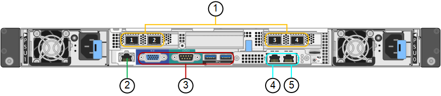

= Aparelhos SG100 e SG1000: Visão geral
:allow-uri-read: 
:icons: font
:imagesdir: ../media/

[role="lead"]
O dispositivo de serviços StorageGRID SG100 e o dispositivo de serviços SG1000 podem operar como um nó de gateway e como um nó de administrador para fornecer serviços de balanceamento de carga de alta disponibilidade em um sistema StorageGRID. Ambos os dispositivos podem operar como nós de gateway e nós de administração (primários ou não primários) ao mesmo tempo.

== Caraterísticas do aparelho

Ambos os modelos do dispositivo de serviços fornecem os seguintes recursos:

* Funções de nó de gateway ou nó de administrador para um sistema StorageGRID.
* O instalador do dispositivo StorageGRID para simplificar a implantação e a configuração de nós.
* Quando implantado, pode acessar o software StorageGRID de um nó de administrador existente ou de software baixado para uma unidade local. Para simplificar ainda mais o processo de implementação, uma versão recente do software é pré-carregada no dispositivo durante o fabrico.
* Um controlador de gerenciamento de placa base (BMC) para monitorar e diagnosticar alguns dos hardwares do dispositivo.
* A capacidade de se conetar a todas as três redes StorageGRID, incluindo a rede de Grade, a rede de Administração e a rede de Cliente:
+
** O SG100 suporta até quatro conexões de 10 ou 25 GbE à rede de Grade e à rede do cliente.
** O SG1000 suporta até quatro conexões de 10, 25, 40 ou 100 GbE à rede de Grade e à rede de Cliente.

== Diagramas SG100D e SG1000D.

Esta figura mostra a parte frontal do SG100 e do SG1000 com a moldura removida. Pela frente, os dois aparelhos são idênticos, exceto o nome do produto na moldura.

image::../media/sg1000_front_with_ssds.png[Frente com SSDs SG100 e SG1000]

As duas unidades de estado sólido (SSDs), indicadas pelo contorno laranja, são usadas para armazenar o sistema operacional StorageGRID e são espelhadas usando RAID 1 para redundância. Quando o dispositivo de serviços SG100 ou SG1000 é configurado como um nó Admin, essas unidades podem ser usadas para armazenar logs de auditoria, métricas e tabelas de banco de dados.

Os restantes slots de unidade estão em branco.

== Conetores SG100

Esta figura mostra os conetores na parte de trás do SG100.

[cols="1a,2a,2a,2a"]
|===
| Legenda | Porta | Tipo | Utilização 

 a| 
1
 a| 
Portas de rede 1-4
 a| 
10/25-GbE, com base no tipo de transcetor de cabo ou SFP (os módulos SFP28 e SFP mais são suportados), velocidade do switch e velocidade do link configurada
 a| 
Conete-se à rede de grade e à rede de cliente para StorageGRID.

 a| 
2
 a| 
Porta de gerenciamento de BMC
 a| 
1 GbE (RJ-45)
 a| 
Ligue ao controlador de gestão da placa de base do aparelho.

 a| 
3
 a| 
Portas de diagnóstico e suporte
 a| 
* VGA
* Série, 115200 8-N-1
* USB

 a| 
Reservado para uso de suporte técnico.

 a| 
4
 a| 
Admin Network port 1
 a| 
1 GbE (RJ-45)
 a| 
Ligue o dispositivo à rede de administração para StorageGRID.

 a| 
5
 a| 
Admin Network port 2
 a| 
1 GbE (RJ-45)
 a| 
Opções:

* Vincular com a porta de gerenciamento 1 para uma conexão redundante com a rede de administração para StorageGRID.
* Deixe desconetado e disponível para acesso local temporário (IP 169.254.0.1).
* Durante a instalação, use a porta 2 para configuração IP se os endereços IP atribuídos pelo DHCP não estiverem disponíveis.

|===

== Conetores SG1000

Esta figura mostra os conetores na parte de trás do SG1000.

image::../media/sg1000_rear_connectors.png[Conetores traseiros SG1000]

[cols="1a,2a,2a,2a"]
|===
| Legenda | Porta | Tipo | Utilização 

 a| 
1
 a| 
Portas de rede 1-4
 a| 
10/25/40/100-GbE, com base no tipo de cabo ou transcetor, velocidade do switch e velocidade do link configurada. Os transcetores QSFP28 e QSFP (40/100GbE) são suportados nativamente e os transcetores SFP28/SFP podem ser usados com um QSA (vendido separadamente) para usar velocidades 10/25GbE.
 a| 
Conete-se à rede de grade e à rede de cliente para StorageGRID.

 a| 
2
 a| 
Porta de gerenciamento de BMC
 a| 
1 GbE (RJ-45)
 a| 
Ligue ao controlador de gestão da placa de base do aparelho.

 a| 
3
 a| 
Portas de diagnóstico e suporte
 a| 
* VGA
* Série, 115200 8-N-1
* USB

 a| 
Reservado para uso de suporte técnico.

 a| 
4
 a| 
Admin Network port 1
 a| 
1 GbE (RJ-45)
 a| 
Ligue o dispositivo à rede de administração para StorageGRID.

 a| 
5
 a| 
Admin Network port 2
 a| 
1 GbE (RJ-45)
 a| 
Opções:

* Vincular com a porta de gerenciamento 1 para uma conexão redundante com a rede de administração para StorageGRID.
* Deixe desconetado e disponível para acesso local temporário (IP 169.254.0.1).
* Durante a instalação, use a porta 2 para configuração IP se os endereços IP atribuídos pelo DHCP não estiverem disponíveis.

|===

== Aplicações SG100 e SG1000

Você pode configurar os dispositivos de serviços StorageGRID de várias maneiras para fornecer serviços de gateway, bem como redundância de alguns serviços de administração de grade.

Os dispositivos podem ser implantados das seguintes maneiras:

* Adicionar a uma grade nova ou existente como um nó de gateway
* Adicione a uma nova grade como um nó de administração primário ou não primário ou a uma grade existente como um nó de administração não primário
* Opere como um nó de gateway e um nó de administrador (primário ou não primário) ao mesmo tempo

O dispositivo facilita o uso de grupos de alta disponibilidade (HA) e balanceamento de carga inteligente para conexões de caminho de dados S3 ou Swift.

Os exemplos a seguir descrevem como você pode maximizar os recursos do dispositivo:

* Use dois dispositivos SG100 ou dois SG1000 para fornecer serviços de gateway configurando-os como nós de gateway.
+

NOTE: Não implante os dispositivos de serviço SG100 e SG1000 no mesmo site. Pode resultar em performance imprevisível.

* Use dois dispositivos SG100 ou dois SG1000 para fornecer redundância de alguns serviços de administração de rede. Faça isso configurando cada dispositivo como nós de administração.
* Use dois dispositivos SG100 ou dois SG1000 para fornecer serviços de balanceamento de carga e modelagem de tráfego altamente disponíveis acessados por meio de um ou mais endereços IP virtuais. Faça isso configurando os dispositivos como qualquer combinação de nós de administrador ou nós de gateway e adicionando ambos os nós ao mesmo grupo de HA.
+

NOTE: Se você usar nós de administrador e nós de gateway no mesmo grupo de HA, a porta somente nó de administrador não fará failover. Consulte as instruções para https://docs.netapp.com/us-en/storagegrid-118/admin/configure-high-availability-group.html["Configuração de grupos de HA"^].

Quando usados com dispositivos de storage do StorageGRID, os dispositivos de serviços SG100 e SG1000 permitem a implantação de grades somente de dispositivos sem dependências em hipervisores externos ou hardware de computação.
