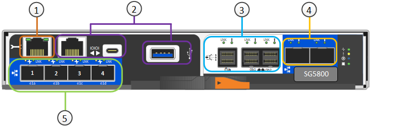

= Aparelhos SG5800: Visão geral
:allow-uri-read: 
:icons: font
:imagesdir: ../media/

[role="lead"]
Os dispositivos StorageGRID da série SG5800 são plataformas de storage e computação integradas que operam como nós de storage em uma grade StorageGRID.

Os aparelhos da série StorageGRID SG5800 oferecem os seguintes recursos:

* Integre os elementos de storage e computação para um nó de storage StorageGRID.
* Inclua o instalador do dispositivo StorageGRID para simplificar a implantação e a configuração do nó de storage.
* Inclua o e-Series SANtricity System Manager para gerenciamento e monitoramento de hardware.
* Suporte até quatro conexões de 10 GbE ou 25 GbE à rede de Grade StorageGRID e à rede de Cliente.
* Dar suporte a unidades Full Disk Encryption (FDE) ou unidades FIPS. Quando essas unidades são usadas com o recurso de Segurança da Unidade no Gerenciador de sistema do SANtricity, o acesso não autorizado aos dados é impedido.

O aparelho SG5800 está disponível em dois modelos: O SG5812 e o SG5860.

== SG5800 componentes

Os modelos SG5800 incluem os seguintes componentes:

[role="tabbed-block"]
====
.SG5812
--
Controlador de computação:: Controlador SG5800
Controlador de storage:: Controlador E4000
Chassis:: Compartimento e-Series DE212C, um compartimento de duas unidades de rack (2UU)
Unidades:: Unidades NL-SAS de 12 TB (3,5 polegadas)
Fontes de alimentação e ventiladores redundantes:: Dois coletores de ventilador de potência

--
.SG5860
--
Controlador de computação:: Controlador SG5800
Controlador de storage:: Controlador E4000
Chassis:: Compartimento e-Series DE460C, um compartimento de quatro unidades de rack (4UU)
Unidades:: Unidades NL-SAS de 60 TB (3,5 polegadas)
Fontes de alimentação e ventiladores redundantes:: Dois coletores de energia e dois coletores de ventilador

--
====
O storage bruto máximo disponível no dispositivo StorageGRID é fixo, com base no número de unidades em cada compartimento. Não é possível expandir o armazenamento disponível adicionando uma gaveta com unidades adicionais.

== SG5800 diagramas

=== SG5812 vistas dianteira e traseira

As figuras mostram a parte frontal e traseira do SG5812, um compartimento 2U com capacidade para 12 unidades.

image::../media/sg5812_front_and_back_views.png[A parte frontal e traseira do aparelho SG5812]

=== SG5812 componentes

O SG5812 inclui dois controladores e dois coletores de ventilador.

image::../media/sg5812_with_callouts.png[Controladores e coletores de ventilador no aparelho SG5812]

[cols="1a,3a"]
|===
| Legenda | Descrição 

 a| 
1
 a| 
Controlador E4000 (controlador de storage)

 a| 
2
 a| 
Controladora SG5800 (controlador de computação)

 a| 
3
 a| 
Coletores do ventilador de potência

|===

=== SG5860 vistas dianteira e traseira

As figuras mostram a parte frontal e traseira do modelo SG5860, um gabinete 4UU com capacidade para 60 unidades em 5 gavetas de unidade.

image::../media/sg5860_front_and_back_views.png[Parte frontal e traseira do aparelho SG5860]

=== SG5860 componentes

O SG5860 inclui dois controladores, dois coletores de ventilador e dois coletores de energia.

image::../media/sg5860_with_callouts.png[Controladores,fan canisters,and power canisters in SG5860 appliance]

[cols="1a,2a"]
|===
| Legenda | Descrição 

 a| 
1
 a| 
Controlador E4000 (controlador de storage)

 a| 
2
 a| 
Controladora SG5800 (controlador de computação)

 a| 
3
 a| 
Recipiente da ventoinha (1 de 2)

 a| 
4
 a| 
Recipiente de alimentação (1 de 2)

|===

== Controlador SG5800

Os modelos SG5812 de 12 unidades e SG5860 de 60 unidades do dispositivo StorageGRID incluem um controlador de computação SG5800 e um controlador de storage e-Series E4000.

=== Controlador de computação SG5800

* Opera como o servidor de computação do dispositivo.
* Inclui o instalador do dispositivo StorageGRID.
+

NOTE: O software StorageGRID não está pré-instalado no dispositivo. Este software é acessado a partir do Admin Node quando você implantar o dispositivo.

* Pode se conetar a todas as três redes StorageGRID, incluindo a rede de Grade, a rede Admin e a rede cliente.
* Liga-se ao controlador E4000 e funciona como iniciador.

==== Conetores SG5800

[cols="1a,2a,2a,2a"]
|===
| Legenda | Porta | Tipo | Utilização 

 a| 
1
 a| 
Porta de gerenciamento 1
 a| 
Ethernet de 1 GB (RJ-45)
 a| 
Conete-se à rede de administração para StorageGRID.

 a| 
2
 a| 
Portas de diagnóstico e suporte
 a| 
* Porta serial RJ-45
* Porta serial USB-C.
* Porta de USB

 a| 
Reservado para suporte técnico.

 a| 
3
 a| 
Portas de expansão da unidade
 a| 
SAS de 12GB GB/s.
 a| 
Não utilizado.

 a| 
4
 a| 
Portas de interconexão 1 e 2
 a| 
ISCSI de 25GbE GB
 a| 
Ligue o controlador SG5800 ao controlador E4000.

 a| 
5
 a| 
Portas de rede 1-4
 a| 
10 GbE ou 25 GbE, com base no tipo de transcetor SFP, na velocidade do switch e na velocidade do link configurada
 a| 
Conete-se à rede de grade e à rede de cliente para StorageGRID.

|===

=== Controlador de storage E4000

O controlador de armazenamento da série E4000 tem as seguintes especificações:

* Funciona como o controlador de armazenamento do dispositivo.
* Gerencia o armazenamento de dados nas unidades.
* Funciona como um controlador padrão da série e no modo simplex.
* Inclui o software SANtricity os (firmware do controlador).
* Inclui o Gerenciador de sistema do SANtricity para monitorar o hardware do dispositivo e gerenciar alertas, o recurso AutoSupport e o recurso de segurança da unidade.
* Liga-se ao controlador SG5800 e funciona como alvo.

==== Conetores E4000

image::../media/e4000_controller_with_callouts.png[Conetores no controlador E4000]

[cols="1a,2a,2a,2a"]
|===
| Legenda | Porta | Tipo | Utilização 

 a| 
1
 a| 
Porta de gerenciamento
 a| 
Ethernet de 1 GB (RJ-45)
 a| 
Opções de porta: ** Conete-se a uma rede de gerenciamento para habilitar o acesso direto TCP/IP ao Gerenciador de sistemas SANtricity ** deixe sem fio para salvar uma porta de switch e um endereço IP. Acesse o Gerenciador de sistema do SANtricity usando o Gerenciador de Grade ou o Instalador do dispositivo de Grade de armazenamento.

*Nota*: Algumas funcionalidades opcionais do SANtricity, como a sincronização NTP para carimbos de data/hora precisos de registo, não estão disponíveis quando optar por deixar a porta de gestão sem fios.

*Nota*: O StorageGRID 11,8 ou superior e o SANtricity 11,8 ou superior são necessários quando você deixa a porta de gerenciamento sem fio.

 a| 
2
 a| 
Portas de diagnóstico e suporte
 a| 
* Porta serial RJ-45
* Porta serial USB-C.
* Porta de USB

 a| 
Reservado para uso de suporte técnico.

 a| 
3
 a| 
Portas de expansão da unidade.
 a| 
SAS de 12GB GB/s.
 a| 
Não utilizado.

 a| 
4
 a| 
Portas de interconexão 1 e 2
 a| 
ISCSI de 25GbE GB
 a| 
Ligue o controlador E4000 ao controlador SG5800.

|===
.Informações relacionadas
https://docs.netapp.com/us-en/e-series-family/index.html["Documentação do NetApp e-Series"^]
