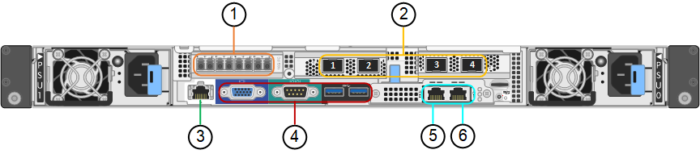

= Aparelhos SG6060 e SG6060X: Visão geral
:allow-uri-read: 
:icons: font
:imagesdir: ../media/

[role="lead"]
Os dispositivos StorageGRID SG6060 e SG6060X incluem um controlador de computação e um compartimento de controladores de storage que contém duas controladoras de storage e 60 unidades.

Opcionalmente, é possível adicionar gavetas de expansão de 60 unidades a ambos os dispositivos. Não existem diferenças funcionais ou de especificação entre o SG6060 e o SG6060X, exceto para a localização das portas de interconexão no controlador de armazenamento.

== Componentes SG6060 e SG6060X

Os aparelhos SG6060 e SG6060X incluem os seguintes componentes:

Controlador de computação:: O controlador SG6000-CN é um servidor de unidade de um rack (1UU) que inclui:
+
--
* 40 núcleos (80 threads)
* 192 GB DE RAM
* Até 4 x 25 Gbps de largura de banda agregada Ethernet
* Interconexão Fibre Channel (FC) de 4 x 16 Gbps
* Controlador de gerenciamento de placa base (BMC) que simplifica o gerenciamento de hardware
* Fontes de alimentação redundantes

--
Compartimento do controlador de storage:: O compartimento de controladora e-Series E2860 (storage array) é uma gaveta de 4UU que inclui:
+
--
* Dois controladores da série E2800 (configuração duplex) para fornecer suporte a failover do controlador de armazenamento
+
** O SG6060 contém E2800A controladores de storage
** O SG6060X contém E2800B controladores de storage

* Compartimento de unidade de cinco gavetas com capacidade para sessenta unidades de 3,5 polegadas (2 unidades de estado sólido, ou SSDs e 58 unidades NL-SAS)
* Fontes de alimentação e ventiladores redundantes

--
Opcional: Prateleiras de expansão de storage:: Cada dispositivo SG6060 e SG6060X pode ter um ou dois compartimentos de expansão para um total de 180 unidades (duas dessas unidades são reservadas para o cache de leitura e-Series).
+
--
*Observação:* as prateleiras de expansão podem ser instaladas durante a implantação inicial ou adicionadas posteriormente.

O compartimento e-Series DE460C é um compartimento de 4U TB que inclui:

* Dois módulos de entrada/saída (IOMs)
* Cinco gavetas, cada uma com capacidade para 12 unidades NL-SAS, para um total de 60 unidades
* Fontes de alimentação e ventiladores redundantes

--

== Diagramas SG6060D e SG6060XD.

As frentes dos anos SG6060 e SG6060X são idênticas.

=== Vista frontal SG6060 ou SG6060X

Esta figura mostra a frente do SG6060 ou SG6060X, que inclui uma controladora de computação de 1U TB e uma gaveta de 4U TB que contém duas controladoras de storage e 60 unidades em cinco gavetas de unidades.

image::../media/sg6060_front_view_with_and_without_bezels.gif[SG6060 Vista frontal]

[cols="1a,2a"]
|===
| Legenda | Descrição 

 a| 
1
 a| 
Controlador de computação SG6000-CN com moldura frontal

 a| 
2
 a| 
Compartimento do controlador E2860 com painel frontal (compartimento de expansão opcional aparece idêntico)

 a| 
3
 a| 
Controlador de computação SG6000-CN com painel frontal removido

 a| 
4
 a| 
Compartimento do controlador E2860 com painel frontal removido (o compartimento de expansão opcional aparece idêntico)

|===
Esta figura mostra a localização da fonte de alimentação e identifica LEDs na parte traseira do controlador de computação SG6000-CN usado nos modelos SG6060 e SG6060X. Os LEDs de status e atividade adicionais estão nas portas do aparelho. Estes LEDs podem variar de acordo com o modelo do aparelho.

image::../media/q2023_rear_leds.png[LEDs traseiros SG6000-CN]

[cols="1a,2a,3a"]
|===
| Legenda | LED | Estado 

 a| 
1
 a| 
LED da fonte de alimentação
 a| 
* Verde, sólido: Energia aplicada ao aparelho, botão de alimentação está ligado.
* Verde, intermitente: Alimentação aplicada ao aparelho, o botão de alimentação está desligado.
* Desligado: sem alimentação aplicada ao aparelho.
* Âmbar: Falha na alimentação de energia.

 a| 
2
 a| 
Identifique o LED
 a| 
* Azul intermitente: Identifica o aparelho no gabinete ou rack.
* Azul, sólido: Identifica o aparelho no gabinete ou rack.
* Desligado: O aparelho não é visualmente identificável no gabinete ou no rack.

|===

=== Vista traseira de SG6060 mm

Essa figura mostra a parte traseira do SG6060, incluindo controladores de computação e storage, ventiladores e fontes de alimentação.

image::../media/sg6060_rear_view.gif[SG6060 Vista traseira]

[cols="1a,2a"]
|===
| Legenda | Descrição 

 a| 
1
 a| 
Fonte de alimentação (1 de 2) para o controlador de computação SG6000-CN

 a| 
2
 a| 
Conetores para controlador de computação SG6000-CN

 a| 
3
 a| 
Ventilador (1 de 2) para compartimento do controlador E2860

 a| 
4
 a| 
Controlador de armazenamento e-Series E2800A (1 de 2) e conetores

 a| 
5
 a| 
Fonte de alimentação (1 de 2) para o compartimento do controlador E2860

|===

=== Vista traseira de SG6060X mm

Esta figura mostra a parte de trás do SG6060X.

image::../media/sg6060x_rear_view.gif[SG6060x Vista traseira]

[cols="1a,2a"]
|===
| Legenda | Descrição 

 a| 
1
 a| 
Fonte de alimentação (1 de 2) para o controlador de computação SG6000-CN

 a| 
2
 a| 
Conetores para controlador de computação SG6000-CN

 a| 
3
 a| 
Ventilador (1 de 2) para compartimento do controlador E2860

 a| 
4
 a| 
Controlador de armazenamento e-Series E2800B (1 de 2) e conetores

 a| 
5
 a| 
Fonte de alimentação (1 de 2) para o compartimento do controlador E2860

|===

=== Compartimento de expansão

Esta figura mostra a parte traseira do compartimento de expansão opcional para o SG6060 e SG6060X, incluindo os módulos de entrada/saída (IOMs), ventiladores e fontes de alimentação. Cada SG6060 pode ser instalado com uma ou duas prateleiras de expansão, que podem ser incluídas na instalação inicial ou adicionadas posteriormente.

image::../media/de460c_expansion_shelf_rear_view.gif[Prateleira de expansão traseira]

[cols="1a,2a"]
|===
| Legenda | Descrição 

 a| 
1
 a| 
Ventilador (1 de 2) para a prateleira de expansão

 a| 
2
 a| 
IOM (1 de 2) para compartimento de expansão

 a| 
3
 a| 
Fonte de alimentação (1 de 2) para o compartimento de expansão

|===

== SG6000 controladoras

Cada modelo do dispositivo StorageGRID SG6000 inclui um controlador de computação SG6000-CN em um compartimento 1U e controladores de storage duplex e-Series em um compartimento 2U ou 4U, dependendo do modelo. Reveja os diagramas para saber mais sobre cada tipo de controlador.

=== Controlador de computação SG6000-CN

* Fornece recursos de computação para o dispositivo.
* Inclui o instalador do dispositivo StorageGRID.
+

NOTE: O software StorageGRID não está pré-instalado no dispositivo. Este software é recuperado a partir do Admin Node quando você implementa o dispositivo.

* Pode se conetar a todas as três redes StorageGRID, incluindo a rede de Grade, a rede Admin e a rede cliente.
* Conecta-se aos controladores de storage e-Series e opera como iniciador.

==== Conetores SG6000-CN

[cols="1a,2a,2a,3a"]
|===
| Legenda | Porta | Tipo | Utilização 

 a| 
1
 a| 
Portas de interconexão 1-4
 a| 
Fibre Channel (FC) de 16 GB/s, com ótica integrada
 a| 
Ligue o controlador SG6000-CN aos controladores E2800 (duas ligações a cada E2800).

 a| 
2
 a| 
Portas de rede 1-4
 a| 
10 GbE ou 25 GbE, com base no tipo de transcetor de cabo ou SFP, na velocidade do switch e na velocidade do link configurada
 a| 
Conete-se à rede de grade e à rede de cliente para StorageGRID.

 a| 
3
 a| 
Porta de gerenciamento de BMC
 a| 
1 GbE (RJ-45)
 a| 
Conete-se ao controlador de gerenciamento de placa base SG6000-CN.

 a| 
4
 a| 
Portas de diagnóstico e suporte
 a| 
* VGA
* Série, 115200 8-N-1
* USB

 a| 
Reservado para uso de suporte técnico.

 a| 
5
 a| 
Admin Network port 1
 a| 
1 GbE (RJ-45)
 a| 
Ligue o SG6000-CN à rede de administração para StorageGRID.

 a| 
6
 a| 
Admin Network port 2
 a| 
1 GbE (RJ-45)
 a| 
Opções:

* Vincular com a porta de gerenciamento 1 para uma conexão redundante com a rede de administração para StorageGRID.
* Deixe desconetado e disponível para acesso local temporário (IP 169.254.0.1).
* Durante a instalação, use a porta 2 para configuração IP se os endereços IP atribuídos pelo DHCP não estiverem disponíveis.

|===

=== SGF6024: EF570 controladoras de storage

* Duas controladoras para suporte a failover.
* Gerenciar o armazenamento de dados nas unidades.
* Funciona como controladores padrão da série e em uma configuração duplex.
* Inclua o software SANtricity os (firmware do controlador).
* Inclua o Gerenciador do sistema do SANtricity para monitorar o hardware de armazenamento e gerenciar alertas, o recurso AutoSupport e o recurso de segurança da unidade.
* Conete-se ao controlador SG6000-CN e forneça acesso ao armazenamento flash.

==== Conetores EF570

image::../media/ef570_rear_connectors.gif[EF570 conetores traseiros]

[cols="1a,2a,2a,3a"]
|===
| Legenda | Porta | Tipo | Utilização 

 a| 
1
 a| 
Portas de interconexão 1 e 2
 a| 
SFP ótico FC de 16 GB/s.
 a| 
Ligue cada um dos controladores EF570 ao controlador SG6000-CN.

Existem quatro ligações ao controlador SG6000-CN (duas de cada EF570).

 a| 
2
 a| 
Portas de diagnóstico e suporte
 a| 
* Porta serial RJ-45
* Porta serial micro USB
* Porta de USB

 a| 
Reservado para uso de suporte técnico.

 a| 
3
 a| 
Portas de expansão da unidade
 a| 
SAS de 12GB GB/s.
 a| 
Não utilizado. O dispositivo SGF6024 não é compatível com compartimentos de unidades de expansão.

 a| 
4
 a| 
Portas de gerenciamento 1 e 2
 a| 
Ethernet de 1 GB (RJ-45)
 a| 
* A porta 1 coneta-se à rede onde você acessa o Gerenciador de sistema do SANtricity em um navegador.
* A porta 2 está reservada para uso de suporte técnico.

|===

=== SG6060 e SG6060X: E2800 controladoras de storage

* Duas controladoras para suporte a failover.
* Gerenciar o armazenamento de dados nas unidades.
* Funciona como controladores padrão da série e em uma configuração duplex.
* Inclua o software SANtricity os (firmware do controlador).
* Inclua o Gerenciador do sistema do SANtricity para monitorar o hardware de armazenamento e gerenciar alertas, o recurso AutoSupport e o recurso de segurança da unidade.
* Conete-se ao controlador SG6000-CN e forneça acesso ao armazenamento.

O SG6060 e o SG6060X usam controladores de storage E2800.

[cols="1a,2a,2a"]
|===
| Aparelho | Controlador | Controlador HIC 

 a| 
SG6060
 a| 
Dois controladores de storage E2800A
 a| 
Nenhum

 a| 
SG6060X
 a| 
Dois controladores de storage E2800B
 a| 
HIC de quatro portas

|===
Os controladores de storage E2800A e E2800B são idênticos em especificações e funções, exceto para a localização das portas de interconexão.

CAUTION: Não utilize um E2800A e um E2800B no mesmo aparelho.

==== Conetores E2800A

image::../media/e2800_controller_with_callouts.gif[Conetores no controlador E2800A]

[cols="1a,2a,2a,3a"]
|===
| Legenda | Porta | Tipo | Utilização 

 a| 
1
 a| 
Portas de interconexão 1 e 2
 a| 
SFP ótico FC de 16 GB/s.
 a| 
Ligue cada um dos controladores E2800A ao controlador SG6000-CN.

Existem quatro ligações ao controlador SG6000-CN (duas de cada E2800A).

 a| 
2
 a| 
Portas de gerenciamento 1 e 2
 a| 
Ethernet de 1 GB (RJ-45)
 a| 
* Opções da porta 1:
+
** Conete-se a uma rede de gerenciamento para permitir o acesso direto TCP/IP ao Gerenciador de sistemas SANtricity
** Deixe sem fio para salvar uma porta do switch e um endereço IP. Acesse o Gerenciador de sistema do SANtricity usando o Gerenciador de Grade ou o Instalador do dispositivo de Grade de armazenamento.

*Nota*: Algumas funcionalidades opcionais do SANtricity, como a sincronização NTP para carimbos de data/hora precisos de registo, não estão disponíveis quando optar por deixar a porta 1 sem fios.

*Nota*: StorageGRID 11,5 ou superior e SANtricity 11,70 ou superior são necessários quando você deixa a porta 1 sem fio.

* A porta 2 está reservada para uso de suporte técnico.

 a| 
3
 a| 
Portas de diagnóstico e suporte
 a| 
* Porta serial RJ-45
* Porta serial micro USB
* Porta de USB

 a| 
Reservado para uso de suporte técnico.

 a| 
4
 a| 
Portas de expansão da unidade 1 e 2
 a| 
SAS de 12GB GB/s.
 a| 
Conete as portas às portas de expansão da unidade nas IOMs no compartimento de expansão.

|===

==== Conetores E2800B

image::../media/e2800B_controller_with_callouts.gif[Conetores no controlador E2800B]

[cols="1a,2a,2a,3a"]
|===
| Legenda | Porta | Tipo | Utilização 

 a| 
1
 a| 
Portas de interconexão 1 e 2
 a| 
SFP ótico FC de 16 GB/s.
 a| 
Ligue cada um dos controladores E2800B ao controlador SG6000-CN.

Existem quatro ligações ao controlador SG6000-CN (duas de cada E2800B).

 a| 
2
 a| 
Portas de gerenciamento 1 e 2
 a| 
Ethernet de 1 GB (RJ-45)
 a| 
* Opções da porta 1:
+
** Conete-se a uma rede de gerenciamento para permitir o acesso direto TCP/IP ao Gerenciador de sistemas SANtricity
** Deixe sem fio para salvar uma porta do switch e um endereço IP. Acesse o Gerenciador de sistema do SANtricity usando o Gerenciador de Grade ou o Instalador do dispositivo de Grade de armazenamento.

*Nota*: Algumas funcionalidades opcionais do SANtricity, como a sincronização NTP para carimbos de data/hora precisos de registo, não estão disponíveis quando optar por deixar a porta 1 sem fios.

*Nota*: StorageGRID 11,5 ou superior e SANtricity 11,70 ou superior são necessários quando você deixa a porta 1 sem fio.

* A porta 2 está reservada para uso de suporte técnico.

 a| 
3
 a| 
Portas de diagnóstico e suporte
 a| 
* Porta serial RJ-45
* Porta serial micro USB
* Porta de USB

 a| 
Reservado para uso de suporte técnico.

 a| 
4
 a| 
Portas de expansão da unidade 1 e 2
 a| 
SAS de 12GB GB/s.
 a| 
Conete as portas às portas de expansão da unidade nas IOMs no compartimento de expansão.

|===

=== SG6060 e SG6060X: IOMs para compartimentos de expansão opcionais

O compartimento de expansão contém dois módulos de entrada/saída (IOMs) que se conectam aos controladores de storage ou a outros compartimentos de expansão.

==== Conetores IOM

image::../media/iom_connectors.gif[Traseira IOM]

[cols="1a,2a,2a,3a"]
|===
| Legenda | Porta | Tipo | Utilização 

 a| 
1
 a| 
Portas de expansão da unidade 1-4
 a| 
SAS de 12GB GB/s.
 a| 
Conecte cada porta aos controladores de storage ou ao compartimento de expansão adicional (se houver).

|===