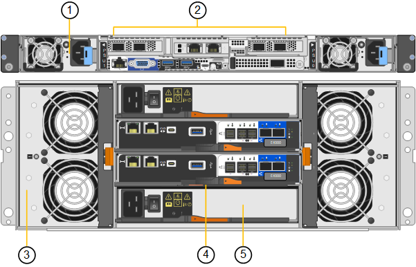

= Aparelhos SG6100: Visão geral
:allow-uri-read: 
:icons: font
:imagesdir: ../media/

[role="lead"]
Os dispositivos da série StorageGRID SG6100 operam como nós de storage em um sistema StorageGRID. Como todos os dispositivos StorageGRID, eles podem ser misturados livremente com outros modelos de dispositivo e nós somente de software em uma única implantação.

O dispositivo StorageGRID SG6160 inclui uma controladora de computação com um par de SSDs NVMe que funcionam como cache de leitura e um compartimento de controladora de storage que contém duas controladoras de storage e unidades de disco rígido NL-SAS de 60 TB. Ele pode ser expandido para até 180 unidades de disco rígido NL-SAS com a adição de até dois compartimentos de expansão opcionais. O dispositivo StorageGRID SGF6112 é um dispositivo all-flash com um fator forma compacto de 1UU preenchido com SSDs NVMe de 12 TB.

Os aparelhos SGF6112 e SG6160 fornecem as seguintes caraterísticas:

* Integra os elementos de storage e computação de um nó de storage da StorageGRID.
* Inclui o instalador do dispositivo StorageGRID para simplificar a implantação e a configuração do nó de storage.
* Inclui um controlador de gerenciamento de placa base (BMC) para monitorar e diagnosticar o hardware no controlador de computação.

O SGF6112 fornece os seguintes recursos de proteção de dados:

* Capacidade de funcionar após a falha de um único SSD sem impactos na disponibilidade de objetos.
* Capacidade de funcionar após várias falhas SSD com uma redução mínima necessária na disponibilidade de objetos (com base no design do esquema RAID subjacente).
+

NOTE: Dependendo da política de ILM configurada, as solicitações de objetos localmente indisponíveis podem ser atendidas por outros nós, portanto, geralmente não haverá redução na disponibilidade.

* Totalmente recuperável, durante o serviço, de falhas de SSD que não resultam em danos extremos ao RAID que hospeda o volume raiz do nó (o sistema operacional StorageGRID).
* Os dados de objetos podem ser restaurados automaticamente a partir de cópias ou blocos codificados de apagamento em outros nós se várias falhas de SSD resultarem na perda de dados locais.

O SG6160 fornece os seguintes recursos de proteção de dados:

* Capacidade de funcionar após a falha de quaisquer dois discos rígidos (HDDs) sem impactos na disponibilidade de objetos.
* Evacuação e reconstrução rápidas de HDDs durante eventos de falha e substituição (quando configurado para DDP ou DDP16 durante a instalação), aumentando a durabilidade dos dados em relação ao padrão RAID6.
* Totalmente recuperável, enquanto estiver em serviço, pela falha de quaisquer dois HDDs.
* Os dados de objetos podem ser restaurados automaticamente a partir de cópias ou blocos codificados de apagamento em outros nós se várias falhas de HDD resultarem na perda de dados locais.

== SG6100 componentes de hardware

=== SGF6112 aparelho

O aparelho SGF6112 inclui os seguintes componentes:

Plataforma de computação e storage:: Um servidor de unidade de um rack (1UU) que inclui:
+
--
* Dois processadores de 2,1/2,6 GHz 165 W que fornecem 48 núcleos (96 threads)
* 256 GB DE RAM
* 2 portas Gbase-T de 1/10 mm
* 4 portas Ethernet de 10/25 GbE para tráfego de rede Grid/Client
* 1 x unidade de inicialização interna de 256 GB (inclui software StorageGRID)
* Controlador de gerenciamento de placa base (BMC) que simplifica o gerenciamento de hardware
* Fontes de alimentação e ventiladores redundantes

--

=== SG6160 aparelho

O aparelho SG6160 inclui os seguintes componentes:

Controlador de computação:: O controlador SG6100-CN é um servidor de unidade de um rack (1UU) que inclui:
+
--
* 48 núcleos (96 threads)
* 256 GB DE RAM
* Largura de banda Ethernet agregada de até 4 x 25 GbE (ou até 4 x 100 GbE com SKU de NIC 100g opcional)
* 1 interconexão de 100 GbE
* Dois SSDs NVMe para cache de leitura
* Controlador de gerenciamento de placa base (BMC) que simplifica o gerenciamento de hardware
* Fontes de alimentação e ventiladores redundantes

--
Compartimento do controlador de storage:: O compartimento de controladora e-Series E4000 (storage array) é uma gaveta de 4UU que inclui:
+
--
* Dois controladores da série E4000 (configuração duplex) para fornecer suporte a failover do controlador de armazenamento
* Compartimento de unidade com cinco gavetas que acomoda sessenta unidades NL-SAS de 3,5 polegadas
* Fontes de alimentação e ventiladores redundantes

--
Opcional: Prateleiras de expansão de storage:: Cada dispositivo SG6160 pode ter uma ou duas gavetas de expansão para um total de 180 unidades.
+
--

NOTE: Os compartimentos de expansão podem ser instalados durante a implantação inicial ou adicionados posteriormente.

O compartimento e-Series DE460C é um compartimento de 4U TB que inclui:

* Dois módulos de entrada/saída (IOMs)
* Cinco gavetas, cada uma com capacidade para 12 unidades NL-SAS, para um total de 60 unidades
* Fontes de alimentação e ventiladores redundantes

--

== Diagramas SGF6112D e SG6160D.

=== Vista dianteira SGF6112D.

Esta figura mostra a parte frontal do SGF6112 sem a moldura. O dispositivo inclui uma plataforma de computação e storage 1U que contém 12 unidades SSD.

image::../media/sgf6112_front_with_ssds.png[SGF6112 Vista frontal]

=== Vista traseira de SGF6112 mm

Esta figura mostra a parte de trás do SGF6112, incluindo as portas, os ventiladores e as fontes de alimentação.

image::../media/sgf6112_rear_view.png[SGF6112 Vista traseira]

[cols="1a,2a,2a,2a"]
|===
| Legenda | Porta | Tipo | Utilização 

 a| 
1
 a| 
Portas de rede 1-4
 a| 
10/25-GbE, com base no tipo de transcetor de cabo ou SFP (os módulos SFP28 e SFP mais são suportados), velocidade do switch e velocidade do link configurada.
 a| 
Conete-se à rede de grade e à rede de cliente para StorageGRID.

 a| 
2
 a| 
Porta de gerenciamento de BMC
 a| 
1 GbE (RJ-45)
 a| 
Ligue ao controlador de gestão da placa de base do aparelho.

 a| 
3
 a| 
Portas de diagnóstico e suporte
 a| 
* VGA
* USB
* Porta de console micro-USB
* Micro-SD slot module

 a| 
Reservado para uso de suporte técnico.

 a| 
4
 a| 
Admin Network port 1
 a| 
1/10-GbE (RJ-45)
 a| 
Ligue o dispositivo à rede de administração para StorageGRID.

 a| 
5
 a| 
Admin Network port 2
 a| 
1/10-GbE (RJ-45)
 a| 
Opções:

* Vincular com a porta de rede de administração 1 para uma conexão redundante com a rede de administração para StorageGRID.
* Deixe desconetado e disponível para acesso local temporário (IP 169.254.0.1).
* Durante a instalação, use a porta 2 para configuração IP se os endereços IP atribuídos pelo DHCP não estiverem disponíveis.

|===
Esta figura mostra a localização da fonte de alimentação e identifica os LEDs na parte traseira do SGF6112. Os LEDs de status e atividade adicionais estão nas portas do aparelho. Estes LEDs podem variar de acordo com o modelo do aparelho.

image::../media/q2024_rear_leds.png[LEDs traseiros SGF6112]

[cols="1a,2a,3a"]
|===
| Legenda | LED | Estado 

 a| 
1
 a| 
LED da fonte de alimentação
 a| 
* Verde, sólido: Energia aplicada ao aparelho, botão de alimentação está ligado.
* Verde, intermitente: Alimentação aplicada ao aparelho, o botão de alimentação está desligado.
* Desligado: sem alimentação aplicada ao aparelho.
* Âmbar: Falha na alimentação de energia.

 a| 
2
 a| 
Identifique o LED
 a| 
* Azul intermitente: Identifica o aparelho no gabinete ou rack.
* Azul, sólido: Identifica o aparelho no gabinete ou rack.
* Desligado: O aparelho não é visualmente identificável no gabinete ou no rack.

|===

=== Vista dianteira SG6160D.

Esta figura mostra a parte frontal do SG6160, que inclui uma controladora de computação de 1U TB e uma gaveta de 4U TB contendo duas controladoras de storage e 60 unidades em cinco gavetas de unidades.

image::../media/sg6160_front_view_without_bezels.png[SG6160 Vista frontal]

[cols="1a,2a"]
|===
| Legenda | Descrição 

 a| 
1
 a| 
Controlador de computação SG6100-CN com painel frontal removido

 a| 
2
 a| 
Compartimento do controlador E4000 com painel frontal removido (o compartimento de expansão opcional aparece idêntico)

|===

=== Vista traseira de SG6160 mm

Essa figura mostra a parte traseira do SG6160, incluindo controladores de computação e storage, ventiladores e fontes de alimentação.

[cols="1a,2a"]
|===
| Legenda | Descrição 

 a| 
1
 a| 
Fonte de alimentação (1 de 2) para o controlador de computação SG6100-CN

 a| 
2
 a| 
Conetores para controlador de computação SG6100-CN

 a| 
3
 a| 
Ventilador (1 de 2) para compartimento do controlador E4000

 a| 
4
 a| 
Controlador de armazenamento e-Series E400 (1 de 2) e conetores

 a| 
5
 a| 
Fonte de alimentação (1 de 2) para o compartimento do controlador E4000

|===

== SG6100 controladoras

=== Controlador de computação SG6100-CN

* Fornece recursos de computação para o dispositivo.
* Inclui o instalador do dispositivo StorageGRID.
+

NOTE: O software StorageGRID não está pré-instalado no dispositivo. Este software é recuperado a partir do Admin Node quando você implementa o dispositivo.

* Pode se conetar a todas as três redes StorageGRID, incluindo a rede de Grade, a rede Admin e a rede cliente.
* Conecta-se aos controladores de storage e-Series e opera como iniciador.

Esta figura mostra as portas na parte de trás do controlador de computação SG6100-CN.

image::../media/sg6100_cn_rear_connectors.png[Conetores traseiros SG6100-CN]

[cols="1a,2a,2a,3a"]
|===
| Legenda | Porta | Tipo | Utilização 

 a| 
1
 a| 
Portas de rede 1-4
 a| 
* 10/25-GbE com base no tipo de transcetor de cabo ou SFP (os módulos SFP28 e SFP mais são suportados), velocidade do switch e velocidade do link configurada.
* Com SKU NIC 100g opcional (somente SG6160), 10/25/40/100-GbE baseado no tipo de cabo ou transcetor, velocidade do switch e velocidade de link configurada. QSFP56 GbE (limitado a 100GbE GbE/porta), QSFP28 GbE (100GbE GbE) e QSFP (40GbE GbE) são suportados nativamente. Transcetores SFP (10GbE) ou SFP28 (25GbE) opcionais podem ser usados com um QSA (vendido separadamente).

 a| 
Conete-se à rede de grade e à rede de cliente para StorageGRID.

 a| 
2
 a| 
Porta de gerenciamento de BMC
 a| 
1 GbE (RJ-45)
 a| 
Conete-se ao controlador de gerenciamento de placa base SG6100-CN.

 a| 
3
 a| 
Portas de diagnóstico e suporte
 a| 
* VGA
* USB
* Porta de console micro-USB
* Micro-SD slot module

 a| 
Reservado para uso de suporte técnico.

 a| 
4
 a| 
Admin Network port 1
 a| 
1/10-GbE (RJ-45)
 a| 
Ligue o SG6100-CN à rede de administração para StorageGRID.

 a| 
5
 a| 
Admin Network port 2
 a| 
1/10-GbE (RJ-45)
 a| 
Opções:

* Vincular com a porta de gerenciamento 1 para uma conexão redundante com a rede de administração para StorageGRID.
* Deixe desconetado e disponível para acesso local temporário (IP 169.254.0.1).
* Durante a instalação, use a porta 2 para configuração IP se os endereços IP atribuídos pelo DHCP não estiverem disponíveis.

 a| 
6
 a| 
Porta de interconexão
 a| 
100-GbE
 a| 
Ligue o controlador SG6100-CN aos controladores E4000.

|===
Esta figura mostra a localização da fonte de alimentação e identifica LEDs na parte traseira do controlador de computação SG6100-CN. Os LEDs de status e atividade adicionais estão nas portas do aparelho. Estes LEDs podem variar de acordo com o modelo do aparelho.

image::../media/q2023_rear_leds.png[LEDs traseiros SG6100-CN]

[cols="1a,2a,3a"]
|===
| Legenda | LED | Estado 

 a| 
1
 a| 
LED da fonte de alimentação
 a| 
* Verde, sólido: Energia aplicada ao aparelho, botão de alimentação está ligado.
* Verde, intermitente: Alimentação aplicada ao aparelho, o botão de alimentação está desligado.
* Desligado: sem alimentação aplicada ao aparelho.
* Âmbar: Falha na alimentação de energia.

 a| 
2
 a| 
Identifique o LED
 a| 
* Azul intermitente: Identifica o aparelho no gabinete ou rack.
* Azul, sólido: Identifica o aparelho no gabinete ou rack.
* Desligado: O aparelho não é visualmente identificável no gabinete ou no rack.

|===

=== SG6160: Controlador de armazenamento E4000

* Duas controladoras para suporte a failover.
* Gerenciar o armazenamento de dados nas unidades.
* Funciona como controladores padrão da série e em uma configuração duplex.
* Inclua o software SANtricity os (firmware do controlador).
* Inclua o Gerenciador do sistema do SANtricity para monitorar o hardware de armazenamento e gerenciar alertas, o recurso AutoSupport e o recurso de segurança da unidade.
* Conete-se ao controlador SG6100-CN e forneça acesso ao armazenamento.

image::../media/e4000_controller_with_callouts.png[Conetores no controlador E4000]

[cols="1a,2a,2a,3a"]
|===
| Legenda | Porta | Tipo | Utilização 

 a| 
1
 a| 
Porta de gerenciamento 1
 a| 
Ethernet de 1 GB (RJ-45)
 a| 
* Opções da porta 1:
+
** Conete-se a uma rede de gerenciamento para permitir o acesso direto TCP/IP ao Gerenciador de sistemas SANtricity
** Deixe sem fio para salvar uma porta do switch e um endereço IP. Acesse o Gerenciador de sistema do SANtricity usando o Gerenciador de Grade ou o Instalador do dispositivo de Grade de armazenamento.

*Nota*: Algumas funcionalidades opcionais do SANtricity, como a sincronização NTP para carimbos de data/hora precisos de registo, não estão disponíveis quando optar por deixar a porta 1 sem fios.

 a| 
2
 a| 
Portas de diagnóstico e suporte
 a| 
* Porta serial RJ-45
* Porta serial micro USB
* Porta de USB

 a| 
Reservado para uso de suporte técnico.

 a| 
3
 a| 
Portas de expansão da unidade 1 e 2
 a| 
SAS de 12GB GB/s.
 a| 
Conete as portas às portas de expansão da unidade nas IOMs no compartimento de expansão.

 a| 
4
 a| 
Portas de interconexão 1 e 2
 a| 
ISCSI de 25GbE GB
 a| 
Ligue cada um dos controladores E4000 ao controlador SG6100-CN.

Existem quatro ligações ao controlador SG6100-CN (duas de cada E4000).

|===

=== SG6160: IOMs para compartimentos de expansão opcionais

O compartimento de expansão contém dois módulos de entrada/saída (IOMs) que se conectam aos controladores de storage ou a outros compartimentos de expansão.

==== Conetores IOM

image::../media/iom_connectors.gif[Traseira IOM]

[cols="1a,2a,2a,3a"]
|===
| Legenda | Porta | Tipo | Utilização 

 a| 
1
 a| 
Portas de expansão da unidade 1-4
 a| 
SAS de 12GB GB/s.
 a| 
Conecte cada porta aos controladores de storage ou ao compartimento de expansão adicional (se houver).

|===