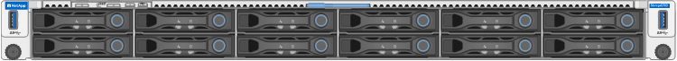

= Appliances StorageGRID SG6200
:allow-uri-read: 
:icons: font
:imagesdir: ../media/

[role="lead"]
Os appliances da série StorageGRID SG6200 operam como nós de armazenamento em um sistema StorageGRID. Assim como todos os appliances StorageGRID, eles podem ser livremente combinados com outros modelos de appliances e nós somente de software em uma única implementação.

O appliance StorageGRID SG6260 inclui um controlador de computação com dois SSDs NVMe funcionando como cache de leitura e um shelf de controladores de storage que contém dois controladores de storage e 60 discos rígidos NL-SAS. Ele pode ser expandido para até 180 discos rígidos NL-SAS com a adição de até dois shelves de expansão opcionais. O appliance StorageGRID SGF6212 é um appliance all-flash com um fator forma compacto 1U equipado com 12 SSDs NVMe.

== Caraterísticas do aparelho

=== Características gerais

Os aparelhos SGF6212 e SG6260 oferecem os seguintes recursos:

* Integra os elementos de storage e computação de um nó de storage da StorageGRID.
* Inclui o instalador do dispositivo StorageGRID para simplificar a implantação e a configuração do nó de storage.
* Inclui um controlador de gerenciamento de placa base (BMC) para monitorar e diagnosticar o hardware no controlador de computação.

=== Recursos de proteção de dados

O SGF6212 oferece os seguintes recursos de proteção de dados:

* Capacidade de funcionar após a falha de um único SSD sem impactos na disponibilidade de objetos.
* Capacidade de funcionar após várias falhas SSD com uma redução mínima necessária na disponibilidade de objetos (com base no design do esquema RAID subjacente).
+

NOTE: Dependendo da política de ILM configurada, as solicitações de objetos localmente indisponíveis podem ser atendidas por outros nós, portanto, geralmente não haverá redução na disponibilidade.

* Totalmente recuperável, durante o serviço, de falhas de SSD que não resultam em danos extremos ao RAID que hospeda o volume raiz do nó (o sistema operacional StorageGRID).
* Os dados de objetos podem ser restaurados automaticamente a partir de cópias ou blocos codificados de apagamento em outros nós se várias falhas de SSD resultarem na perda de dados locais.
* Capacidade de operar como um https://docs.netapp.com/us-en/storagegrid/admin/managing-load-balancing.html["Nó de gateway com cache"^] .

O SG6260 oferece os seguintes recursos de proteção de dados:

* Capacidade de funcionar após a falha de quaisquer dois discos rígidos (HDDs) sem impactos na disponibilidade de objetos.
* Evacuação e reconstrução rápidas de HDDs durante eventos de falha e substituição (quando configurado para DDP ou DDP16 durante a instalação), aumentando a durabilidade dos dados em relação ao padrão RAID6.
* Totalmente recuperável, enquanto estiver em serviço, pela falha de quaisquer dois HDDs.
* Os dados de objetos podem ser restaurados automaticamente a partir de cópias ou blocos codificados de apagamento em outros nós se várias falhas de HDD resultarem na perda de dados locais.

== Componentes de hardware SG6200

=== Appliance SGF6212

O appliance SGF6212 inclui os seguintes componentes:

Plataforma de computação e storage:: Um servidor de unidade de um rack (1UU) que inclui:
+
--
* 256 GB DE RAM
* Unidade de inicialização interna de 240 GB (inclui o software StorageGRID)
* 2 portas Gbase-T de 1/10 mm
* 4 × portas Ethernet 10/25/40/100GbE para tráfego de rede Grid/cliente (ou 4 × 200GbE com placa de rede 200GbE opcional)
* 12 SSDs NVMe para storage
* Controlador de gerenciamento de placa base (BMC) que simplifica o gerenciamento de hardware
* Fontes de alimentação e ventiladores redundantes

--

=== Appliance SG6260

O appliance SG6260 inclui os seguintes componentes:

Controlador de computação:: O controlador SG6200-CN é um servidor de uma unidade de rack (1U) que inclui:
+
--
* 256 GB DE RAM
* Unidade de inicialização interna de 240 GB (inclui o software StorageGRID)
* 2 portas Gbase-T de 1/10 mm
* 4 × portas Ethernet 10/25/40/100GbE para tráfego de rede Grid/cliente (ou 4 × 200GbE com placa de rede 200GbE opcional)
* 1 porta de interconexão de storage 100 GbE
* Dois SSDs NVMe para cache de leitura
* Controlador de gerenciamento de placa base (BMC) que simplifica o gerenciamento de hardware
* Fontes de alimentação e ventiladores redundantes

--
Compartimento do controlador de storage:: O compartimento de controladora e-Series E4000 (storage array) é uma gaveta de 4UU que inclui:
+
--
* Dois controladores da série E4000 (configuração duplex) para fornecer suporte a failover do controlador de armazenamento
* Compartimento de unidade com cinco gavetas que acomoda sessenta unidades NL-SAS de 3,5 polegadas
* Fontes de alimentação e ventiladores redundantes

--
Opcional: Prateleiras de expansão de storage:: Cada dispositivo SG6260 pode ter uma ou duas gavetas de expansão, totalizando 180 unidades. As gavetas de expansão podem ser instaladas durante a implantação inicial ou adicionadas posteriormente.
+
--
O compartimento e-Series DE460C é um compartimento de 4U TB que inclui:

* Dois módulos de entrada/saída (IOMs)
* Cinco gavetas, cada uma com capacidade para 12 unidades NL-SAS, para um total de 60 unidades
* Fontes de alimentação e ventiladores redundantes

--

== Diagramas SGF6212 e SG6260

=== Vista frontal do SGF6212

Esta figura mostra a parte frontal do SGF6212 sem o painel. O dispositivo inclui uma plataforma de storage 1U de computação e storage que contém 12 unidades SSD.

=== Vista traseira do SGF6212

Esta figura mostra a parte traseira do SGF6212, incluindo as portas, ventoinhas e fontes de alimentação.

image::../media/sgf6212_rear_connectors.png[SGF6212 Vista Traseira]

[cols="1a,2a,2a,2a"]
|===
| Legenda | Porta | Tipo | Utilização 

 a| 
1
 a| 
Portas de rede 1-4
 a| 
10/25/40/100/200-GbE, dependendo do tipo de cabo ou transceptor, da velocidade do switch e da velocidade de link configurada.

QSFP56 (máx. 200GbE/porta), QSFP28 (máx. 100GbE/porta) e QSFP+ (40GbE) são suportados nativamente (velocidades de 200GbE exigem opção de NIC 200GbE). Transceptores SFP+ (10GbE) ou SFP28 (25GbE) opcionais podem ser usados com um QSA (vendido separadamente).
 a| 
Conete-se à rede de grade e à rede de cliente para StorageGRID.

 a| 
2
 a| 
Porta de gerenciamento de BMC
 a| 
1 GbE (RJ-45)
 a| 
Ligue ao controlador de gestão da placa de base do aparelho.

 a| 
3
 a| 
Portas de diagnóstico e suporte
 a| 
* Mini display port
* Porta USB 3.0
* Porta de console micro-USB

 a| 
Reservado para uso de suporte técnico.

 a| 
4
 a| 
Admin Network port 1
 a| 
1/10-GbE (RJ-45)
 a| 
Ligue o dispositivo à rede de administração para StorageGRID.

 a| 
5
 a| 
Admin Network port 2
 a| 
1/10-GbE (RJ-45)
 a| 
Opções:

* Vincular com a porta de rede de administração 1 para uma conexão redundante com a rede de administração para StorageGRID.
* Deixe desconetado e disponível para acesso local temporário (IP 169.254.0.1).
* Durante a instalação, use a porta 2 para configuração IP se os endereços IP atribuídos pelo DHCP não estiverem disponíveis.

|===
Esta figura mostra a localização da fonte de alimentação e dos LEDs de identificação na parte traseira do SGF6212. LEDs adicionais de status e atividade estão localizados nas portas do appliance. Esses LEDs podem variar de acordo com o modelo do appliance.

image::../media/s25_rear_leds.png[LEDs traseiros SGF6212]

[cols="1a,2a,3a"]
|===
| Legenda | LED | Estado 

 a| 
1
 a| 
LED da fonte de alimentação
 a| 
* Verde, sólido: Energia aplicada ao aparelho, botão de alimentação está ligado.
* Verde, intermitente: Alimentação aplicada ao aparelho, o botão de alimentação está desligado.
* Desligado: sem alimentação aplicada ao aparelho.
* Âmbar: Falha na alimentação de energia.

 a| 
2
 a| 
Identifique o LED
 a| 
* Azul intermitente: Identifica o aparelho no gabinete ou rack.
* Azul, sólido: Identifica o aparelho no gabinete ou rack.
* Desligado: o aparelho não é visualmente identificável no armário ou rack.

|===

=== SG6260 vista frontal

Esta figura mostra a parte frontal do SG6260, que inclui um controlador de computação 1U e um shelf 4U contendo dois controladores de storage e 60 drives em cinco gavetas para drives.

image::../media/sg6260_front_view_without_bezels.png[SG6260 Vista frontal]

[cols="1a,2a"]
|===
| Legenda | Descrição 

 a| 
1
 a| 
Controladora de computação SG6200-CN com painel frontal removido

 a| 
2
 a| 
Compartimento do controlador E4000 com painel frontal removido (o compartimento de expansão opcional aparece idêntico)

|===

=== Vista traseira do SG6260

Esta figura mostra a parte traseira do SG6260, incluindo os controladores de computação e storage, as ventoinhas e as fontes de alimentação.

image::../media/sg6260_rear_view.png[SG6260 Vista Traseira]

[cols="1a,2a"]
|===
| Legenda | Descrição 

 a| 
1
 a| 
Fonte de alimentação (1 de 2) para o controlador de computação SG6200-CN

 a| 
2
 a| 
Conectores para o controlador de computação SG6200-CN

 a| 
3
 a| 
Ventilador (1 de 2) para compartimento do controlador E4000

 a| 
4
 a| 
Controlador de storage E-Series E400 (1 de 2) e conectores

 a| 
5
 a| 
Fonte de alimentação (1 de 2) para o compartimento do controlador E4000

|===

== Controladores SG6200

=== Controlador de computação SG6200-CN

* Fornece recursos de computação para o dispositivo.
* Inclui o instalador do dispositivo StorageGRID.
+

NOTE: O software StorageGRID não está pré-instalado no dispositivo. Este software é recuperado a partir do Admin Node quando você implementa o dispositivo.

* Pode se conetar a todas as três redes StorageGRID, incluindo a rede de Grade, a rede Admin e a rede cliente.
* Conecta-se aos controladores de storage e-Series e opera como iniciador.

Esta figura mostra as portas na parte traseira do controlador de computação SG6200-CN.

image::../media/sg6200_cn_rear_connectors.png[Conectores traseiros SG6200-CN]

[cols="1a,2a,2a,3a"]
|===
| Legenda | Porta | Tipo | Utilização 

 a| 
1
 a| 
Portas de rede 1-4
 a| 
10/25/40/100/200-GbE, com base no tipo de cabo ou transceptor, velocidade do switch e velocidade de link configurada. QSFP56 (máx. 200GbE/porta), QSFP28 (máx. 100GbE/porta) e QSFP+ (40GbE) são suportados nativamente (velocidades de 200GbE exigem opção de NIC 200GbE). Transceptores SFP+ (10GbE) ou SFP28 (25GbE) opcionais podem ser usados com um QSA (vendido separadamente).
 a| 
Conete-se à rede de grade e à rede de cliente para StorageGRID.

 a| 
2
 a| 
Porta de gerenciamento de BMC
 a| 
1 GbE (RJ-45)
 a| 
Conecte-se ao controlador de gerenciamento da placa-mãe SG6200-CN.

 a| 
3
 a| 
Portas de diagnóstico e suporte
 a| 
* Mini display port
* Porta USB 3.0
* Porta de console micro-USB

 a| 
Reservado para uso de suporte técnico.

 a| 
4
 a| 
Admin Network port 1
 a| 
1/10-GbE (RJ-45)
 a| 
Conecte o SG6200-CN à rede administrativa do StorageGRID.

 a| 
5
 a| 
Admin Network port 2
 a| 
1/10-GbE (RJ-45)
 a| 
Opções:

* Vincular com a porta de gerenciamento 1 para uma conexão redundante com a rede de administração para StorageGRID.
* Deixe desconetado e disponível para acesso local temporário (IP 169.254.0.1).
* Durante a instalação, use a porta 2 para configuração IP se os endereços IP atribuídos pelo DHCP não estiverem disponíveis.

 a| 
6
 a| 
Porta de interconexão
 a| 
100-GbE
 a| 
Conecte o controlador SG6200-CN aos controladores E4000.

|===
Esta figura mostra a localização da fonte de alimentação e dos LEDs de identificação na parte traseira do controlador de computação SG6200-CN. LEDs adicionais de status e atividade estão localizados nas portas do appliance. Esses LEDs podem variar de acordo com o modelo do appliance.

image::../media/s25_rear_leds.png[LEDs traseiros SG6200-CN]

[cols="1a,2a,3a"]
|===
| Legenda | LED | Estado 

 a| 
1
 a| 
LED da fonte de alimentação
 a| 
* Verde, sólido: Energia aplicada ao aparelho, botão de alimentação está ligado.
* Verde, intermitente: Alimentação aplicada ao aparelho, o botão de alimentação está desligado.
* Desligado: sem alimentação aplicada ao aparelho.
* Âmbar: Falha na alimentação de energia.

 a| 
2
 a| 
Identifique o LED
 a| 
* Azul intermitente: Identifica o aparelho no gabinete ou rack.
* Azul, sólido: Identifica o aparelho no gabinete ou rack.
* Desligado: o aparelho não é visualmente identificável no armário ou rack.

|===

=== SG6260: Controlador de storage E4000

* Duas controladoras para suporte a failover.
* Gerenciar o armazenamento de dados nas unidades.
* Funciona como controladores padrão da série e em uma configuração duplex.
* Inclua o software SANtricity os (firmware do controlador).
* Inclua o Gerenciador do sistema do SANtricity para monitorar o hardware de armazenamento e gerenciar alertas, o recurso AutoSupport e o recurso de segurança da unidade.
* Conecte-se ao controlador SG6200-CN e forneça acesso ao storage.

image::../media/e4000_controller_with_callouts.png[Conetores no controlador E4000]

[cols="1a,2a,2a,3a"]
|===
| Legenda | Porta | Tipo | Utilização 

 a| 
1
 a| 
Porta de gerenciamento 1
 a| 
Ethernet de 1 GB (RJ-45)
 a| 
* Opções da porta 1:
+
** Conete-se a uma rede de gerenciamento para permitir o acesso direto TCP/IP ao Gerenciador de sistemas SANtricity
** Deixe sem fio para salvar uma porta do switch e um endereço IP. Acesse o Gerenciador de sistema do SANtricity usando o Gerenciador de Grade ou o Instalador do dispositivo de Grade de armazenamento.

*Nota*: Algumas funcionalidades opcionais do SANtricity, como a sincronização NTP para carimbos de data/hora precisos de registo, não estão disponíveis quando optar por deixar a porta 1 sem fios.

 a| 
2
 a| 
Portas de diagnóstico e suporte
 a| 
* Porta serial RJ-45
* Porta serial micro USB
* Porta de USB

 a| 
Reservado para uso de suporte técnico.

 a| 
3
 a| 
Portas de expansão da unidade 1 e 2
 a| 
SAS de 12GB GB/s.
 a| 
Conete as portas às portas de expansão da unidade nas IOMs no compartimento de expansão.

 a| 
4
 a| 
Portas de interconexão 1 e 2
 a| 
ISCSI de 25GbE GB
 a| 
Conecte cada um dos controladores E4000 ao controlador SG6200-CN.

Existem quatro conexões para o controlador SG6200-CN (duas de cada E4000).

|===

=== SG6260: IOMs para prateleiras de expansão opcionais

O compartimento de expansão contém dois módulos de entrada/saída (IOMs) que se conectam aos controladores de storage ou a outros compartimentos de expansão.

==== Conetores IOM

image::../media/iom_connectors.gif[Traseira IOM]

[cols="1a,2a,2a,3a"]
|===
| Legenda | Porta | Tipo | Utilização 

 a| 
1
 a| 
Portas de expansão da unidade 1-4
 a| 
SAS de 12GB GB/s.
 a| 
Conecte cada porta aos controladores de storage ou ao compartimento de expansão adicional (se houver).

|===