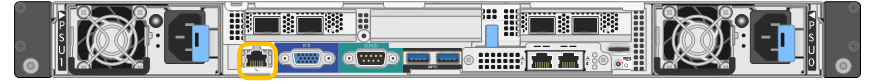
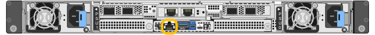
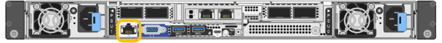
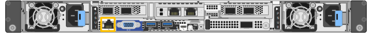
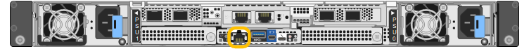

= Defina o endereço IP da porta de gerenciamento BMC em um appliance StorageGRID
:allow-uri-read: 
:icons: font
:imagesdir: ../media/

[role="lead"]
Antes de poder aceder à interface BMC, configure o endereço IP para a porta de gestão BMC no controlador SGF6112, SG6000-CN, no controlador SG6100-CN ou nos dispositivos de serviços.

Se estiver usando o ConfigBuilder para gerar um arquivo JSON, você poderá configurar endereços IP automaticamente. link:automating-appliance-installation-and-configuration.html["Automatize a instalação e a configuração do dispositivo"]Consulte .

.Sobre esta tarefa
Para fins de suporte, a porta de gerenciamento do BMC permite acesso a hardware de baixo nível.

NOTE: Só deve ligar esta porta a uma rede de gestão interna segura, fidedigna. Se nenhuma rede estiver disponível, deixe a porta BMC desconetada ou bloqueada, a menos que uma conexão BMC seja solicitada pelo suporte técnico.

.Antes de começar
* O cliente de gerenciamento está usando um https://docs.netapp.com/us-en/storagegrid/admin/web-browser-requirements.html["navegador da web suportado"^].
* Você está usando qualquer cliente de gerenciamento que possa se conetar a uma rede StorageGRID.
* A porta de gerenciamento do BMC está conetada à rede de gerenciamento que você planeja usar.
+
[role="tabbed-block"]
====
.SG100
--

--
.SG110
--
image::../media/sgf6112_cn_bmc_management_port.png[Porta de gerenciamento BMC SG110]

--
.SG120
--

--
.SG1000
--
image::../media/sg1000_bmc_management_port.png[SG1000 porta de gestão BMC]

--
.SG1100
--

--
.SG1200
--
image::../media/sg1200_bmc_management_port.png[Porta de gerenciamento BMC SG1200]

--
.SG6000
--
image::../media/sg6000_cn_bmc_management_port.gif[Porta de gerenciamento BMC no controlador SG6000-CN]

--
.SG6100
--
_SGF6112_:

image::../media/sgf6112_cn_bmc_management_port.png[Porta de gerenciamento BMC SGF6112]

_SG6100-CN_:

--
.SG6200
--
_SGF6212_:

_SG6200-CN_:

--
====

.Passos
. No cliente, insira o URL para o instalador do StorageGRID Appliance
`*https://_Appliance_IP_:8443*`
+
Para `Appliance_IP`, use o endereço IP do dispositivo em qualquer rede StorageGRID.

+
A página inicial do instalador do dispositivo StorageGRID é exibida.

. Selecione *Configurar hardware* > *Configuração do BMC*.
+
É apresentada a página Baseboard Management Controller Configuration (Configuração do controlador de gestão de base).

. Nas Configurações de IP da LAN, anote o endereço IPv4 que é exibido automaticamente.
+
DHCP é o método padrão para atribuir um endereço IP a esta porta.

+

NOTE: Pode demorar alguns minutos para que os valores DHCP apareçam.

. Opcionalmente, defina um endereço IP estático para a porta de gerenciamento BMC.
+

NOTE: Você deve atribuir um IP estático para a porta de gerenciamento do BMC ou atribuir uma concessão permanente para o endereço no servidor DHCP.

+
.. Selecione *estático*.
.. Introduza o endereço IPv4, utilizando a notação CIDR.
.. Introduza o gateway predefinido.
.. Clique em *Salvar*.
+
Pode levar alguns minutos para que suas alterações sejam aplicadas.

