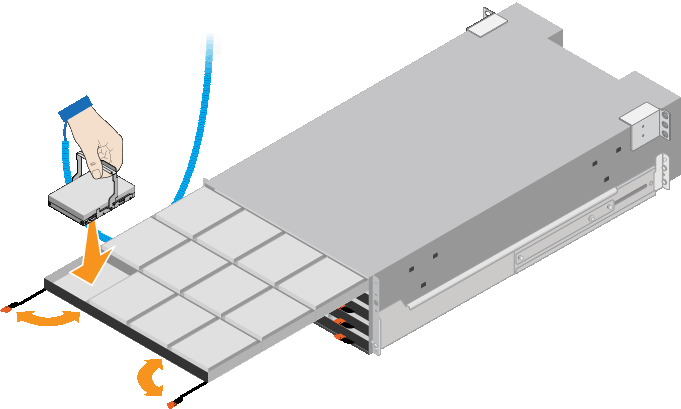

= Instalar gavetas de 60 unidades (SG6160)
:allow-uri-read: 
:icons: font
:imagesdir: ../media/

[role="lead"]
Você instala um conjunto de trilhos para o compartimento do controlador E4000 em seu gabinete ou rack e, em seguida, desliza a prateleira do controlador sobre os trilhos. Se você estiver instalando compartimentos de expansão de 60 unidades, o mesmo procedimento será aplicado.

.Antes de começar
* Você revisou o https://library.netapp.com/ecm/ecm_download_file/ECMP12475945["Avisos de segurança"^] documento incluído na caixa e entendeu as precauções para mover e instalar o hardware.
* Você tem as instruções fornecidas com o kit de trilho.

CAUTION: Para evitar danificar o hardware, nunca mova a gaveta se as unidades estiverem instaladas. É necessário remover todas as unidades antes de mover a gaveta.

CAUTION: Ao instalar o compartimento do controlador E4000 ou as prateleiras de expansão opcionais, instale o hardware da parte inferior para a parte superior do rack ou gabinete para evitar que o equipamento tombe. Para garantir que o equipamento mais pesado esteja na parte inferior do gabinete ou rack, instale o controlador SG6100-CN acima da prateleira do controlador E4000 e das prateleiras de expansão.

CAUTION: Antes de se comprometer com a instalação, verifique se os cabos fornecidos com o aparelho, ou os cabos que você fornecer, são longos o suficiente para o layout planejado.

.Passos
. Siga cuidadosamente as instruções para o kit de trilho para instalar os trilhos em seu gabinete ou rack.
+
Para armários de orifícios quadrados, instale primeiro as porcas de gaiola fornecidas para fixar a parte dianteira e traseira da prateleira com parafusos.

. Retire a caixa de embalagem exterior do aparelho. Em seguida, dobre as abas na caixa interna.
. Se estiver a levantar o aparelho à mão, fixe as quatro pegas nas laterais do chassis.
+
Empurre cada alça para cima até que ela se encaixe no lugar.

+
image::../media/lift_handles.gif[Pegas de elevação]

. Coloque a parte de trás da prateleira (a extremidade com os conetores) nos trilhos.
. Apoiando a prateleira de baixo, deslize-a para dentro do gabinete. Se você estiver usando as alças, use as travas para soltar uma alça de cada vez enquanto você desliza a prateleira para dentro.
+
Para remover as pegas, puxe para trás o trinco de desbloqueio, empurre-o para baixo e, em seguida, puxe-o para fora da prateleira.

. Fixe a prateleira na parte frontal do gabinete.
+
Insira os parafusos no primeiro e terceiro orifícios a partir da parte superior da prateleira em ambos os lados.

. Fixe a prateleira na parte de trás do armário.
+
Coloque dois suportes traseiros em cada lado da secção traseira superior da prateleira. Insira os parafusos no primeiro e terceiro orifícios de cada suporte.

+
image::../media/mount_hardware.gif[Montar o hardware]

. Repita essas etapas para qualquer gaveta de expansão.
. Instalar unidades NL-SAS de 12 TB em cada uma das cinco gavetas de unidade.
+
.. Enrole a extremidade da correia da pulseira ESD à volta do pulso e fixe a extremidade do clipe a um solo metálico para evitar descargas estáticas.
.. Solte as alavancas na gaveta superior da unidade e deslize a gaveta para fora usando as alavancas.
.. Levante cada manípulo de acionamento para uma posição vertical.
.. Posicione cuidadosamente cada unidade na respetiva ranhura e baixe a pega da unidade levantada até encaixar.
+

.. Instalar unidades NL-SAS de 12 TB na gaveta superior.
.. Deslize a gaveta para dentro novamente empurrando o centro e fechando ambas as alavancas com cuidado.
+

CAUTION: Pare de empurrar a gaveta se sentir preso. Use as alavancas de liberação na parte frontal da gaveta para deslizar a gaveta para fora. Em seguida, reinsira cuidadosamente a gaveta na ranhura.

.. Repita estas etapas para instalar unidades NL-SAS nas outras quatro gavetas.
+

CAUTION: Você deve instalar todas as unidades 60 para garantir o funcionamento correto.

.. Fixe a moldura frontal à prateleira, se tiver sido fornecida.

. Se você tiver compartimentos de expansão, repita estas etapas para instalar unidades NL-SAS de 12 TB em cada gaveta de cada compartimento de expansão.
. Avance para as instruções de instalação do SG6100-CN em um gabinete ou rack.

