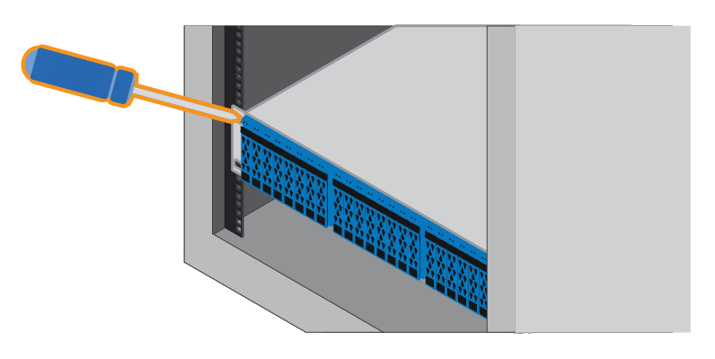

= Instalar gavetas de 24 unidades (SGF6024)
:allow-uri-read: 
:icons: font
:imagesdir: ../media/

[role="lead"]
Você instala um conjunto de trilhos para o compartimento do controlador EF570 em seu gabinete ou rack e, em seguida, desliza o array para os trilhos.

.Antes de começar
* Você revisou o https://library.netapp.com/ecm/ecm_download_file/ECMP12475945["Avisos de segurança"^] documento incluído na caixa e entendeu as precauções para mover e instalar o hardware.
* Você tem as instruções fornecidas com o kit de trilho.

.Passos
. Siga cuidadosamente as instruções para o kit de trilho para instalar os trilhos em seu gabinete ou rack.
+
Para armários de orifícios quadrados, instale primeiro as porcas de gaiola fornecidas para fixar a parte dianteira e traseira da prateleira com parafusos.

. Retire a caixa de embalagem exterior do aparelho. Em seguida, dobre as abas na caixa interna.
. Coloque a parte de trás da prateleira (a extremidade com os conetores) nos trilhos.
+

CAUTION: Uma prateleira totalmente carregada pesa aproximadamente 52 lb (24 kg). Duas pessoas são necessárias para mover o gabinete com segurança.

. Deslize cuidadosamente o compartimento até os trilhos.
+

CAUTION: Talvez seja necessário ajustar os trilhos para garantir que o gabinete deslize totalmente para os trilhos.

+

CAUTION: Não coloque equipamento adicional nos trilhos depois de concluir a instalação do gabinete. Os trilhos não são projetados para suportar peso adicional.

+

NOTE: Se aplicável, talvez seja necessário remover as tampas da extremidade da prateleira ou a moldura do sistema para fixar o compartimento ao poste do rack; se for o caso, você precisará substituir as tampas da extremidade ou a moldura quando terminar.

. Prenda o gabinete à parte frontal do gabinete ou rack e trilhos inserindo dois parafusos M5 através dos suportes de montagem (pré-instalados em ambos os lados da parte frontal do gabinete), os orifícios no rack ou no gabinete do sistema e os orifícios na parte frontal dos trilhos.
+

. Fixe o compartimento na parte de trás dos trilhos inserindo dois parafusos M5 através dos suportes no compartimento e no suporte do kit de trilho.
. Se aplicável, substitua as tampas da extremidade da prateleira ou a moldura do sistema.
+
image::../media/install_endcaps.png[Substitua as tampas laterais da prateleira]

