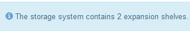

= Solucionar problemas de instalação de hardware (SG5800 ou SG6100)
:allow-uri-read: 
:icons: font
:imagesdir: ../media/

[role="lead"]
Se você encontrar problemas durante a instalação, talvez seja útil revisar informações de solução de problemas relacionadas a problemas de configuração de hardware e conetividade.

== [[view-boot-codes]]Ver códigos de arranque (apenas SGF6112 e SG6160)

Quando você aplica energia ao aparelho, o BMC Registra uma série de códigos de inicialização. Você pode exibir esses códigos em um console gráfico conetado à porta de gerenciamento do BMC.

.Antes de começar
* Você sabe como link:accessing-bmc-interface.html["Acesse o painel do BMC"].
* Se você quiser usar serial-over-laN (sol), você tem experiência usando aplicativos de console IPMI sol.

.Passos
. Selecione um dos seguintes métodos para visualizar os códigos de arranque do controlador do aparelho e recolha o equipamento necessário.
+
[cols="1a,2a"]
|===
| Método | Equipamento necessário 

 a| 
Consola VGA
 a| 
** Monitor compatível com VGA
** Cabo VGA

 a| 
KVM
 a| 
** Cabo RJ-45

 a| 
Porta serial
 a| 
** Cabo USB
** Terminal serial virtual

 a| 
SOL
 a| 
** Terminal serial virtual

|===
. Se você estiver usando um console VGA, execute estas etapas:
+
.. Ligue um monitor compatível com VGA à porta VGA na parte posterior do aparelho.
.. Veja os códigos exibidos no monitor.

. Se você estiver usando o BMC KVM, execute estas etapas:
+
.. Conete-se à porta de gerenciamento do BMC e faça login na interface da Web do BMC.
.. Selecione *Controle remoto*.
.. Inicie o KVM.
.. Veja os códigos no monitor virtual.

. Se você estiver usando uma porta serial e um terminal, execute estas etapas:
+
.. Ligue à porta USB serial na parte posterior do aparelho.
.. Utilize as definições `115200 8-N-1`.
.. Veja os códigos impressos no terminal serial.

. Se você estiver usando sol, execute estas etapas:
+
.. Conete-se ao sol IPMI usando o endereço IP BMC e as credenciais de login.
+
`ipmitool -I lanplus -H _BMC_Port_IP_ -U admin -P _Password_ sol activate`

+

NOTE: Em alguns casos, o nome de usuário padrão pode ser 'root' em vez de 'admin'.

.. Veja os códigos no terminal serial virtual.

. Utilize a tabela para procurar os códigos do seu aparelho.
+
[cols="1a,3a"]
|===
| Código | Indica 

 a| 
HT
 a| 
O script de inicialização mestre está esperando que a inicialização do sistema operacional seja concluída.

 a| 
OLÁ
 a| 
O script de inicialização mestre foi iniciado.

 a| 
DE PP
 a| 
O sistema está verificando se o FPGA precisa ser atualizado.

 a| 
HP
 a| 
O sistema está verificando se o firmware da placa de interface de rede (NIC) precisa ser atualizado.

 a| 
RB
 a| 
O sistema está reiniciando após a aplicação de atualizações de firmware.

 a| 
FP
 a| 
As verificações de atualização do firmware do subsistema de hardware foram concluídas. Os serviços de comunicação entre controladores estão a iniciar.

 a| 
ELE
 a| 
Apenas para o SG6160:

O sistema está aguardando conetividade com os controladores de armazenamento e sincronização com o sistema operacional SANtricity.

*Nota*: Se o procedimento de inicialização não avançar além desta etapa, execute estas etapas:

.. Confirme se os quatro cabos de interconexão entre o controlador SG6100-CN e os dois controladores de armazenamento estão bem conetados.
.. Se necessário, substitua um ou mais cabos e tente novamente.
.. Se isso não resolver o problema, entre em Contato com o suporte técnico.

 a| 
HC
 a| 
O sistema está a verificar se existem dados de instalação do StorageGRID.

 a| 
HO
 a| 
O dispositivo StorageGRID está em funcionamento.

 a| 
HA
 a| 
O StorageGRID está em execução.

|===

== [[view-error-codes]]Ver códigos de erro (apenas SGF6112 e SG6160)

Se ocorrer um erro de hardware quando o aparelho está inicializando, o BMC Registra um código de erro. Conforme necessário, você pode visualizar esses códigos de erro usando a porta serial do dispositivo e, em seguida, trabalhar com suporte técnico para resolver o problema.

.Antes de começar
* Reúna o equipamento necessário:
+
** Cabo USB
** Terminal serial virtual

.Passos
. Ligue à porta USB serial na parte posterior do aparelho.
. Utilize as definições `115200 8-N-1`.
. Reveja as informações impressas sobre o terminal serial para o Código atual e o Código anterior.
+
Se algum dos códigos de erro a seguir for exibido, trabalhe com suporte técnico para resolver o problema.

+
[cols="1a,3a"]
|===
| Código | Indica 

 a| 
0x0E
 a| 
Microcódigo não encontrado

 a| 
0x0F
 a| 
Microcódigo não carregado

 a| 
0x50
 a| 
Erro de inicialização da memória. Tipo de memória inválido ou velocidade de memória incompatível.

 a| 
0x51
 a| 
Erro de inicialização da memória. A leitura SPD falhou.

 a| 
0x52
 a| 
Erro de inicialização da memória. O tamanho de memória ou os módulos de memória inválidos não correspondem.

 a| 
0x53
 a| 
Erro de inicialização da memória. Nenhuma memória utilizável detetada.

 a| 
0x54
 a| 
Erro de inicialização de memória não especificado

 a| 
0x55
 a| 
Memória não instalada

 a| 
0x56
 a| 
Tipo ou velocidade de CPU inválida

 a| 
0x57
 a| 
Incompatibilidade de CPU

 a| 
0x58
 a| 
Falha no autoteste da CPU ou possível erro de cache da CPU

 a| 
0x59
 a| 
O micro-código da CPU não foi encontrado ou a atualização do micro-código falhou

 a| 
0x5A
 a| 
Erro interno da CPU

 a| 
0x5B
 a| 
Repor PPI não está disponível

 a| 
0x5C
 a| 
Falha do autoteste do PEI fase BMC

 a| 
0xD0
 a| 
Erro de inicialização da CPU

 a| 
0xD1
 a| 
Erro de inicialização da ponte Norte

 a| 
0xD2
 a| 
Erro de inicialização da ponte sul

 a| 
0xD3
 a| 
Alguns protocolos arquitetônicos não estão disponíveis

 a| 
0xD4
 a| 
Erro de alocação de recursos PCI. Sem recursos.

 a| 
0xD5
 a| 
Sem espaço para a ROM de opção herdada

 a| 
0xD6
 a| 
Não foram encontrados dispositivos de saída da consola

 a| 
0xD7
 a| 
Não foram encontrados dispositivos de entrada da consola

 a| 
0xD8
 a| 
Palavra-passe inválida

 a| 
0xD9
 a| 
Erro ao carregar a opção de inicialização (erro loadImage retornado)

 a| 
0xDA
 a| 
Falha na opção de inicialização (erro retornado pela StartImage)

 a| 
0xDB
 a| 
Falha na atualização do flash

 a| 
0xDC
 a| 
O protocolo de reposição não está disponível

 a| 
0xDD
 a| 
Avaria no autoteste do BMC de fase DXE

 a| 
0xE8
 a| 
MRC: ERR_NO_MEMORY

 a| 
0xE9
 a| 
MRC: ERR_LT_LOCK

 a| 
0xEA
 a| 
MRC: ERR_DDR_INIT

 a| 
0xEB
 a| 
MRC: ERR_MEM_TEST

 a| 
0xEC
 a| 
MRC: ERR_VENDOR_SPECIFIC

 a| 
0xED
 a| 
MRC: ERR_DIMM_COMPAT

 a| 
0xEE
 a| 
MRC: ERR_MRC_COMPATIBILITY

 a| 
0xEF
 a| 
RMC: ERR_MRC_STRUCT

 a| 
0xF0
 a| 
MRC: ERR_SET_VDD

 a| 
0xF1
 a| 
MRC: ERR_IOT_MEM_BUFFER

 a| 
0xF2
 a| 
MRC: ERR_RC_INTERNAL

 a| 
0xF3
 a| 
MRC: ERR_INVALID_REG_ACCESS

 a| 
0xF4
 a| 
MRC: ERR_SET_MC_FREQ

 a| 
0xF5
 a| 
MRC: ERR_READ_MC_FREQ

 a| 
0x70
 a| 
MRC: ERR_DIMM_CHANNEL

 a| 
0x74
 a| 
MRC: ERR_BIST_CHECK

 a| 
0xF6
 a| 
MRC: ERR_SMBUS

 a| 
0xF7
 a| 
MRC: ERR_PCU

 a| 
0xF8
 a| 
MRC: ERR_NGN

 a| 
0xF9
 a| 
MRC: ERR_INTERLEAVE_FAILURE

|===

== A configuração do hardware parece travar

O Instalador de dispositivos StorageGRID pode não estar disponível se falhas de hardware ou erros de cabeamento impedirem que o aparelho conclua seu processamento de inicialização.

.Passos
. Reveja os LEDs no aparelho e/ou os códigos de erro e inicialização apresentados no BMC (se equipado).
. Se você precisar de ajuda para resolver um problema, entre em Contato com o suporte técnico.

== Problemas de conexão

=== As prateleiras de expansão não aparecem no Instalador de dispositivos (SG6160)

Se você instalou prateleiras de expansão e elas não aparecem no Instalador de dispositivos StorageGRID, verifique se as prateleiras foram completamente instaladas e ligadas.

.Sobre esta tarefa
Você pode verificar se os compartimentos de expansão estão conetados ao dispositivo visualizando as seguintes informações no Instalador de dispositivos StorageGRID:

* A página *Home* contém uma mensagem sobre prateleiras de expansão.
+

* A página *Avançado* > *modo RAID* indica pelo número de unidades se o dispositivo inclui ou não compartimentos de expansão.

Se as páginas do Instalador do StorageGRID Appliance não indicarem que as prateleiras de expansão estão presentes, siga este procedimento.

.Passos
. Verifique se todos os cabos necessários foram firmemente conetados. link:cabling-appliance.html["Aparelho de cabo"]Consulte .
. Verifique se você ativou as gavetas de expansão. link:connecting-power-cords-and-applying-power.html["Conete os cabos de alimentação e ligue a alimentação (SG6100)"]Consulte .
. Se você precisar de ajuda para resolver um problema, entre em Contato com o suporte técnico.

=== Não foi possível ligar ao aparelho

Se você não conseguir se conetar ao dispositivo de armazenamento, pode haver um problema de rede ou a instalação de hardware pode não ter sido concluída com êxito.

.Passos
. Tente fazer ping no aparelho usando o endereço IP do aparelho
+
`*ping _appliance/controller_IP_*`

. Se não receber resposta do ping, confirme que está a utilizar o endereço IP correto.
+
Pode utilizar o endereço IP do dispositivo na rede de grelha, na rede de administração ou na rede de cliente.

. Se o endereço IP estiver correto, verifique o cabeamento do dispositivo, transcetores QSFP ou SFP e a configuração da rede.
. Se o acesso físico ao aparelho estiver disponível, você pode usar uma conexão direta com o IP local de link permanente `169.254.0.1` para verificar a configuração de rede do controlador e atualizar, se necessário. Para obter instruções detalhadas, consulte o passo 2 em link:accessing-storagegrid-appliance-installer.html["Acesse o Instalador de dispositivos StorageGRID"].
+
Se isso não resolver o problema, entre em Contato com o suporte técnico.

. Se o ping foi bem-sucedido, abra um navegador da Web.
. Digite o URL para o instalador de dispositivos StorageGRID ou Gerenciador de sistemas SANtricity
`*https://_appliances_controller_IP_:8443*`
+
A página inicial é exibida.

