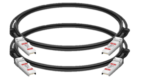
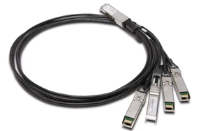

= Desembale caixas
:allow-uri-read: 
:icons: font
:imagesdir: ../media/

[role="lead"]
Antes de instalar o seu dispositivo StorageGRID, desembale todas as caixas e compare o conteúdo com os itens no saco de embalagem.

[role="tabbed-block"]
====
.SG100 e SG1000
--
* *Hardware*
+
SG100 ou SG1000::
+
--
image::../media/sg6000_cn_front_without_bezel.gif[Dispositivo de serviços de unidades frontais SG 100 ou SG1000]

--
Kit de calha com instruções::
+
--
image::../media/rail_kit.gif[Kit de calha]

--

* *Cabos de alimentação*
+

TIP: O gabinete pode ter cabos de alimentação especiais que você usa em vez dos cabos de alimentação fornecidos com o aparelho.

+
Dois cabos de energia para o seu país::
+
--
image::../media/power_cords.gif[Cabos de energia]

--

--
.SG110 e SG1100
--
* *Hardware*
+
SG110 ou SG1100::
+
--
image::../media/sgf6112_front_with_ssds.png[Unidades frontais SG110 e SG1100 dispositivos]

--
Kit de calha com instruções::
+
--
image::../media/rail_kit.gif[Kit de calha]

--
Painel frontal::
+
--
image::../media/sgf_6112_front_bezel.png[Painel frontal]

--

* *Cabos de alimentação*
+

TIP: O gabinete pode ter cabos de alimentação especiais que você usa em vez dos cabos de alimentação fornecidos com o aparelho.

+
Dois cabos de energia para o seu país::
+
--
image::../media/power_cords.gif[Cabos de energia]

--

--
.SG5700
--
* *Hardware*
+
Dispositivo SG5712 com 12 unidades instaladas::
+
--
image::../media/de212c_table_size.gif[SG5712 2U aparelho]

--
Dispositivo SG5760 sem unidades instaladas::
+
--
image::../media/de460c_table_size.gif[SG5760 4U aparelho]

--
Moldura frontal para o aparelho::
+
--
image::../media/sg5700_front_bezels.gif[Molduras de SG5712 e SG5760]

--
Kit de calha com instruções::
+
--
image::../media/rail_kit.gif[Kit de calha]

--
SG5760: Sessenta unidades::
+
--
image::../media/sg5760_drive.gif[Condução]

--
SG5760: Alças::
+
--
image::../media/handles.gif[SG5760 alças]

--
SG5760: Suportes traseiros e porcas de gaiola para instalação de rack de furo quadrado::
+
--
image::../media/back_brackets_table_size.gif[Suportes traseiros e porcas de gaiola para SG5760]

--

* *Cabos e conetores*
+

TIP: O gabinete pode ter cabos de alimentação especiais que você usa em vez dos cabos de alimentação fornecidos com o aparelho.

+
Dois cabos de energia para o seu país::
+
--
image::../media/power_cords.gif[Cabos de energia]

--
Cabos óticos e transcetores SFP::
+
--
image::../media/fc_cable_and_sfp.gif[Cabos óticos e SFPs]

** Dois cabos óticos para as portas de interconexão FC
** Oito transcetores SFP mais, compatíveis com as quatro portas de interconexão FC de 16GB GB/s e as quatro portas de rede de 10 GbE

--

--
.SG5800
--
* *Hardware*
+
Dispositivo SG5812 com 12 unidades instaladas::
+
--
image::../media/de212c_table_size.gif[SG5812 2U aparelho]

--
Dispositivo SG5860 sem unidades instaladas::
+
--
image::../media/de460c_table_size.gif[SG5860 4U aparelho]

--
Moldura frontal para o aparelho::
+
--
image::../media/sg5700_front_bezels.gif[Molduras de SG5812 e SG5860]

NOTE: Suas molduras podem parecer diferentes.

--
Kit de calha com instruções::
+
--
image::../media/rail_kit.gif[Kit de calha]

--
SG5860: Sessenta unidades NL-SAS::
+
--
image::../media/sg5760_drive.gif[Condução]

--
SG5860: Alças::
+
--
image::../media/handles.gif[SG5860 alças]

--
SG5860: Suportes traseiros e porcas de gaiola para instalação de rack de furo quadrado::
+
--
image::../media/back_brackets_table_size.gif[Suportes traseiros e porcas de gaiola para SG5860]

--

* *Cabos e conetores*
+

TIP: O gabinete pode ter cabos de alimentação especiais que você usa em vez dos cabos de alimentação fornecidos com o aparelho.

+
Dois cabos de energia para o seu país::
+
--
image::../media/power_cords.gif[Cabos de energia]

--
Dois cabos 25GbE SFP28 para interconexão de controlador (iSCSI)::
+
--

--

--
.SG6000
--
* *Hardware SG6060*
+
Controlador SG6000-CN::
+
--
image::../media/sg6000_cn_front_without_bezel.gif[Controlador SG6000-CN]

--
Compartimento de controladora E2860U sem unidades instaladas::
+
--
image::../media/de460c_table_size.gif[SG5760 4U aparelho]

--
Duas molduras frontais::
+
--
image::../media/sg6000_front_bezels_for_table.gif[Molduras frontais]

--
Dois kits de trilhos com instruções::
+
--
image::../media/rail_kit.gif[Kit de calha]

--
Unidades de 60 TB (2 SSD e NL-SAS de 58 TB)::
+
--
image::../media/sg5760_drive.gif[Condução]

--
Quatro alças::
+
--
image::../media/handles.gif[SG5760 alças]

--
Suportes traseiros e porcas de gaiola para instalação em rack de orifícios quadrados::
+
--
image::../media/back_brackets_table_size.gif[Suportes traseiros e porcas de gaiola para SG5760]

--

* *SG6060 prateleira de expansão*
+
Compartimento de expansão sem unidades instaladas::
+
--
image::../media/de460c_table_size.gif[SG5760 4U aparelho]

--
Painel frontal::
+
--
image::../media/front_bezel_for_table_de460c.gif[Moldura frontal DE460C]

--
Unidades NL-SAS de 60 TB::
+
--
image::../media/sg5760_drive.gif[Condução]

--
Um kit de trilho com instruções::
+
--
image::../media/rail_kit.gif[Kit de calha]

--
Quatro alças::
+
--
image::../media/handles.gif[SG5760 alças]

--
Suportes traseiros e porcas de gaiola para instalação em rack de orifícios quadrados::
+
--
image::../media/back_brackets_table_size.gif[Suportes traseiros e porcas de gaiola para SG5760]

--

* *Hardware SGF6024*
+
Controlador SG6000-CN::
+
--
image::../media/sg6000_cn_front_without_bezel.gif[Controlador SG6000-CN]

--
Array Flash de EF570 GB com 24 unidades de estado sólido (flash) instaladas::
+
--
image::../media/de224c_with_drives.gif[Compartimento de controladores EF570]

--
Duas molduras frontais::
+
--
image::../media/sgf6024_front_bezels_for_table.png[SG6024 molduras frontais]

--
Dois kits de trilhos com instruções::
+
--
image::../media/rail_kit.gif[Kit de calha]

--
Tampas das prateleiras::
+
--
image::../media/endcaps.png[Tampas laterais]

--

* *Cabos e conetores*
+

TIP: O gabinete pode ter cabos de alimentação especiais que você usa em vez dos cabos de alimentação fornecidos com o aparelho.

+
Quatro cabos de energia para o seu país::
+
--
image::../media/power_cords.gif[Cabos de energia]

--
Cabos óticos e transcetores SFP::
+
--
image::../media/fc_cable_and_sfp.gif[Cabos óticos e SFPs]

** Quatro cabos óticos para as portas de interconexão FC
** Quatro transcetores SFP mais, que suportam FC de 16 GB/s

--
Opcional: Dois cabos SAS para conetar cada gaveta de expansão SG6060::
+
--
image::../media/sas_cable.gif[Cabos SAS]

--

--
.SG6100
--
* *Hardware SG6160*
+
Controlador SG6100-CN::
+
--
image::../media/sg6000_cn_front_without_bezel.gif[Controlador SG6100-CN]

--
Compartimento de controladora E4000U sem unidades instaladas::
+
--
image::../media/de460c_table_size.gif[SG5860 4U aparelho]

--
Duas molduras frontais::
+
--
image::../media/sg6000_front_bezels_for_table.gif[Molduras frontais]

NOTE: Suas molduras podem parecer diferentes.

--
Dois kits de trilhos com instruções::
+
--
image::../media/rail_kit.gif[Kit de calha]

--
Unidades NL-SAS de 60 TB::
+
--
image::../media/sg5760_drive.gif[Condução]

--
Quatro alças::
+
--
image::../media/handles.gif[SG5860 alças]

--
Suportes traseiros e porcas de gaiola para instalação em rack de orifícios quadrados::
+
--
image::../media/back_brackets_table_size.gif[Suportes traseiros e porcas de gaiola para SG5860]

--
Um cabo de interconexão de 100 GbE a 4x25GbE::
+
--

--
Quatro cabos de energia para o seu país::
+
--
image::../media/power_cords.gif[Cabos de energia]

--

* *SG6160 prateleira de expansão*
+
Compartimento de expansão sem unidades instaladas::
+
--
image::../media/de460c_table_size.gif[SG5860 4U aparelho]

--
Painel frontal::
+
--
image::../media/front_bezel_for_table_de460c.gif[Moldura frontal DE460C]

--
Unidades NL-SAS de 60 TB::
+
--
image::../media/sg5760_drive.gif[Condução]

--
Um kit de trilho com instruções::
+
--
image::../media/rail_kit.gif[Kit de calha]

--
Quatro alças::
+
--
image::../media/handles.gif[SG5860 alças]

--
Suportes traseiros e porcas de gaiola para instalação em rack de orifícios quadrados::
+
--
image::../media/back_brackets_table_size.gif[Suportes traseiros e porcas de gaiola para SG5860]

--

* *SGF6112 hardware*
+
SGF6112::
+
--
image::../media/sgf6112_front_with_ssds.png[Unidades frontais do dispositivo SGF6112]

--
Kit de calha com instruções::
+
--
image::../media/rail_kit.gif[Kit de calha]

--
Painel frontal::
+
--
image::../media/sgf_6112_front_bezel.png[Painel frontal]

--

* *Cabos de alimentação*
+

TIP: O gabinete pode ter cabos de alimentação especiais que você usa em vez dos cabos de alimentação fornecidos com o aparelho.

+
Dois cabos de energia para o seu país::
+
--
image::../media/power_cords.gif[Cabos de energia]

--

--
====