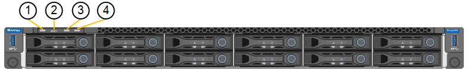

= Ver indicadores e códigos de estado
:allow-uri-read: 
:icons: font
:imagesdir: ../media/

[role="lead"]
Os dispositivos e controladores incluem indicadores que o ajudam a determinar o estado dos componentes do dispositivo.

[role="tabbed-block"]
====
.SG100 e SG1000
--
O dispositivo inclui indicadores que o ajudam a determinar o status do controlador do dispositivo e dos dois SSDs:

* <<appliance_indicators_SG100_1000,Indicadores e botões do aparelho>>
* <<general_boot_codes_SG100_1000,Códigos gerais de arranque>>
* <<ssd_indicators_SG100_1000,Indicadores SSD>>

Use essas informações para ajudar link:troubleshooting-hardware-installation-sg100-and-sg1000.html["Solucionar problemas de instalação de hardware SG100 e SG1000"].

[[appliance_indicators_SG100_1000]]
Indicadores e botões do aparelho::
+
--
A figura a seguir mostra os indicadores de status e os botões nos SG100 e SG1000.

[cols="1a,2a,2a"]
|===
| Legenda | Visor | Estado 

 a| 
1
 a| 
Botão de alimentação
 a| 
* Azul: O aparelho está ligado.
* Desligado: O aparelho está desligado.

 a| 
2
 a| 
Botão Reset (Repor)
 a| 
Utilize este botão para executar uma reinicialização total do controlador.

 a| 
3
 a| 
Botão identificar
 a| 
Este botão pode ser definido como intermitente, ligado (sólido) ou desligado.

* Azul intermitente: Identifica o aparelho no gabinete ou rack.
* Azul, sólido: Identifica o aparelho no gabinete ou rack.
* Desligado: O aparelho não é visualmente identificável no gabinete ou no rack.

 a| 
4
 a| 
LED de alarme
 a| 
* Âmbar, sólido: Ocorreu um erro.
+
*Nota:* para visualizar os códigos de inicialização e de erro, link:accessing-bmc-interface.html["Acesse a interface do BMC"].

* Desligado: Nenhum erro está presente.

|===
--

[[general_boot_codes_SG100_1000]]
Códigos gerais de arranque::
+
--
Durante a inicialização ou após uma reinicialização forçada do aparelho, ocorre o seguinte:

. O controlador de gerenciamento de placa base (BMC) Registra códigos para a sequência de inicialização, incluindo quaisquer erros que ocorram.
. O botão liga/desliga acende-se.
. Se ocorrerem erros durante a inicialização, o LED de alarme acende-se.
+
Para exibir os códigos de inicialização e de erro, link:accessing-bmc-interface.html["Acesse a interface do BMC"].

--

[[ssd_indicators_SG100_1000]]
Indicadores SSD::
+
--
A figura a seguir mostra os indicadores de SSD no SG100 e SG1000.

image::../media/ssd_indicators.png[Indicadores SSD]

[cols="1a,2a,2a"]
|===
| LED | Visor | Estado 

 a| 
1
 a| 
Estado/avaria da transmissão
 a| 
* Azul (sólido): A unidade está online
* Âmbar (sólido): Falha da unidade
* Âmbar (intermitente): Luz de localização da unidade acesa
* Desligado: A ranhura está vazia

 a| 
2
 a| 
Condução ativa
 a| 
Azul (intermitente): A unidade está a ser acedida

|===
--

--
.SG110 e SG1100
--
O dispositivo inclui indicadores que o ajudam a determinar o status do controlador do dispositivo e dos SSDs:

* <<appliance_indicators,Indicadores e botões do aparelho>>
* <<general_boot_codes,Códigos gerais de arranque>>
* <<ssd_indicators,Indicadores SSD>>

Use essas informações para ajudar link:troubleshooting-hardware-installation-sg110-and-sg1100.html["Solucionar problemas de instalação de hardware SG110 e SG1100"].

[[appliance_indicators]]
Indicadores e botões do aparelho::
+
--
A figura a seguir mostra indicadores e botões nos aparelhos SG110 e SG1100.

image::../media/sgf6112_front_indicators.png[Indicadores dianteiros - SG110 e SG1100]

[cols="1a,2a,3a"]
|===
| Legenda | Visor | Estado 

 a| 
1
 a| 
Botão de alimentação
 a| 
* Azul: O aparelho está ligado.
* Desligado: O aparelho está desligado.

 a| 
2
 a| 
Botão Reset (Repor)
 a| 
Utilize este botão para executar uma reinicialização total do controlador.

 a| 
3
 a| 
Botão identificar
 a| 
Utilizando o BMC, este botão pode ser definido como intermitente, ligado (contínuo) ou desligado.

* Azul intermitente: Identifica o aparelho no gabinete ou rack.
* Azul, sólido: Identifica o aparelho no gabinete ou rack.
* Desligado: O aparelho não é visualmente identificável no gabinete ou no rack.

 a| 
4
 a| 
LED de estado
 a| 
* Âmbar, sólido: Ocorreu um erro.
+
*Nota:* para visualizar os códigos de inicialização e de erro, link:accessing-bmc-interface.html["Acesse a interface do BMC"].

* Desligado: Nenhum erro está presente.

 a| 
5
 a| 
PFR
 a| 
Esta luz não é utilizada pelos aparelhos SG110 e SG1100 e permanece apagada.

|===
--

[[general_boot_codes]]
Códigos gerais de arranque::
+
--
Durante a inicialização ou após uma reinicialização forçada do aparelho, ocorre o seguinte:

. O controlador de gerenciamento de placa base (BMC) Registra códigos para a sequência de inicialização, incluindo quaisquer erros que ocorram.
. O botão liga/desliga acende-se.
. Se ocorrerem erros durante a inicialização, o LED de alarme acende-se.
+
Para exibir os códigos de inicialização e de erro, link:accessing-bmc-interface.html["Acesse a interface do BMC"].

--

[[ssd_indicators]]
Indicadores SSD::
+
--
A figura a seguir mostra os indicadores SSD nos dispositivos SG110 e SG1100.

image::../media/ssd_indicators.png[Indicadores SSD]

[cols="1a,2a,2a"]
|===
| LED | Visor | Estado 

 a| 
1
 a| 
Estado/avaria da transmissão
 a| 
* Azul (sólido): A unidade está online
* Âmbar (sólido): Falha da unidade
* Desligado: A ranhura está vazia

 a| 
2
 a| 
Condução ativa
 a| 
Azul (intermitente): A unidade está a ser acedida

|===
--

--
.SG5700
--
Os controladores do aparelho incluem indicadores que o ajudam a determinar o estado do controlador do aparelho:

* <<boot_codes_sg5700,SG5700 códigos de estado do arranque>>
* <<status_indicators_e5700sg_controller,Indicadores de status no controlador E5700SG>>
* <<general_boot_codes_sg5700,Códigos gerais de arranque>>
* <<boot_codes_e5700sg_controller,Códigos de inicialização do controlador E5700SG>>
* <<error_codes_e5700sg_controller,E5700SG códigos de erro do controlador>>

Use essas informações para ajudar link:troubleshooting-hardware-installation.html["Solucionar problemas de instalação de hardware do SG5700"].

[[boot_codes_sg5700]]
SG5700 códigos de estado do arranque::
+
--
Os ecrãs de sete segmentos em cada controlador mostram os códigos de estado e de erro à medida que o aparelho liga.

O controlador E2800 e o controlador E5700SG apresentam diferentes Estados e códigos de erro.

Para entender o que esses códigos significam, consulte os seguintes recursos:

[cols="1a,2a"]
|===
| Controlador | Referência 

 a| 
Controlador E2800
 a| 
_Guia de monitorização do sistema E5700 e E2800_

*Nota:* os códigos listados para o controlador e-Series E5700 não se aplicam ao controlador E5700SG no aparelho.

 a| 
Controlador E5700SG
 a| 
"Indicadores de status no controlador E5700SG"

|===
--

.Passos
. Durante o arranque, monitorize o progresso visualizando os códigos apresentados nos ecrãs de sete segmentos.
+
** O visor de sete segmentos no controlador E2800 mostra a sequência de repetição *os*, *SD*, `*_blank_*` para indicar que está a efetuar o processamento de início do dia.
** O visor de sete segmentos no controlador E5700SG mostra uma sequência de códigos, terminando com *AA* e *FF*.

. Depois que os controladores iniciarem, confirme se as exibições de sete segmentos mostram o seguinte:
+
image::../media/seven_segment_display_codes.gif[Exibições de sete segmentos depois que os controladores iniciarem.]

+
[cols="1a,2a"]
|===
| Controlador | Visor de sete segmentos 

 a| 
Controlador E2800
 a| 
A mostra 99, que é o ID padrão de um compartimento de controladora e-Series.

 a| 
Controlador E5700SG
 a| 
Mostra *HO*, seguido de uma sequência repetida de dois números.

[listing]
----
HO -- IP address for Admin Network -- IP address for Grid Network HO
----
Na sequência, o primeiro conjunto de números é o endereço IP atribuído pelo DHCP para a porta de gerenciamento 1 do controlador. Este endereço é utilizado para ligar o controlador à rede de administração para StorageGRID. O segundo conjunto de números é o endereço IP atribuído pelo DHCP utilizado para ligar o dispositivo à rede de grelha para StorageGRID.

*Nota:* se um endereço IP não puder ser atribuído usando DHCP, 0.0.0.0 será exibido.

|===
. Se as telas de sete segmentos mostrarem outros valores, consulte link:troubleshooting-hardware-installation.html["Solucionar problemas de instalação de hardware (SG6000 ou SG5700)"] e confirme que você concluiu as etapas de instalação corretamente. Se não conseguir resolver o problema, contacte o suporte técnico.

[[status_indicators_e5700sg_controller]]
Indicadores de status no controlador E5700SG::
+
--
O visor de sete segmentos e os LEDs no controlador E5700SG mostram códigos de estado e erro enquanto o aparelho liga e enquanto o hardware está a ser inicializado. Você pode usar esses monitores para determinar o status e solucionar erros.

Após o instalador do StorageGRID Appliance ter iniciado, você deve revisar periodicamente os indicadores de status no controlador E5700SG.

A figura a seguir mostra os indicadores de status no controlador E5700SG.

image::../media/e5700sg_leds.gif[Indicadores de status no controlador E5700SG]

[cols="1a,2a,2a"]
|===
| Legenda | Visor | Descrição 

 a| 
1
 a| 
LED de atenção
 a| 
Âmbar: O controlador está com defeito e requer atenção do operador, ou o script de instalação não foi encontrado.

Desligado: O controlador está operando normalmente.

 a| 
2
 a| 
Visor de sete segmentos
 a| 
Mostra um código de diagnóstico

As sequências de visualização de sete segmentos permitem compreender os erros e o estado operacional do aparelho.

 a| 
3
 a| 
LEDs de atenção da porta de expansão
 a| 
Âmbar: Estes LEDs são sempre âmbar (sem ligação estabelecida) porque o aparelho não utiliza as portas de expansão.

 a| 
4
 a| 
LEDs de Status do Link da porta do host
 a| 
Verde: O link está ativo.

Desligado: O link está inativo.

 a| 
5
 a| 
LEDs de estado da ligação Ethernet
 a| 
Verde: Um link é estabelecido.

Desligado: Nenhum link é estabelecido.

 a| 
6
 a| 
LEDs de atividade Ethernet
 a| 
Verde: O link entre a porta de gerenciamento e o dispositivo ao qual está conetado (como um switch Ethernet) está ativado.

Desligado: Não existe ligação entre o controlador e o dispositivo ligado.

Verde intermitente: Existe atividade Ethernet.

|===
--

[[general_boot_codes_sg5700]]
Códigos gerais de arranque::
+
--
Durante a inicialização ou após uma reinicialização forçada do aparelho, ocorre o seguinte:

. O visor de sete segmentos no controlador E5700SG apresenta uma sequência geral de códigos que não é específica do controlador. A sequência geral termina com os códigos AA e FF.
. São apresentados códigos de arranque específicos do controlador E5700SG.

--

[[boot_codes_e5700sg_controller]]
Códigos de inicialização do controlador E5700SG::
+
--
Durante uma inicialização normal do aparelho, o visor de sete segmentos no controlador E5700SG mostra os seguintes códigos na ordem indicada:

[cols="1a,3a"]
|===
| Código | Indica 

 a| 
OLÁ
 a| 
O script de inicialização mestre foi iniciado.

 a| 
DE PP
 a| 
O sistema está verificando se o FPGA precisa ser atualizado.

 a| 
HP
 a| 
O sistema está verificando se o firmware da controladora 10/25-GbE precisa ser atualizado.

 a| 
RB
 a| 
O sistema está reiniciando após a aplicação de atualizações de firmware.

 a| 
FP
 a| 
As verificações de atualização do firmware do subsistema de hardware foram concluídas. Os serviços de comunicação entre controladores estão a iniciar.

 a| 
ELE
 a| 
O sistema aguarda conetividade com o controlador E2800 e sincronização com o sistema operativo SANtricity.

*Nota:* se este procedimento de arranque não passar por esta fase, verifique as ligações entre os dois controladores.

 a| 
HC
 a| 
O sistema está a verificar se existem dados de instalação do StorageGRID.

 a| 
HO
 a| 
O Instalador de dispositivos StorageGRID está em execução.

 a| 
HA
 a| 
O StorageGRID está em execução.

|===
--

[[error_codes_e5700sg_controller]]
E5700SG códigos de erro do controlador::
+
--
Estes códigos representam condições de erro que podem ser apresentadas no controlador E5700SG à medida que o aparelho arranca. Códigos hexadecimais de dois dígitos adicionais são exibidos se ocorrerem erros específicos de hardware de baixo nível. Se algum destes códigos persistir durante mais de um segundo ou dois, ou se não conseguir resolver o erro seguindo um dos procedimentos de resolução de problemas prescritos, contacte o suporte técnico.

[cols="1a,3a"]
|===
| Código | Indica 

 a| 
22
 a| 
Nenhum Registro mestre de inicialização encontrado em qualquer dispositivo de inicialização.

 a| 
23
 a| 
O disco flash interno não está ligado.

 a| 
2A, 2B
 a| 
Barramento preso, não é possível ler dados SPD do DIMM.

 a| 
40
 a| 
DIMMs inválidos.

 a| 
41
 a| 
DIMMs inválidos.

 a| 
42
 a| 
Falha no teste de memória.

 a| 
51
 a| 
Falha na leitura de SPD.

 a| 
92 a 96
 a| 
Inicialização do barramento PCI.

 a| 
A0 a A3
 a| 
Inicialização da unidade SATA.

 a| 
AB
 a| 
Código de inicialização alternativo.

 a| 
AE
 a| 
A arrancar o SO.

 a| 
EA
 a| 
DDR4 a formação falhou.

 a| 
E8
 a| 
Nenhuma memória instalada.

 a| 
UE
 a| 
O script de instalação não foi encontrado.

 a| 
EP
 a| 
A instalação ou comunicação com o controlador E2800 falhou.

|===
--

.Informações relacionadas
* https://mysupport.netapp.com/site/global/dashboard["Suporte à NetApp"^]
* https://library.netapp.com/ecmdocs/ECMLP2588751/html/frameset.html["Guia de monitorização do sistema E5700 e E2800"^]

--
.SG5800
--
Os controladores do aparelho incluem indicadores que o ajudam a determinar o estado do controlador do aparelho. Use essas informações para ajudar link:troubleshooting-hardware-installation.html["Solucionar problemas de instalação de hardware do SG5800"].

Indicadores de status no controlador SG5800::
+
--
Após o instalador do StorageGRID Appliance ter iniciado, você deve revisar periodicamente os indicadores de status no controlador SG5800.

A figura a seguir mostra os indicadores de status no controlador SG5800.

image::../media/sg5800_leds.png[Indicadores de status no controlador SG5800]

[cols="1a,2a,2a"]
|===
| Legenda | Visor | Descrição 

 a| 
1
 a| 
LED de atenção
 a| 
Âmbar: O controlador está com defeito e requer atenção do operador, ou o script de instalação não foi encontrado.

Desligado: O controlador está operando normalmente.

 a| 
2
 a| 
LEDs de atenção da porta de expansão
 a| 
Âmbar: Estes LEDs são sempre âmbar (sem ligação estabelecida) porque o aparelho não utiliza as portas de expansão.

 a| 
3
 a| 
LEDs de Status do Link da porta do host
 a| 
Verde: O link está ativo.

Desligado: O link está inativo.

 a| 
4
 a| 
LEDs de estado da ligação Ethernet
 a| 
Verde: Um link é estabelecido.

Desligado: Nenhum link é estabelecido.

 a| 
5
 a| 
LEDs de atividade Ethernet
 a| 
Verde: O link entre a porta de gerenciamento e o dispositivo ao qual está conetado (como um switch Ethernet) está ativado.

Desligado: Não existe ligação entre o controlador e o dispositivo ligado.

Verde intermitente: Existe atividade Ethernet.

|===
--

.Informações relacionadas
* https://mysupport.netapp.com/site/global/dashboard["Suporte à NetApp"^]

--
.SG6000
--
Os controladores do dispositivo SG6000 incluem indicadores que o ajudam a determinar o estado do controlador do aparelho:

* <<status_indicators_sg6000cn,Indicadores de estado e botões no controlador SG6000-CN>>
* <<general_boot_codes_sg6000,Códigos gerais de arranque>>
* <<boot_codes_sg6000_storage_controller,Códigos de status de inicialização para controladores de storage SG6000>>

Use essas informações para ajudar link:troubleshooting-hardware-installation.html["Solucionar problemas de instalação do SG6000"].

[[status_indicators_sg6000cn]]
Indicadores de estado e botões no controlador SG6000-CN::
+
--
O controlador SG6000-CN inclui indicadores que o ajudam a determinar o estado do controlador, incluindo os seguintes indicadores e botões.

A figura a seguir mostra os indicadores de status e os botões no controlador SG6000-CN.

[cols="1a,2a,3a"]
|===
| Legenda | Visor | Descrição 

 a| 
1
 a| 
Botão de alimentação
 a| 
* Azul: O controlador está ligado.
* Desligado: O controlador está desligado.

 a| 
2
 a| 
Botão Reset (Repor)
 a| 
_Nenhum indicador_

Utilize este botão para executar uma reinicialização total do controlador.

 a| 
3
 a| 
Botão identificar
 a| 
* Azul intermitente ou contínuo: Identifica o controlador no gabinete ou rack.
* Desligado: O controlador não é visualmente identificável no gabinete ou rack.

Este botão pode ser definido como intermitente, ligado (sólido) ou desligado.

 a| 
4
 a| 
LED de alarme
 a| 
* Âmbar: Ocorreu um erro.
+
*Nota:* para visualizar os códigos de inicialização e de erro, link:accessing-bmc-interface.html["Acesse a interface do BMC"].

* Desligado: Nenhum erro está presente.

|===
--

[[general_boot_codes_sg6000]]
Códigos gerais de arranque::
+
--
Durante a inicialização ou após uma reinicialização forçada do controlador SG6000-CN, ocorre o seguinte:

. O controlador de gerenciamento de placa base (BMC) Registra códigos para a sequência de inicialização, incluindo quaisquer erros que ocorram.
. O botão liga/desliga acende-se.
. Se ocorrerem erros durante a inicialização, o LED de alarme acende-se.
+
Para exibir os códigos de inicialização e de erro, link:accessing-bmc-interface.html["Acesse a interface do BMC"].

--

[[boot_codes_sg6000_storage_controller]]
Códigos de status de inicialização para controladores de storage SG6000::
+
--
Cada controlador de storage tem uma tela de sete segmentos que fornece códigos de status à medida que o controlador liga. Os códigos de status são os mesmos para o controlador E2800 e o controlador EF570.

Para obter descrições desses códigos, consulte as informações de monitoramento do sistema e-Series para o tipo de controlador de storage.

--

.Passos
. Durante a inicialização, monitore o progresso visualizando os códigos mostrados no visor de sete segmentos para cada controlador de armazenamento.
+
A exibição de sete segmentos em cada controlador de armazenamento mostra a sequência repetida *os*, *SD*, `*_blank_*` para indicar que o controlador está executando o processamento de início do dia.

. Após a inicialização dos controladores, confirme se cada controlador de armazenamento mostra 99, que é o ID padrão para um compartimento de controladora e-Series.
+
Certifique-se de que esse valor seja exibido em ambos os controladores de storage, como mostrado neste exemplo E2800 controlador.

+
image::../media/seven_segment_display_codes_for_e2800.gif[Códigos de exibição de sete segmentos para E2800]

. Se um ou ambos os controladores mostrarem outros valores, consulte link:troubleshooting-hardware-installation.html["Solucionar problemas de instalação de hardware (SG6000 ou SG5700)"] e confirme que concluiu corretamente as etapas de instalação. Se não conseguir resolver o problema, contacte o suporte técnico.

.Informações relacionadas
* https://mysupport.netapp.com/site/global/dashboard["Suporte à NetApp"^]
* link:../sg6000/power-sg6000-cn-controller-off-on.html#power-on-sg6000-cn-controller-and-verify-operation["Ligue o controlador SG6000-CN e verifique a operação"]

--
.SG6100
--
O dispositivo inclui indicadores que o ajudam a determinar o status do controlador do dispositivo e dos SSDs:

* <<appliance_indicators_SG6100,Indicadores e botões do aparelho>>
* <<general_boot_codes_SG6100,Códigos gerais de arranque>>
* <<ssd_indicators_SG6100,Indicadores SSD>>

Use essas informações para ajudar link:troubleshooting-hardware-installation-sg6100.html["Solucionar problemas de instalação de hardware do SG6100"].

[[appliance_indicators_SG6100]]
Indicadores e botões do aparelho::
+
--
A figura a seguir mostra indicadores e botões nos aparelhos SG6100.

image::../media/sgf6112_front_indicators.png[Indicadores dianteiros - SGF6112]

[cols="1a,2a,3a"]
|===
| Legenda | Visor | Estado 

 a| 
1
 a| 
Botão de alimentação
 a| 
* Azul: O aparelho está ligado.
* Desligado: O aparelho está desligado.

 a| 
2
 a| 
Botão Reset (Repor)
 a| 
Utilize este botão para executar uma reinicialização total do controlador.

 a| 
3
 a| 
Botão identificar
 a| 
Utilizando o BMC, este botão pode ser definido como intermitente, ligado (contínuo) ou desligado.

* Azul intermitente: Identifica o aparelho no gabinete ou rack.
* Azul, sólido: Identifica o aparelho no gabinete ou rack.
* Desligado: O aparelho não é visualmente identificável no gabinete ou no rack.

 a| 
4
 a| 
LED de estado
 a| 
* Âmbar, sólido: Ocorreu um erro.
+
*Nota:* para visualizar os códigos de inicialização e de erro, link:accessing-bmc-interface.html["Acesse a interface do BMC"].

* Desligado: Nenhum erro está presente.

 a| 
5
 a| 
PFR
 a| 
Esta luz não é usada por aparelhos SG6100 e permanece apagada.

|===
--

[[general_boot_codes_SG6100]]
Códigos gerais de arranque::
+
--
Durante a inicialização ou após uma reinicialização forçada do aparelho, ocorre o seguinte:

. O controlador de gerenciamento de placa base (BMC) Registra códigos para a sequência de inicialização, incluindo quaisquer erros que ocorram.
. O botão liga/desliga acende-se.
. Se ocorrerem erros durante a inicialização, o LED de alarme acende-se.
+
Para exibir os códigos de inicialização e de erro, link:accessing-bmc-interface.html["Acesse a interface do BMC"].

--

[[ssd_indicators_SG6100]]
Indicadores SSD::
+
--
A figura a seguir mostra os indicadores SSD no dispositivo SGF6112 ou SG6160.

image::../media/ssd_indicators.png[Indicadores SSD]

[cols="1a,2a,2a"]
|===
| LED | Visor | Estado 

 a| 
1
 a| 
Estado/avaria da transmissão
 a| 
* Azul (sólido): A unidade está online
* Âmbar (sólido): Falha da unidade
* Desligado: A ranhura está vazia

*Nota:* se um novo SSD em funcionamento for inserido em um nó SGF6112 ou SG6160 StorageGRID em funcionamento, os LEDs no SSD deverão piscar inicialmente, mas parar de piscar assim que o sistema determinar que a unidade tem capacidade suficiente e está funcional.

 a| 
2
 a| 
Condução ativa
 a| 
Azul (intermitente): A unidade está a ser acedida

|===
--

.Informações relacionadas
* https://mysupport.netapp.com/site/global/dashboard["Suporte à NetApp"^]

--
====