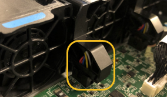

= Substitua o ventilador em SG100 ou SG1000
:allow-uri-read: 
:icons: font
:imagesdir: ../media/

[role="lead"]
O aparelho de serviços tem oito ventiladores de refrigeração. Se uma das ventoinhas falhar, deve substituí-la o mais rapidamente possível para garantir que o aparelho arrefeça corretamente.

.Antes de começar
* Desembalou a ventoinha de substituição.
* Você link:locating-controller-in-data-center.html["localizado fisicamente o aparelho"]tem .
* Você confirmou que os outros ventiladores estão instalados e funcionando.

.Sobre esta tarefa
O nó do aparelho não estará acessível enquanto substituir a ventoinha.

A fotografia mostra um ventilador para o aparelho de serviços. As ventoinhas de arrefecimento estão acessíveis depois de retirar a tampa superior do aparelho.

NOTE: Cada uma das duas unidades de fonte de alimentação também contém um ventilador. Esses fãs não estão incluídos neste procedimento.

image::../media/fan_fru.png[Ventoinha FRU]

.Passos
. Desligue o aparelho.
+
.. Faça login no nó da grade:
+
... Introduza o seguinte comando: `ssh admin@_grid_node_IP_`
... Introduza a palavra-passe listada no `Passwords.txt` ficheiro.
... Digite o seguinte comando para mudar para root: `su -`
... Introduza a palavra-passe listada no `Passwords.txt` ficheiro.
+
Quando você estiver conetado como root, o prompt mudará de `$` para `#`.

.. Desligue o aparelho de serviços
`*shutdown -h now*`

. Use um dos dois métodos para verificar se a energia do dispositivo de serviços está desligada:
+
** O LED indicador de alimentação na parte frontal do aparelho está apagado.
** A página Controle de energia da interface BMC indica que o aparelho está desligado.

. Puxe o aparelho para fora do rack.
. Levante o trinco da tampa superior e retire a tampa do aparelho.
. Localize o ventilador que falhou.
+
image::../media/fan_location.png[Localização dos fãs]

. Levante a ventoinha avariada para fora do chassis.
+
image::../media/fan_removal.png[Remoção da ventoinha]

. Faça deslizar a ventoinha de substituição para a ranhura aberta no chassis.
+
Alinhe a extremidade da ventoinha com o pino-guia. O pino é circulado na fotografia.

+
image::../media/fan_guide_pin.png[Pino de guia do ventilador]

. Pressione firmemente o conetor da ventoinha na placa de circuito impresso.
+

. Volte a colocar a tampa superior no aparelho e pressione o trinco para baixo para fixar a tampa no lugar.
. Ligue o aparelho e monitorize os LEDs do controlador e os códigos de arranque.
+
Use a interface BMC para monitorar o status de inicialização.

. Confirme se o nó do dispositivo é exibido no Gerenciador de Grade e se nenhum alerta é exibido.

Após a substituição da peça, devolva a peça com falha à NetApp, conforme descrito nas instruções de RMA fornecidas com o kit. Consulte a https://mysupport.netapp.com/site/info/rma["Substituição  Devolução artigo"^] página para obter mais informações.
