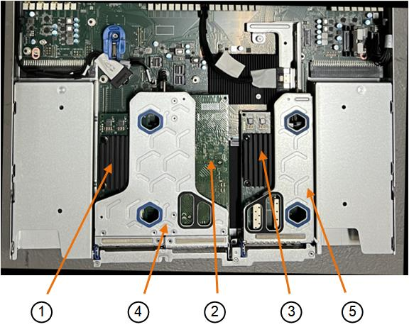
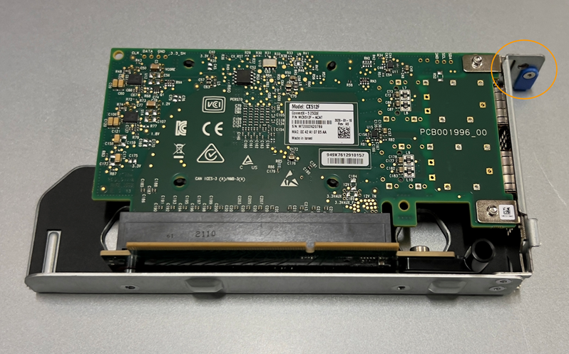

= Substitua a NIC em um SG110 ou SG1100
:allow-uri-read: 
:icons: font
:imagesdir: ../media/

[role="lead"]
Talvez seja necessário substituir uma placa de interface de rede (NIC) no SG110 ou SG1100 se não estiver funcionando de forma ideal ou se tiver falhado.

Use estes procedimentos para:

* Remova a NIC
* Reinstale a NIC

== Remova a NIC

.Antes de começar
* Tem a NIC de substituição correta.
* Você determinou o link:verify-component-to-replace.html["Localização da NIC a substituir"].
* Você tem link:locating-sg110-and-sg1100-in-data-center.html["Localizado fisicamente o aparelho SG110 ou SG1100"] onde você está substituindo a NIC no data center.
+

NOTE: É necessário um link:power-sg110-and-sg1100-off-on.html#shut-down-the-appliance["corte de funcionamento controlado do aparelho"]antes de retirar o aparelho do rack.

* Desligou todos os cabos e link:reinstalling-sg110-and-sg1100-cover.html["a tampa do aparelho foi removida"].

.Sobre esta tarefa
Para evitar interrupções de serviço, confirme se todos os outros nós de armazenamento estão conetados à grade antes de iniciar a substituição da placa de interface de rede (NIC) ou substitua a placa de rede durante uma janela de manutenção programada quando os períodos de interrupção de serviço são aceitáveis. Consulte as informações sobre https://docs.netapp.com/us-en/storagegrid-118/monitor/monitoring-system-health.html#monitor-node-connection-states["monitorização dos estados de ligação do nó"^]o .

CAUTION: Se você já usou uma regra ILM que cria apenas uma cópia de um objeto, você deve substituir a NIC durante uma janela de manutenção programada, pois você pode perder temporariamente o acesso a esses objetos durante este procedimento. Consulte informações sobre https://docs.netapp.com/us-en/storagegrid-118/ilm/why-you-should-not-use-single-copy-replication.html["por que você não deve usar replicação de cópia única"^]o .

.Passos
. Enrole a extremidade da correia da pulseira ESD à volta do pulso e fixe a extremidade do clipe a um solo metálico para evitar descargas estáticas.
. Localize o conjunto riser que contém a NIC na parte de trás do aparelho.
+
As três placas de rede no aparelho estão em dois conjuntos de riser nas posições no chassi mostrado na fotografia (parte traseira do aparelho com a tampa superior removida mostrada):

+

+
[cols="1a,2a,4a"]
|===
|  | Nome do dispositivo ou da peça | Descrição 

 a| 
1
 a| 
hic1/hic2
 a| 
Portas de rede Ethernet de 10/25 GbE no conjunto riser de duas portas

 a| 
2
 a| 
mtc1/mtc2
 a| 
Portas de gerenciamento 1/10GBaseBASE-T no conjunto riser de duas portas

 a| 
3
 a| 
hic3/hic4
 a| 
Portas de rede Ethernet de 10/25 GbE no conjunto riser de uma porta

 a| 
4
 a| 
Conjunto riser de duas ranhuras
 a| 
Suporte para uma das placas de rede 10/25-GbE e a placa de rede 1/10GBaseBASE-T.

 a| 
5
 a| 
Conjunto riser de uma ranhura
 a| 
Suporte para uma das NICs de 10/25 GbE

|===
. Segure o conjunto da riser com a NIC com falha através dos orifícios marcados a azul e levante-o cuidadosamente para cima. Mova o conjunto da riser em direção à frente do chassi enquanto o levanta para permitir que os conetores externos em suas NICs instaladas evitem o chassi.
. Coloque a riser em uma superfície plana e antiestática com a estrutura metálica voltada para baixo para acessar as placas de rede.
+
** * Conjunto riser de dois slots com duas NICs*
+
image::../media/two-slot-assembly-sgf6112.png[Duas placas de rede no conjunto riser de dois slots]

** * Conjunto riser de um slot com uma NIC*
+

. Abra a trava azul (circulada) na placa de rede a ser substituída e remova cuidadosamente a placa de rede do conjunto da riser. Agite ligeiramente a placa de rede para ajudar a remover a placa de rede do respetivo conetor. Não use força excessiva.
. Coloque a placa de rede sobre uma superfície antiestática plana.

== Reinstale a NIC interna

Instale a NIC de substituição no mesmo local que a que foi removida.

.Antes de começar
* Tem a NIC de substituição correta.
* Você removeu a NIC existente com falha.

.Passos
. Enrole a extremidade da correia da pulseira ESD à volta do pulso e fixe a extremidade do clipe a um solo metálico para evitar descargas estáticas.
. Remova a placa de rede de substituição da respetiva embalagem.
. Se você estiver substituindo uma das placas de rede no conjunto riser de dois slots, faça o seguinte:
+
.. Certifique-se de que o trinco azul está na posição aberta.
.. Alinhe a NIC com o respetivo conetor no conjunto da riser. Pressione cuidadosamente a placa de rede para dentro do conetor até que esteja totalmente encaixada, como mostrado na fotografia, e feche a trava azul.
+
image::../media/two-slot-assembly-sgf6112.png[Duas placas de rede no conjunto riser de dois slots]

.. Localize o orifício de alinhamento no conjunto da riser de duas ranhuras (circulado) que se alinha com um pino-guia na placa de sistema para garantir o posicionamento correto do conjunto da riser.
+
image::../media/sgf6112_two-slot-riser_alignment_hole.png[Orifício de alinhamento no conjunto da riser grande]

.. Localize o pino-guia na placa de sistema
+
image::../media/sgf6112_two-slot-riser_guide-pin.png[Pino-guia para conjunto de riser de duas ranhuras]

.. Posicione o conjunto da riser no chassi, certificando-se de que ele se alinha com o conetor na placa de sistema e o pino guia.
.. Pressione cuidadosamente o conjunto do riser de duas ranhuras no lugar ao longo da linha central, ao lado dos orifícios marcados com azul, até que esteja totalmente assentado.

. Se você estiver substituindo a NIC no conjunto riser de um slot, faça o seguinte:
+
.. Certifique-se de que o trinco azul está na posição aberta.
.. Alinhe a NIC com o respetivo conetor no conjunto da riser. Pressione cuidadosamente a placa de rede para dentro do conetor até que esteja totalmente encaixada, conforme mostrado na fotografia, e feche o trinco azul.
+

.. Localize o orifício de alinhamento no conjunto da riser de uma ranhura (circulado) que se alinha com um pino-guia na placa de sistema para garantir o posicionamento correto do conjunto da riser.
+
image::../media/sgf6112_one-slot-riser_alignment_hole.png[Orifício de alinhamento no conjunto da riser de uma ranhura]

.. Localize o pino-guia na placa de sistema
+
image::../media/sgf6112_one-slot-riser_system-pin.png[Pino-guia no conjunto da riser de uma ranhura]

.. Posicione o conjunto da riser de um slot no chassi, certificando-se de que ele se alinha com o conetor na placa de sistema e o pino guia.
.. Pressione cuidadosamente o conjunto da riser de uma ranhura no lugar ao longo da linha central, ao lado dos orifícios marcados a azul, até que esteja totalmente assente.

. Remova as tampas de proteção das portas NIC onde você estará reinstalando os cabos.

.Depois de terminar
Se não tiver outros procedimentos de manutenção a executar no aparelho, volte a instalar a tampa do aparelho, volte a colocar o aparelho no rack, ligue os cabos e ligue a alimentação.

Após a substituição da peça, devolva a peça com falha à NetApp, conforme descrito nas instruções de RMA fornecidas com o kit. Consulte a https://mysupport.netapp.com/site/info/rma["Substituição  Devolução artigo"^] página para obter mais informações.
