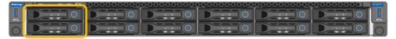

= Substitua as unidades no SG110 ou SG1100
:allow-uri-read: 
:icons: font
:imagesdir: ../media/

[role="lead"]
Os dispositivos de serviços SG110 e SG1100 contêm duas unidades SSD. As unidades são espelhadas usando RAID1 para redundância. Se uma das unidades falhar, você deve substituí-la o mais rápido possível para garantir a redundância.

.Antes de começar
* Você link:locating-sg110-and-sg1100-in-data-center.html["localizado fisicamente o aparelho"]tem .
* Você verificou qual unidade falhou observando que o LED esquerdo da unidade é âmbar sólido ou usando o Gerenciador de Grade para link:verify-component-to-replace.html["veja o alerta causado pela unidade com falha"].
+

IMPORTANT: Consulte as informações sobre como visualizar indicadores de status para verificar a falha.

* Obteve a unidade de substituição.
* Você obteve proteção ESD adequada.

.Passos
. Verifique se o LED de falha esquerdo da unidade está âmbar ou use o ID do slot da unidade do alerta para localizar a unidade.
+
As unidades estão nas seguintes posições no chassi (frente do chassi com a moldura removida mostrada):

+

. Enrole a extremidade da correia da pulseira ESD à volta do pulso e fixe a extremidade do clipe a um solo metálico para evitar descargas estáticas.
. Desembale a unidade de substituição e coloque-a numa superfície plana e livre de estática perto do aparelho.
+
Salve todos os materiais de embalagem.

. Pressione o botão de liberação na unidade com falha.
+
image::../media/h600s_driveremoval.gif[Remoção da unidade]

+
A alavanca nas molas de acionamento abre parcialmente e a unidade solta-se da ranhura.

. Abra a alça, deslize a unidade para fora e coloque-a em uma superfície plana e livre de estática.
. Pressione o botão de liberação na unidade de substituição antes de inseri-la no slot da unidade.
+
As molas do trinco abrem.

+
image::../media/h600s_driveinstall.gif[Instalação da unidade]

. Insira a unidade de substituição na ranhura e, em seguida, feche a pega da unidade.
+

IMPORTANT: Não utilize força excessiva ao fechar a pega.

+
Quando a unidade estiver totalmente inserida, você ouvirá um clique.

+
A unidade substituída é reconstruída automaticamente com dados espelhados da unidade de trabalho. Você pode verificar o status da reconstrução usando o Gerenciador de Grade. Aceda a *NODES* `*Appliance Node*` > *hardware*. O campo Storage RAID Mode (modo RAID de armazenamento) contém uma mensagem de "reconstrução" até que a unidade seja completamente reconstruída.

Após a substituição da peça, devolva a peça com falha à NetApp, conforme descrito nas instruções de RMA fornecidas com o kit. Consulte a https://mysupport.netapp.com/site/info/rma["Substituição  Devolução artigo"^] página para obter mais informações.
