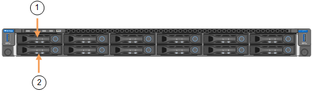

= Substitua os aparelhos SG110 ou SG110
:allow-uri-read: 
:icons: font
:imagesdir: ../media/

[role="lead"]
Pode ser necessário substituir o aparelho se não estiver a funcionar de forma ideal ou se tiver falhado.

.Antes de começar
* Tem um aparelho de substituição com o mesmo número de peça do aparelho que está a substituir. Verifique as etiquetas anexadas à parte frontal dos aparelhos para confirmar que os números de peça correspondem.
* Tem etiquetas para identificar cada cabo ligado ao aparelho.
* Você link:locating-sg110-and-sg1100-in-data-center.html["localizado fisicamente o aparelho"]tem .

.Sobre esta tarefa
O nó StorageGRID não estará acessível enquanto você substituir o dispositivo. Se o aparelho estiver a funcionar o suficiente, pode efetuar um encerramento controlado no início deste procedimento.

NOTE: Se estiver a substituir o dispositivo antes de instalar o software StorageGRID, poderá não conseguir aceder ao instalador do StorageGRID Appliance imediatamente após concluir este procedimento. Embora você possa acessar o Instalador de dispositivos StorageGRID de outros hosts na mesma sub-rede que o appliance, você não pode acessá-lo de hosts em outras sub-redes. Esta condição deve resolver-se dentro de 15 minutos (quando qualquer entrada de cache ARP para o tempo limite do dispositivo original), ou você pode limpar a condição imediatamente, limpando quaisquer entradas de cache ARP antigas manualmente do roteador ou gateway local.

.Passos
. Apresente as configurações atuais do aparelho e registe-as.
+
.. Inicie sessão no aparelho a substituir:
+
... Introduza o seguinte comando: `ssh admin@_grid_node_IP_`
... Introduza a palavra-passe listada no `Passwords.txt` ficheiro.
... Digite o seguinte comando para mudar para root: `su -`
... Introduza a palavra-passe listada no `Passwords.txt` ficheiro.
+
Quando você estiver conetado como root, o prompt mudará de `$` para `#`.

.. Enter: `*run-host-command ipmitool lan print*` Para exibir as configurações atuais do BMC para o dispositivo.

. link:power-sg110-and-sg1100-off-on.html#shut-down-the-sg110-or-sg1100-appliance["Desligue o aparelho"].
. Se qualquer uma das interfaces de rede neste dispositivo StorageGRID estiver configurada para DHCP, será necessário atualizar as atribuições permanentes de concessão DHCP nos servidores DHCP para fazer referência aos endereços MAC do dispositivo de substituição. Isso garante que o dispositivo receba os endereços IP esperados.
+
Contacte o administrador da rede ou do servidor DHCP para atualizar as atribuições de concessão DHCP permanentes. O administrador pode determinar os endereços MAC do dispositivo de substituição a partir dos logs do servidor DHCP ou inspecionando as tabelas de endereços MAC nos switches aos quais as portas Ethernet do dispositivo estão conetadas.

. Retire e substitua o aparelho:
+
.. Identifique os cabos e, em seguida, desligue os cabos e quaisquer transcetores de rede.
+

IMPORTANT: Para evitar um desempenho degradado, não torça, dobre, aperte ou pise nos cabos.

.. link:reinstalling-sg110-and-sg1100-into-cabinet-or-rack.html["Remova o aparelho com falha do gabinete ou rack"].
.. Anote a posição dos componentes substituíveis (duas fontes de alimentação, oito ventoinhas de arrefecimento, três placas de rede e dois SSDs) no dispositivo com falha.
+
As duas unidades estão nas seguintes posições no chassi (frente do chassi com a moldura removida mostrada):

+

+
|===
|  | Condução 

 a| 
1
 a| 
HDD00

 a| 
2
 a| 
HDD01

|===
.. Transfira os componentes substituíveis para o aparelho de substituição.
+
Siga as instruções de manutenção fornecidas para reinstalar os componentes substituíveis.

+

CAUTION: Se você deseja manter os dados nas unidades, certifique-se de inserir as unidades SSD nos mesmos slots de unidade que ocuparam no dispositivo com falha. Se não o fizer, o Instalador do aparelho apresentará uma mensagem de aviso e terá de colocar as unidades nas ranhuras corretas e reiniciar o aparelho antes de o aparelho poder voltar a ligar a grelha.

.. link:reinstalling-sg110-and-sg1100-into-cabinet-or-rack.html["Instale o aparelho de substituição no gabinete ou rack"].
.. Substitua os cabos e quaisquer transcetores óticos.

. Ligue o aparelho.
. Se o dispositivo substituído tiver a encriptação da unidade de hardware ativada para as unidades SED, tem de link:../installconfig/optional-enabling-node-encryption.html#access-an-encrypted-drive["introduza a frase-passe de encriptação da unidade"]aceder às unidades encriptadas quando o dispositivo de substituição for iniciado pela primeira vez.
. Aguarde que o aparelho volte a ligar a grelha. Se o aparelho não voltar a juntar-se à grelha, siga as orientações na página inicial do Instalador de dispositivos StorageGRID para resolver quaisquer problemas.
+

WARNING: Para evitar a perda de dados se o Instalador do dispositivo indicar que são necessárias alterações físicas de hardware, como mover unidades de disco para diferentes slots, desligue o dispositivo antes de fazer alterações de hardware.

. Se o dispositivo que você substituiu usou um servidor de gerenciamento de chaves (KMS) para gerenciar chaves de criptografia para criptografia de nó, configuração adicional pode ser necessária antes que o nó possa ingressar na grade. Se o nó não se juntar automaticamente à grade, certifique-se de que essas configurações foram transferidas para o novo dispositivo e configure manualmente quaisquer configurações que não tenham a configuração esperada:
+
** link:../installconfig/accessing-storagegrid-appliance-installer.html["Configurar conexões StorageGRID"]
** https://docs.netapp.com/us-en/storagegrid/admin/kms-overview-of-kms-and-appliance-configuration.html#set-up-the-appliance["Configure a criptografia de nó para o dispositivo"^]

. Inicie sessão no aparelho substituído:
+
.. Introduza o seguinte comando: `ssh admin@_grid_node_IP_`
.. Introduza a palavra-passe listada no `Passwords.txt` ficheiro.
.. Digite o seguinte comando para mudar para root: `su -`
.. Introduza a palavra-passe listada no `Passwords.txt` ficheiro.

. Restaure a conetividade de rede BMC para o dispositivo substituído. Existem duas opções:
+
** Use IP estático, máscara de rede e gateway
** Use DHCP para obter um IP, máscara de rede e gateway
+
... Para restaurar a configuração do BMC para usar um IP estático, máscara de rede e gateway, digite os seguintes comandos:
+
`*run-host-command ipmitool lan set 1 ipaddr _Appliance_IP_*`

+
`*run-host-command ipmitool lan set 1 netmask _Netmask_IP_*`

+
`*run-host-command ipmitool lan set 1 defgw ipaddr _Default_gateway_*`

... Para restaurar a configuração do BMC para usar DHCP para obter um IP, máscara de rede e gateway, digite o seguinte comando:
+
`*run-host-command ipmitool lan set 1 ipsrc dhcp*`

. Depois de restaurar a conetividade de rede BMC, conete-se à interface BMC para auditar e restaurar qualquer configuração personalizada adicional do BMC que você possa ter aplicado. Por exemplo, você deve confirmar as configurações para destinos de intercetação SNMP e notificações por e-mail. link:../installconfig/configuring-bmc-interface.html["Configurar a interface BMC"]Consulte .
. Confirme se o nó do dispositivo é exibido no Gerenciador de Grade e se nenhum alerta é exibido.

.Informações relacionadas
* link:../installconfig/viewing-status-indicators.html["Ver indicadores de estado"]
* link:../installconfig/troubleshooting-hardware-installation-sg110-and-sg1100.html#view-error-codes["Veja os códigos de inicialização do aparelho"]

Após a substituição da peça, devolva a peça com falha à NetApp, conforme descrito nas instruções de RMA fornecidas com o kit. Consulte a https://mysupport.netapp.com/site/info/rma["Substituição  Devolução artigo"^] página para obter mais informações.
