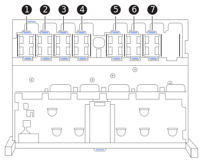

= Substituir a ventoinha em um SG120 ou SG1200
:allow-uri-read: 
:icons: font
:imagesdir: ../media/

[role="lead"]
Os appliances SG120 ou SG1200 possuem sete ventiladores de refrigeração. Se um dos ventiladores falhar, você deve substituí-lo o mais rápido possível para garantir que o appliance tenha refrigeração adequada.

.Sobre esta tarefa
Para evitar interrupções de serviço, confirme se todos os outros nós de armazenamento estão conetados à grade antes de iniciar a substituição do ventilador ou substitua o ventilador durante uma janela de manutenção programada quando os períodos de interrupção de serviço são aceitáveis. Consulte as informações sobre https://docs.netapp.com/us-en/storagegrid/monitor/monitoring-system-health.html#monitor-node-connection-states["monitorização dos estados de ligação do nó"^]o .

O nó do aparelho não estará acessível enquanto substituir a ventoinha.

Os ventiladores de resfriamento ficam acessíveis após a remoção da tampa superior do appliance.

NOTE: Cada uma das duas unidades de fonte de alimentação também contém um ventilador. As ventoinhas da fonte de alimentação não estão incluídas neste procedimento.

.Antes de começar
* Tem a ventoinha de substituição correta.
* Você link:verify-component-to-replace.html["determinada a localização da ventoinha a substituir"]tem .
* Você está link:locating-sg120-and-sg1200-in-data-center.html["localizou fisicamente o appliance SG120 ou SG1200"] no local onde está substituindo o ventilador no data center.
+

NOTE: A link:power-sg120-and-sg1200-off-on.html#shut-down-the-sg120-or-sg1200-appliance["corte de funcionamento controlado do aparelho"] é necessária antes de remover o aparelho do rack.

* Você desconectou todos os cabos e link:reinstalling-sg120-and-sg1200-cover.html["a tampa do aparelho foi removida"].
* Você confirmou que os outros ventiladores estão instalados e funcionando.

.Passos
. Enrole a extremidade da correia da pulseira ESD à volta do pulso e fixe a extremidade do clipe a um solo metálico para evitar descargas estáticas.
. Localize o ventilador que você precisa substituir.
+
Os sete ventiladores estão localizados nas seguintes posições no chassi (metade frontal do dispositivo StorageGRID com a tampa superior removida mostrada):

+

+
|===
| Posição do chassi | Grupo motoventilador 

 a| 
1
 a| 
Fan_SYS0

 a| 
2
 a| 
Fan_SYS1

 a| 
3
 a| 
Fan_SYS2

 a| 
4
 a| 
Fan_SYS3

 a| 
5
 a| 
Fan_SYS4

 a| 
6
 a| 
Fan_SYS5

 a| 
7
 a| 
Fan_SYS6

|===
. Usando as abas azuis na ventoinha, levante a ventoinha com falha para fora do chassis.
+
image:../media/drw_s2025_fan_replace_ieops-2552.svg["Removendo uma ventoinha do chassi"]

. Faça deslizar a ventoinha de substituição para a ranhura aberta no chassis.
+
Alinhe o conector do ventilador com o soquete na placa de circuito.

. Pressione firmemente o conetor da ventoinha na placa de circuito impresso.
. link:reinstalling-sg120-and-sg1200-cover.html["Volte a colocar a tampa superior no aparelho"], e pressione a trava para baixo para fixar a tampa no lugar.
. link:power-sg120-and-sg1200-off-on.html["Ligue o aparelho"] e monitorar os LEDs do appliance e os códigos de inicialização.
+
Use a interface BMC para monitorar o status de inicialização.

. Confirme se o nó do dispositivo é exibido no Gerenciador de Grade e se nenhum alerta é exibido.

Após substituir a peça, devolva a peça defeituosa à NetApp, conforme descrito nas instruções de RMA que acompanham o kit. Consulte a  https://mysupport.netapp.com/site/info/rma["Devolução e substituição de peças"^] página para obter mais informações.
