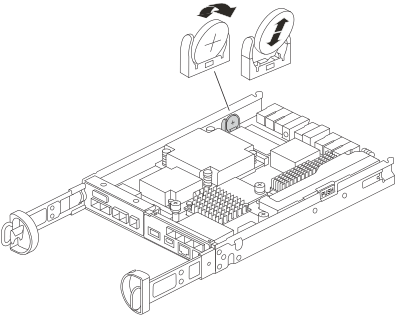

= Substitua a bateria CMOS no controlador SG5800
:allow-uri-read: 
:icons: font
:imagesdir: ../media/

[role="lead"]
Você pode precisar substituir a bateria CMOS no controlador SG5800 para que os serviços e aplicações do seu sistema tenham sincronização de tempo precisa e continuem funcionando normalmente.

.Sobre esta tarefa
Você não poderá acessar o nó de armazenamento do appliance ao substituir a bateria CMOS. Para evitar interrupções no serviço, confirme que todos os outros nós de armazenamento estão conectados à grid antes de iniciar a substituição da bateria CMOS ou substitua a bateria durante uma janela de manutenção programada, quando períodos de interrupção do serviço forem aceitáveis.

== Etapa 1: desligue o controlador SG5800

.Passos
. Faça login no nó da grade:
+
.. Introduza o seguinte comando: `ssh admin@grid_node_IP`
.. Introduza a palavra-passe listada no `Passwords.txt` ficheiro.
.. Digite o seguinte comando para mudar para root: `su -`
.. Introduza a palavra-passe listada no `Passwords.txt` ficheiro.
+
Quando você estiver conetado como root, o prompt mudará de `$` para `#`.

. Desligue o controlador SG5800:
+
*`shutdown -h now`*

== Passo 2: remova o controlador do aparelho

.Passos
. Coloque uma pulseira antiestática ou tome outras precauções antiestáticas.
. Identifique os cabos e, em seguida, desligue os cabos e SFPs.
+

NOTE: Para evitar a degradação do desempenho, não torça, dobre, aperte ou pise nos cabos.

. Solte o controlador do aparelho apertando o trinco na pega do came até soltar e, em seguida, abra a pega do came para a direita.
. Utilizando as duas mãos e a pega do came, deslize o controlador para fora do aparelho.
+

NOTE: Utilize sempre duas mãos para suportar o peso do controlador.

. Vire o módulo controlador e coloque-o sobre uma superfície plana e estável.
. Abra a tampa pressionando os botões azuis nas laterais do módulo de controle e, em seguida, gire a tampa para cima e retire-a do módulo de controle.
+
image::../media/drw_sg5800_open_controller_module_cover_IEOPS-695.svg[Abra a tampa do módulo controlador SG5800]

== Passo 3: substituir a bateria CMOS

.Passos
. Localize a bateria CMOS.
+

+

NOTE: Seu controlador pode ter uma aparência diferente da mostrada na ilustração. No entanto, a localização da bateria CMOS é a mesma.

. Empurre e gire a bateria cuidadosamente para afastá-la do suporte e, em seguida, levante-a para fora do aparelho.
+

NOTE: Observe a polaridade da bateria ao removê-la do suporte. A bateria é marcada com um sinal de mais e deve ser posicionada corretamente no suporte. Um sinal de mais próximo ao suporte indica como a bateria deve ser posicionada.

. Retire a bateria de substituição da embalagem de envio antiestática.
. Localize o compartimento vazio da bateria no módulo controlador.
. Observe a polaridade da bateria CMOS e, em seguida, insira-a no suporte inclinando a bateria em um ângulo e pressionando para baixo.
. Inspecione visualmente a bateria para garantir que ela esteja completamente instalada no suporte e que a polaridade esteja correta.
. Reinstale a tampa do controlador.

== Passo 4: reinstale o controlador no aparelho

.Passos
. Instale o controlador no appliance:
+
.. Vire o controle de forma que a tampa removível fique voltada para baixo.
.. Com a pega do came na posição aberta, deslize o controlador até ao aparelho.
.. Mova a alavanca do came para a esquerda para bloquear o controlador no lugar.
.. Reconecte os cabos.

. Após a reinicialização do controlador e o dispositivo se conectar novamente à rede, confirme se o nó de armazenamento do dispositivo aparece no Grid Manager e se nenhum alarme aparece.

Após a substituição da peça, devolva a peça com falha à NetApp, conforme descrito nas instruções de RMA fornecidas com o kit. Consulte a https://mysupport.netapp.com/site/info/rma["Substituição  Devolução artigo"] página para obter mais informações.
