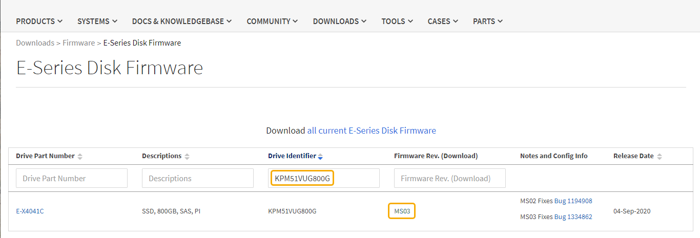

= Atualize o firmware da unidade SG5800 usando o Gerenciador de sistema SANtricity usando o método offline
:allow-uri-read: 
:icons: font
:imagesdir: ../media/

[role="lead"]
Use o método off-line do Gerenciador de sistema do SANtricity para atualizar o firmware nas unidades do seu dispositivo para garantir que você tenha todos os recursos e correções de bugs mais recentes.

.Antes de começar
* O dispositivo de armazenamento tem um status ideal.
* Todas as unidades têm um status ideal.
* Você link:../commonhardware/placing-appliance-into-maintenance-mode.html["Coloque o aparelho StorageGRID no modo de manutenção"]tem .
+

NOTE: Enquanto o aparelho está no modo de manutenção, a atividade de e/S (entrada/saída) para o controlador de armazenamento é interrompida para tornar as operações de armazenamento disruptivas seguras.

+

CAUTION: Não atualize o firmware da unidade em mais de um dispositivo StorageGRID de cada vez. Isso pode causar indisponibilidade de dados, dependendo do modelo de implantação e da política de ILM.

.Sobre esta tarefa
As unidades são atualizadas em paralelo enquanto o dispositivo está no modo de manutenção. Se o pool ou grupo de volume não suportar redundância ou estiver degradado, você deve usar o método off-line para atualizar o firmware da unidade. Você também deve usar o método off-line para qualquer unidade associada ao cache de leitura flash, ou qualquer pool ou grupo de volume que está atualmente degradado. O método off-line atualiza o firmware apenas enquanto toda a atividade de e/S é interrompida nas unidades a serem atualizadas. Para parar a atividade de e/S, coloque o nó no modo de manutenção.

O método off-line é mais rápido do que o método on-line e será significativamente mais rápido quando muitas unidades em um único dispositivo precisam de atualizações. No entanto, exige que os nós sejam retirados do serviço, o que pode exigir o agendamento de uma janela de manutenção e o progresso do monitoramento. Escolha o método mais adequado para seus procedimentos operacionais e o número de unidades que precisam ser atualizadas.

.Passos
. Confirme se o aparelho está na link:../commonhardware/placing-appliance-into-maintenance-mode.html["modo de manutenção"].
. Acesse o Gerenciador de sistemas do SANtricity usando um destes métodos:
+
** Use o Instalador de dispositivos StorageGRID e selecione *Avançado* > *Gerenciador de sistemas SANtricity*
** Use o Gerenciador de Grade e selecione *NÓS* > *_nó de armazenamento_* > *Gerenciador do sistema SANtricity*
** Use o Gerenciador do sistema SANtricity navegando até o IP do controlador de armazenamento:
+
`*https://_Storage_Controller_IP_*`

. Introduza o nome de utilizador e a palavra-passe do administrador do Gestor do sistema SANtricity, se necessário.
. Verifique a versão do firmware da unidade atualmente instalada no dispositivo de armazenamento:
+
.. No Gerenciador de sistema SANtricity, selecione *SUPORTE* > *Centro de Atualização*.
.. Em Drive firmware upgrade, selecione *Begin Upgrade* (Iniciar atualização).
+
A página Atualizar firmware da unidade exibe os arquivos de firmware da unidade atualmente instalados.

.. Observe as revisões atuais do firmware da unidade e os identificadores da unidade na coluna firmware da unidade atual.
+
image::../media/storagegrid_update_drive_firmware.png[Atualize o firmware da unidade]

+
Neste exemplo:

+
*** A revisão do firmware da unidade é *MS02*.
*** O identificador da unidade é *KPM51VUG800G*.

.. Selecione *Exibir unidades* na coluna unidades associadas para exibir onde essas unidades estão instaladas no seu dispositivo de armazenamento.
.. Feche a janela Upgrade Drive firmware (Atualizar firmware da unidade).

. Transfira e prepare a atualização de firmware da unidade disponível:
+
.. Em Atualização do firmware da unidade, selecione *suporte NetApp*.
.. No site de suporte da NetApp, selecione a guia *Downloads* e, em seguida, selecione *firmware da unidade de disco da série e*.
+
É apresentada a página firmware do disco e-Series.

.. Procure cada *Drive Identifier* instalado no seu dispositivo de armazenamento e verifique se cada identificador de unidade tem a revisão de firmware mais recente.
+
*** Se a revisão do firmware não for um link, esse identificador de unidade terá a revisão de firmware mais recente.
*** Se um ou mais números de peça de unidade forem listados para um identificador de unidade, uma atualização de firmware estará disponível para essas unidades. Pode selecionar qualquer ligação para transferir o ficheiro de firmware.
+

.. Se estiver listada uma revisão de firmware posterior, selecione o link na coluna firmware Rev. (Download) para baixar um `.zip` arquivo contendo o arquivo de firmware.
.. Extraia (descompacte) os arquivos de arquivo de firmware da unidade que você baixou do site de suporte.

. Instale a atualização do firmware da unidade:
+
.. No Gerenciador de sistema do SANtricity, em Atualização do firmware da unidade, selecione *Begin Upgrade*.
.. Selecione *Procurar* e selecione os novos arquivos de firmware da unidade que você baixou no site de suporte.
+
Os arquivos de firmware da unidade têm um nome de arquivo semelhante `D_HUC101212CSS600_30602291_MS01_2800_0002.dlp` ao .

+
Você pode selecionar até quatro arquivos de firmware da unidade, um de cada vez. Se mais de um arquivo de firmware de unidade for compatível com a mesma unidade, você receberá um erro de conflito de arquivo. Decida qual arquivo de firmware da unidade você deseja usar para a atualização e remova o outro.

.. Selecione *seguinte*.
+
*Selecionar unidades* lista as unidades que você pode atualizar com os arquivos de firmware selecionados.

+
Apenas as unidades compatíveis aparecem.

+
O firmware selecionado para a unidade aparece na coluna *firmware proposto*. Se tiver de alterar este firmware, selecione *voltar*.

.. Selecione *Atualizar todas as unidades offline (paralelo)* – atualiza as unidades que podem suportar um download de firmware apenas enquanto toda a atividade de e/S é interrompida em qualquer volume que use as unidades.
+

CAUTION: Deve colocar o aparelho no modo de manutenção antes de utilizar este método. Você deve usar o método *Offline* para atualizar o firmware da unidade.

+

CAUTION: Se pretender utilizar a atualização offline (paralela), não prossiga, a menos que tenha a certeza de que o aparelho está no modo de manutenção. A falha em colocar o aparelho no modo de manutenção antes de iniciar uma atualização de firmware da unidade offline pode causar perda de dados.

.. Na primeira coluna da tabela, selecione a unidade ou unidades que deseja atualizar.
+
A prática recomendada é atualizar todas as unidades do mesmo modelo para a mesma revisão de firmware.

.. Selecione *Start* (Iniciar) e confirme que pretende efetuar a atualização.
+
Se você precisar parar a atualização, selecione *Stop*. Todas as transferências de firmware atualmente em curso são concluídas. Quaisquer downloads de firmware que não tenham sido iniciados são cancelados.

+

CAUTION: Parar a atualização do firmware da unidade pode resultar em perda de dados ou unidades indisponíveis.

.. (Opcional) para ver uma lista do que foi atualizado, selecione *Save Log*.
+
O arquivo de log é salvo na pasta de downloads do navegador com o `latest-upgrade-log-timestamp.txt` nome .

+
link:troubleshoot-upgrading-drive-firmware-using-santricity-system-manager.html["Se necessário, solucione os erros de atualização do firmware do driver"].

. Após a conclusão do procedimento, execute quaisquer procedimentos de manutenção adicionais enquanto o nó estiver no modo de manutenção. Quando terminar, ou se tiver alguma avaria e quiser recomeçar, aceda ao Instalador de aplicações StorageGRID e selecione *Avançado* > *controlador de reinicialização*. Em seguida, selecione uma destas opções:
+
** * Reinicie no StorageGRID*.
** * Reinicie no modo de manutenção*. Reinicie o controlador e mantenha o nó no modo de manutenção. Selecione esta opção se houver falhas durante o procedimento e você quiser recomeçar. Depois que o nó terminar de reiniciar para o modo de manutenção, reinicie a partir da etapa apropriada no procedimento que falhou.
+
Pode levar até 20 minutos para que o aparelho seja reinicializado e reconectado à rede.  Para confirmar que a reinicialização foi concluída e que o nó retornou à rede:

+
... No Grid Manager, selecione *NODES*.
... Verifique se o nó do dispositivo tem um status normal (ícone de marca de seleção verdeimage:../media/icon_alert_green_checkmark.png["marca de verificação verde"] à esquerda do nome do nó), o que indica que nenhum alerta está ativo e o nó está conectado à rede.

