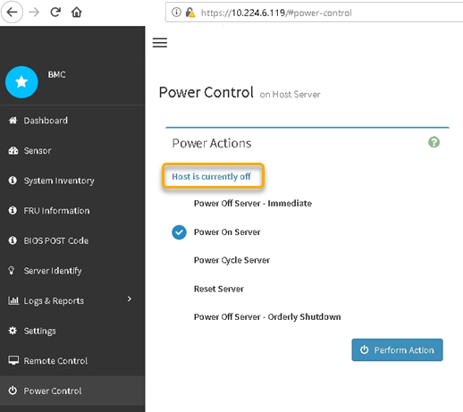

= Ligue e desligue o controlador SG6000-CN
:allow-uri-read: 
:icons: font
:imagesdir: ../media/

[role="lead"]
Pode desligar o controlador SG6000-CN e ligá-lo novamente para efetuar a manutenção.

== Desligue o controlador SG6000-CN

Desligue o controlador SG6000-CN para efetuar a manutenção do hardware.

.Antes de começar
* Você localizou fisicamente o controlador SG6000-CN que exige manutenção no data center. link:locating-controller-in-data-center.html["Localize o controlador no data center"]Consulte .

.Sobre esta tarefa
Para evitar interrupções de serviço, confirme se todos os outros nós de armazenamento estão conetados à grade antes de desligar o controlador ou desligue o controlador durante uma janela de manutenção programada quando os períodos de interrupção de serviço são aceitáveis. Consulte as informações sobre https://docs.netapp.com/us-en/storagegrid/monitor/monitoring-system-health.html#monitor-node-connection-states["monitorização dos estados de ligação do nó"^]o .

CAUTION: Se você já usou uma regra ILM que cria apenas uma cópia de um objeto, você deve encerrar o controlador durante uma janela de manutenção agendada. Caso contrário, você pode perder temporariamente o acesso a esses objetos durante este procedimento. Veja informações sobre o gerenciamento de objetos com o gerenciamento do ciclo de vida das informações.

.Passos
. Desligue o controlador SG6000-CN.
+

CAUTION: Tem de efetuar um corte de funcionamento controlado do aparelho introduzindo os comandos especificados abaixo. É uma prática recomendada executar um desligamento controlado quando possível para evitar alertas desnecessários, garantir que Registros completos estejam disponíveis e evitar interrupções de serviço.

+
.. Se você ainda não fez login no nó de grade, faça login usando PuTTY ou outro cliente ssh:
+
... Introduza o seguinte comando: `ssh admin@_grid_node_IP_`
... Introduza a palavra-passe listada no `Passwords.txt` ficheiro.
... Digite o seguinte comando para mudar para root: `su -`
... Introduza a palavra-passe listada no `Passwords.txt` ficheiro.
+
Quando você estiver conetado como root, o prompt mudará de `$` para `#`.

.. Desligar o controlador SG6000-CN
`*shutdown -h now*`
+
Esse comando pode levar até 10 minutos para ser concluído.

. Use um dos seguintes métodos para verificar se o controlador SG6000-CN está desligado:
+
** Olhe para o LED azul de alimentação na parte frontal do controlador e confirme que está desligado.
+
image::../media/sg6060_front_panel_power_led_off.jpg[SG6060 LED de alimentação do painel frontal - desligado]

** Observe os LEDs verdes em ambas as fontes de alimentação na parte traseira do controlador e confirme que piscam a uma taxa regular (aproximadamente um piscar por segundo).
+
image::../media/sg6060_rear_panel_power_led_on.jpg[SG6060 LED de alimentação do painel traseiro]

** Use a interface BMC do controlador:
+
... Acesse a interface BMC do controlador.
+
link:../installconfig/accessing-bmc-interface.html["Acesse a interface BMC"]

... Selecione *Power Control*.
... Verifique se as ações de energia indicam que o host está desligado no momento.
+

== Ligue o controlador SG6000-CN e verifique a operação

Ligue o controlador após concluir a manutenção.

.Antes de começar
* Você instalou o controlador em um gabinete ou rack e conetou os cabos de dados e alimentação.
+
link:reinstalling-sg6000-cn-controller-into-cabinet-or-rack.html["Reinstale o controlador SG6000-CN no gabinete ou rack"]

* Você localizou fisicamente o controlador no data center.
+
link:locating-controller-in-data-center.html["Localize o controlador no data center"]

.Passos
. Ligue o controlador SG6000-CN e monitorize os LEDs do controlador e os códigos de arranque utilizando um dos seguintes métodos:
+
** Prima o interrutor de alimentação na parte frontal do controlador.
+
image::../media/sg6060_front_panel_power_led_off.jpg[SG6060 LED de alimentação do painel frontal - desligado]

** Use a interface BMC do controlador:
+
... Acesse a interface BMC do controlador.
+
link:../installconfig/accessing-bmc-interface.html["Acesse a interface BMC"]

... Selecione *Power Control*.
... Selecione *Power on Server* e, em seguida, selecione *Perform Action*.
+
image::../media/sg6060_power_on_from_bmc.png[Ligue o controlador da BMC]

+
Use a interface BMC para monitorar o status de inicialização.

. Confirme se o controlador do dispositivo é apresentado no Gestor de grelha e sem alertas.
+
Pode levar até 20 minutos para o controlador ser exibido no Gerenciador de Grade.

. Confirme se o novo controlador SG6000-CN está totalmente operacional:
+
.. Faça login no nó de grade usando PuTTY ou outro cliente ssh:
+
... Introduza o seguinte comando: `ssh admin@_grid_node_IP_`
... Introduza a palavra-passe listada no `Passwords.txt` ficheiro.
... Digite o seguinte comando para mudar para root: `su -`
... Introduza a palavra-passe listada no `Passwords.txt` ficheiro.
+
Quando você estiver conetado como root, o prompt mudará de `$` para `#`.

.. Digite o seguinte comando e verifique se ele retorna a saída esperada
`cat /sys/class/fc_host/*/port_state`
+
Saída esperada:

+
[listing]
----
Online
Online
Online
Online
----
+
Se a saída esperada não for devolvida, entre em Contato com o suporte técnico.

.. Digite o seguinte comando e verifique se ele retorna a saída esperada
`cat /sys/class/fc_host/*/speed`
+
Saída esperada:

+
[listing]
----
16 Gbit
16 Gbit
16 Gbit
16 Gbit
----
+
Se a saída esperada não for devolvida, entre em Contato com o suporte técnico.

.. Na página nós no Gerenciador de Grade, verifique se o nó do dispositivo está conetado à grade e não tem alertas.
+

CAUTION: Não coloque outro nó de dispositivo offline a menos que este dispositivo tenha um ícone verde.

. Opcional: Instale o painel frontal, se um tiver sido removido.

.Informações relacionadas
* link:reinstalling-sg6000-cn-controller-into-cabinet-or-rack.html#remove-sg6000-cn-controller-from-cabinet-or-rack["Remova o controlador SG6000-CN do gabinete ou rack"]
* link:../installconfig/viewing-status-indicators.html["Ver indicadores de estado"]

