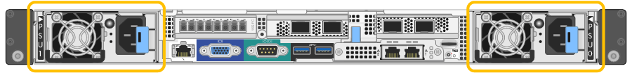

= Substitua a fonte de alimentação no controlador SG6000-CN
:allow-uri-read: 
:icons: font
:imagesdir: ../media/

[role="lead"]
O controlador SG6000-CN tem duas fontes de alimentação para redundância. Se uma das fontes de alimentação falhar, você deve substituí-la o mais rápido possível para garantir que o controlador de computação tenha energia redundante.

NOTE: Ambas as fontes de alimentação devem ter a mesma potência. Se for necessário substituir ambas as fontes de alimentação, link:replacing-one-or-both-power-supplies-in-sg6000-cn-controller.html["Substituição de ambas as fontes de alimentação no controlador SG6000-CN"]consulte .

.Antes de começar
* Desembalou a fonte de alimentação de substituição.
* Você localizou fisicamente o controlador onde está substituindo a fonte de alimentação no data center.
+
link:locating-controller-in-data-center.html["Localize o controlador no data center"]

* Confirmou que a outra fonte de alimentação está instalada e em funcionamento.

.Sobre esta tarefa
A figura mostra as duas unidades de fonte de alimentação para o controlador SG6000-CN, que são acessíveis a partir da parte de trás do controlador.

.Passos
. Desconete o cabo de alimentação da fonte de alimentação.
. Levante o manípulo do excêntrico.
+
image::../media/sg6000_cn_lift_cam_handle_psu.gif[Levante a alavanca do came para remover a PSU SG6000-CN]

. Pressione o trinco azul e puxe a fonte de alimentação para fora.
+
image::../media/sg6000_cn_remove_power_supply.gif[Remova a fonte de alimentação SG6000-CN]

. Faça deslizar a fonte de alimentação de substituição para o chassis.
+
Certifique-se de que o trinco azul se encontra no lado direito ao deslizar a unidade para dentro.

+
image::../media/sg6000_cn_insert_power_supply.gif[Deslize a fonte de alimentação para SG6000-CN]

. Empurre o manípulo do came para baixo para fixar a fonte de alimentação.
. Ligue o cabo de alimentação à fonte de alimentação e certifique-se de que o LED verde se acende.

