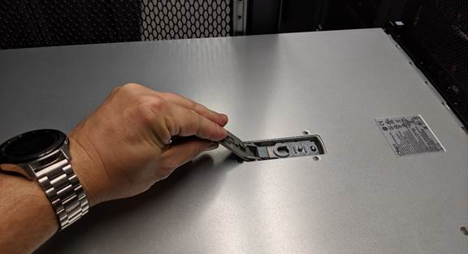

= Substituir a tampa SGF6112 ou SG6100-CN
:allow-uri-read: 
:icons: font
:imagesdir: ../media/

[role="lead"]
Retire a tampa do aparelho para aceder aos componentes internos para manutenção e volte a colocar a tampa quando terminar.

== Remova a tampa

.Antes de começar
link:reinstalling-sgf6112-into-cabinet-or-rack.html["Retire o aparelho do armário ou do rack"] para aceder à tampa superior.

.Passos
. Certifique-se de que o trinco da tampa do aparelho não está bloqueado. Se necessário, rode o bloqueio do trinco de plástico azul um quarto de volta na direção de desbloqueio, conforme ilustrado no bloqueio do trinco.
. Rode o trinco para cima e para trás em direção à parte traseira do chassis do aparelho até parar; em seguida, levante cuidadosamente a tampa do chassis e coloque-a de lado.
+

+

CAUTION: Enrole a extremidade da correia de uma pulseira ESD à volta do pulso e fixe a extremidade do clipe a um solo metálico para evitar descargas estáticas ao trabalhar no interior do aparelho.

== Reinstale a tampa

.Antes de começar
Concluiu todos os procedimentos de manutenção no interior do aparelho.

.Passos
. Com a trava da tampa aberta, segure a tampa acima do chassi e alinhe o orifício no trinco da tampa superior com o pino no chassi. Quando a tampa estiver alinhada, baixe-a sobre o chassis.
+
image::../media/sg6060_cover_latch_alignment_pin.jpg[SG6060 pino de alinhamento do trinco da tampa]

. Rode o trinco da tampa para a frente e para baixo até parar e a tampa assentar totalmente no chassis. Verifique se não existem folgas ao longo da extremidade dianteira da tampa.
+
Se a tampa não estiver totalmente encaixada, poderá não conseguir deslizar o aparelho para dentro do rack.

. Opcional: Rode o fecho de plástico azul um quarto de volta na direção do bloqueio, conforme ilustrado no bloqueio do trinco, para o bloquear.

.Depois de terminar
link:reinstalling-sgf6112-into-cabinet-or-rack.html["Volte a instalar o aparelho no armário ou no rack"].
