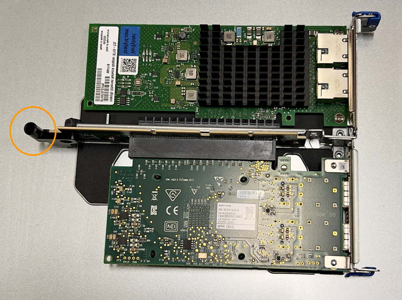

= Substitua a bateria CMOS SGF6112 ou SG6100-CN
:allow-uri-read: 
:icons: font
:imagesdir: ../media/

[role="lead"]
Use este procedimento para substituir a bateria de célula tipo moeda CMOS na placa de sistema.

Use estes procedimentos para:

* Retire a bateria CMOS
* Volte a instalar a bateria CMOS

== Retire a bateria CMOS

.Antes de começar
* Você link:verify-component-to-replace.html["Verificado o aparelho onde a bateria CMOS precisa ser substituída"]tem .
* Você tem link:locating-sgf6112-in-data-center.html["Fisicamente localizado o aparelho SGF6112 ou o controlador SG6100-CN"] onde você está substituindo a bateria CMOS no data center.
+

NOTE: É necessário um link:power-sgf6112-off-on.html#shut-down-the-sgf6112-appliance["corte de funcionamento controlado do aparelho"]antes de retirar o aparelho do rack.

* Desligou todos os cabos e link:reinstalling-sgf6112-cover.html["a tampa do aparelho foi removida"].

.Sobre esta tarefa
Para evitar interrupções de serviço, confirme se todos os outros nós de armazenamento estão conetados à rede antes de iniciar a substituição da bateria do CMOS ou substitua a bateria durante uma janela de manutenção programada quando os períodos de interrupção de serviço são aceitáveis. Consulte as informações sobre https://docs.netapp.com/us-en/storagegrid-118/monitor/monitoring-system-health.html#monitor-node-connection-states["monitorização dos estados de ligação do nó"^]o .

CAUTION: Se você já usou uma regra ILM que cria apenas uma cópia de um objeto, você deve substituir a bateria durante uma janela de manutenção programada, pois você pode perder temporariamente o acesso a esses objetos durante este procedimento. Consulte informações sobre https://docs.netapp.com/us-en/storagegrid-118/ilm/why-you-should-not-use-single-copy-replication.html["por que você não deve usar replicação de cópia única"^]o .

.Passos
. Enrole a extremidade da correia da pulseira ESD à volta do pulso e fixe a extremidade do clipe a um solo metálico para evitar descargas estáticas.
. Localize o conjunto da riser de duas ranhuras na parte de trás do aparelho.
+
image::../media/SGF6112-two-slot-riser-position.png[Localização da riser de dois slots]

. Segure o conjunto da riser através dos orifícios marcados a azul e levante-o cuidadosamente para cima. Mova o conjunto da riser em direção à frente do chassi enquanto o levanta para permitir que os conetores externos em suas NICs instaladas evitem o chassi.
. Coloque a riser sobre uma superfície plana anti-estática com o lado da estrutura metálica voltado para baixo.
. Localize a bateria CMOS na placa de sistema na posição abaixo do conjunto da riser removido.
+
image::../media/SGF6112-cmos-position.png[Localização da bateria CMOS]

. Use o dedo ou uma ferramenta de alavanca de plástico para pressionar o clipe de retenção (destacado) para longe da bateria para prendê-lo da tomada.
+
image::../media/SGF6112-battery-cmos.png[Clipe de bateria CMOS]

. Retire a bateria e elimine-a corretamente.

== Volte a instalar a bateria CMOS

Instale a bateria CMOS de substituição na tomada na placa de sistema.

.Antes de começar
* Tem a bateria CMOS de substituição correta (CR2032).
* Você removeu a bateria CMOS com falha.

.Passos
. Enrole a extremidade da correia da pulseira ESD à volta do pulso e fixe a extremidade do clipe a um solo metálico para evitar descargas estáticas.
. Retire a bateria CMOS da embalagem.
. Pressione a bateria de substituição para o soquete vazio na placa de sistema com o lado positivo para cima até que a bateria encaixe no lugar.
. Localize o orifício de alinhamento no conjunto da riser de duas ranhuras (circulado) que se alinha com o pino guia na placa de sistema para garantir o posicionamento correto do conjunto da riser.
+

. Localize o pino-guia na placa de sistema
+
image::../media/sgf6112_two-slot-riser_guide-pin.png[Pino-guia na placa de sistema para o conjunto do riser de duas ranhuras]

. Posicione o conjunto da riser no chassi, certificando-se de que ele se alinha com o conetor na placa de sistema e o pino guia.
. Pressione cuidadosamente o conjunto do riser de duas ranhuras no lugar ao longo da linha central, ao lado dos orifícios marcados com azul, até que esteja totalmente assentado.
. Se não tiver outros procedimentos de manutenção a executar no aparelho, volte a instalar a tampa do aparelho, volte a colocar o aparelho no rack, ligue os cabos e ligue a alimentação.
. Se o dispositivo que você substituiu tivesse a criptografia de unidade ativada para as unidades SED, você deverá link:../installconfig/optional-enabling-node-encryption.html#access-an-encrypted-drive["introduza a frase-passe de encriptação da unidade"]acessar as unidades criptografadas quando o dispositivo de substituição for iniciado pela primeira vez.
. Se o dispositivo que você substituiu usou um servidor de gerenciamento de chaves (KMS) para gerenciar chaves de criptografia para criptografia de nó, configuração adicional pode ser necessária antes que o nó possa ingressar na grade. Se o nó não se juntar automaticamente à grade, certifique-se de que essas configurações foram transferidas para o novo dispositivo e configure manualmente quaisquer configurações que não tenham a configuração esperada:
+
** link:../installconfig/accessing-storagegrid-appliance-installer.html["Configurar conexões StorageGRID"]
** https://docs.netapp.com/us-en/storagegrid-118/admin/kms-overview-of-kms-and-appliance-configuration.html#set-up-the-appliance["Configure a criptografia de nó para o dispositivo"^]

. Inicie sessão no aparelho:
+
.. Introduza o seguinte comando: `ssh admin@_grid_node_IP_`
.. Introduza a palavra-passe listada no `Passwords.txt` ficheiro.
.. Digite o seguinte comando para mudar para root: `su -`
.. Introduza a palavra-passe listada no `Passwords.txt` ficheiro.

. Restaure a conetividade de rede BMC para o dispositivo. Existem duas opções:
+
** Use IP estático, máscara de rede e gateway
** Use DHCP para obter um IP, máscara de rede e gateway
+
... Para restaurar a configuração do BMC para usar um IP estático, máscara de rede e gateway, digite os seguintes comandos:
+
`*run-host-command ipmitool lan set 1 ipsrc static*`

+
`*run-host-command ipmitool lan set 1 ipaddr _Appliance_IP_*`

+
`*run-host-command ipmitool lan set 1 netmask _Netmask_IP_*`

+
`*run-host-command ipmitool lan set 1 defgw ipaddr _Default_gateway_*`

... Para restaurar a configuração do BMC para usar DHCP para obter um IP, máscara de rede e gateway, digite o seguinte comando:
+
`*run-host-command ipmitool lan set 1 ipsrc dhcp*`

. Depois de restaurar a conetividade de rede BMC, conete-se à interface BMC para auditar e restaurar qualquer configuração personalizada adicional do BMC que você possa ter aplicado. Por exemplo, você deve confirmar as configurações para destinos de intercetação SNMP e notificações por e-mail. link:../installconfig/configuring-bmc-interface.html["Configurar a interface BMC"]Consulte .
. Confirme se o nó do dispositivo é exibido no Gerenciador de Grade e se nenhum alerta é exibido.

