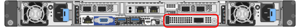

= Substitua NIC externo no SG6100-CN
:allow-uri-read: 
:icons: font
:imagesdir: ../media/

[role="lead"]
Talvez seja necessário substituir uma placa de interface de rede (NIC) externa no SG6100-CN se não estiver funcionando de forma otimizada ou se tiver falhado.

Use estes procedimentos para:

* Remova a NIC
* Reinstale a NIC

.Antes de começar
* Tem a NIC de substituição correta.
* Você determinou o link:verify-component-to-replace.html["Localização da NIC a substituir"].
+

* Você tem link:locating-sgf6112-in-data-center.html["Fisicamente localizado o controlador SG6100-CN"] onde você está substituindo a NIC no data center.
+

NOTE: A troca a quente é *não* suportada para este procedimento. É necessário um link:power-sgf6112-off-on.html#shut-down-the-sgf6112-appliance-or-sg6100-cn-controller["corte de funcionamento controlado do aparelho"]antes de desconetar os cabos e remover a NIC.

* Você desligou todos os cabos, incluindo os dois cabos de alimentação no SG6100-CN.
* *Opcional*: Você removeu o controlador do rack, se exigido pelos regulamentos locais. A remoção não é necessária, uma vez que a NIC está acessível externamente.

.Sobre esta tarefa
Para evitar interrupções de serviço, confirme se todos os outros nós de armazenamento estão conectados à rede antes de iniciar a substituição da placa de interface de rede (NIC) ou substitua a NIC durante uma janela de manutenção programada, quando períodos de interrupção de serviço são aceitáveis.  Veja informações sobre https://docs.netapp.com/us-en/storagegrid/monitor/monitoring-system-health.html#monitor-node-connection-states["estados de conexão do nó de montioring"^] .

CAUTION: Se você já usou uma regra ILM que cria apenas uma cópia de um objeto, você deve substituir a NIC durante uma janela de manutenção programada, pois você pode perder temporariamente o acesso a esses objetos durante este procedimento. Consulte informações sobre https://docs.netapp.com/us-en/storagegrid/ilm/why-you-should-not-use-single-copy-replication.html["por que você não deve usar replicação de cópia única"^]o .

== Remova a NIC externa

.Passos
. Enrole a extremidade da correia de uma pulseira antiestática em torno do pulso e fixe a extremidade do clipe a um solo metálico para evitar descargas estáticas.
. Use uma chave de fenda para soltar o parafuso na placa frontal da placa de rede.
+

CAUTION: A troca a quente é *não* suportada para este procedimento. O controlador deve ser desconetado da alimentação antes de remover a NIC.

. Remova cuidadosamente a placa de rede puxando a pega da placa de face. Coloque a placa de rede sobre uma superfície plana e antiestática.

== Reinstale a NIC externa

.Passos
. Enrole a extremidade da correia de uma pulseira antiestática em torno do pulso e fixe a extremidade do clipe a um solo metálico para evitar descargas estáticas.
. Remova a placa de rede de substituição da respetiva embalagem.
. Alinhe a placa de rede com a abertura no chassi e empurre-a cuidadosamente até que fique totalmente encaixada.
. Aperte o parafuso na placa frontal da NIC.

.Depois de terminar
Se não tiver outros procedimentos de manutenção a executar no aparelho, volte a colocar o aparelho no rack se este tiver sido removido, ligue os cabos e ligue a alimentação.

Após a substituição da peça, devolva a peça com falha à NetApp, conforme descrito nas instruções de RMA fornecidas com o kit. Consulte a https://mysupport.netapp.com/site/info/rma["Substituição  Devolução artigo"^] página para obter mais informações.
