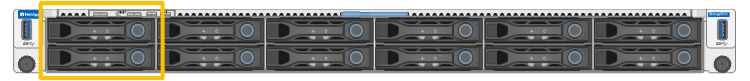

= Substitua a unidade em SG6200-CN
:allow-uri-read: 
:icons: font
:imagesdir: ../media/

[role="lead"]
O dispositivo SG6260 contém duas unidades SSD no controlador SG6200-CN, que funcionam como cache de leitura. Se uma dessas unidades falhar, você deve substituí-la o mais rápido possível para minimizar o impacto potencial no desempenho.

.Antes de começar
* Você tem link:locating-sg6200-in-data-center.html["localizado fisicamente o aparelho"].
* Você verificou qual unidade falhou observando que seu LED esquerdo é âmbar sólido ou usando o Gerenciador de Grade para link:verify-component-to-replace.html["veja o alerta causado pela unidade com falha"].
* Obteve a unidade de substituição.
* Você obteve proteção ESD adequada.

.Passos
. Verifique se o LED de falha esquerdo da unidade está âmbar ou use o ID do slot da unidade do alerta para localizar a unidade.
+
As unidades estão nas seguintes posições no chassi (frente do chassi com a moldura removida mostrada).

+

. Enrole a extremidade da correia da pulseira ESD à volta do pulso e fixe a extremidade do clipe a um solo metálico para evitar descargas estáticas.
. Desembale a unidade de substituição e coloque-a numa superfície plana e livre de estática perto do aparelho.
+
Salve todos os materiais de embalagem.

. Pressione o botão de liberação na unidade com falha.
+
image:../media/drw_s2025_drive_replace_ieops-2553.svg["Removendo uma unidade do chassi"]

+
A alavanca nas molas de acionamento abre parcialmente e a unidade solta-se da ranhura.

. Abra a alça, deslize a unidade para fora e coloque-a em uma superfície plana e livre de estática.
. Pressione o botão de liberação na unidade de substituição antes de inseri-la no slot da unidade.
+
As molas do trinco abrem.

. Insira a unidade de substituição na ranhura e, em seguida, feche a pega da unidade.
+

CAUTION: Não utilize força excessiva ao fechar a pega.

+
Quando a unidade estiver totalmente inserida, você ouvirá um clique.

+
Quando ambas as unidades SSD estão funcionando normalmente, o sistema restaurará automaticamente a funcionalidade de cache de leitura. Você pode https://docs.netapp.com/us-en/storagegrid/monitor/running-diagnostics.html["execute o diagnóstico"^] monitorar a taxa de acerto do cache de leitura. Como o cache foi reconstruído, a taxa de acertos pode ser baixa inicialmente, mas deve aumentar com o tempo, pois o cache é repreenchido pelos clientes que acessam dados de objeto.

Após substituir a peça, devolva a peça defeituosa à NetApp, conforme descrito nas instruções de RMA que acompanham o kit. Consulte a  https://mysupport.netapp.com/site/info/rma["Devolução e substituição de peças"^] página para obter mais informações.
