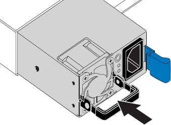

= Substitua uma ou ambas as fontes de alimentação do SGF6212 ou SG6200-CN
:allow-uri-read: 
:icons: font
:imagesdir: ../media/

[role="lead"]
O dispositivo SGF6212 e o nó de computação SG6200-CN possuem duas fontes de alimentação para redundância. Se uma das fontes de alimentação falhar, você deve substituí-la o mais rápido possível para garantir que o dispositivo tenha fonte de alimentação redundante. Ambas as fontes de alimentação em operação no dispositivo devem ser do mesmo modelo e potência.

.Sobre esta tarefa
A figura mostra a localização das duas fontes de alimentação. As fontes de alimentação são acessíveis pela parte traseira do dispositivo.

image::../media/sgf6212_power_supplies.png[Parte traseira do SGF6212 ou SG6200-CN com duas fontes de alimentação]

+ NOTA: A imagem mostra o dispositivo SGF6212, mas as fontes de alimentação estão localizadas na mesma posição no nó de computação SG6200-CN.

.Antes de começar
* Você tem link:locating-sg6200-in-data-center.html["localizado fisicamente o aparelho"] com a fonte de alimentação a ser substituída.
* Você link:verify-component-to-replace.html["determinada a localização da fonte de alimentação a substituir"]tem .
* Se estiver a substituir apenas uma fonte de alimentação:
+
** Desembalou a unidade de fonte de alimentação de substituição e garantiu que é o mesmo modelo e potência que a unidade de fonte de alimentação que está a substituir.
** Confirmou que a outra fonte de alimentação está instalada e em funcionamento.

* Se você estiver substituindo ambas as fontes de alimentação ao mesmo tempo:
+
** Você desembalou as unidades de fonte de alimentação de substituição e garantiu que elas sejam o mesmo modelo e potência.

.Passos
. Se estiver a substituir apenas uma fonte de alimentação, não necessita de desligar o aparelho. Vá para <<Unplug_the_power_cord,Desconete o cabo de alimentação>>a etapa. Se você estiver substituindo ambas as fontes de alimentação ao mesmo tempo, faça o seguinte antes de desconetar os cabos de alimentação:
+
.. link:power-sg6200-off-on.html#shut-down-the-sgf6212-appliance-or-sg6200-cn-controller["Desligue o aparelho"].
+

CAUTION: Se você já usou uma regra ILM que cria apenas uma cópia de um objeto e está substituindo ambas as fontes de alimentação ao mesmo tempo, você deve substituir as fontes de alimentação durante uma janela de manutenção programada, pois você pode perder temporariamente o acesso a esses objetos durante este procedimento. Consulte informações sobre https://docs.netapp.com/us-en/storagegrid/ilm/why-you-should-not-use-single-copy-replication.html["por que você não deve usar replicação de cópia única"^]o .

. [[Desconete_o_cabo_de_alimentação, start-2]]Desconete o cabo de alimentação de cada fonte de alimentação a ser substituída.
+
Quando vista a partir da parte de trás do aparelho, a fonte de alimentação A (PSU0) está à direita e a fonte de alimentação B (PSU1) está à esquerda.

. Levante a pega na primeira alimentação a ser substituída.
+
image::../media/sg6000_cn_lift_cam_handle_psu.gif[Levantar a pega para remover a PSU]

. Pressione o trinco azul e puxe a fonte de alimentação para fora.
+
image::../media/sg6000_cn_remove_power_supply.gif[Remover uma fonte de alimentação]

. Com o trinco azul à direita, deslize a fonte de alimentação de substituição para o chassis.
+

NOTE: Ambas as fontes de alimentação instaladas devem ser do mesmo modelo e potência.

+
Certifique-se de que o trinco azul se encontra no lado direito ao deslizar a unidade de substituição para dentro.

+
Você sentirá um clique quando a fonte de alimentação estiver bloqueada no lugar.

+

. Empurre a pega para baixo contra o corpo da PSU.
. Se você estiver substituindo ambas as fontes de alimentação, repita as etapas 2 a 6 para substituir a segunda fonte de alimentação.
. link:../installconfig/connecting-power-cords-and-applying-power.html["Conete os cabos de energia às unidades substituídas e ligue a energia"].

Após substituir a peça, devolva a peça defeituosa à NetApp, conforme descrito nas instruções de RMA que acompanham o kit. Consulte a  https://mysupport.netapp.com/site/info/rma["Devolução e substituição de peças"^] página para obter mais informações.
